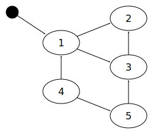

### 概述

python采用的是**引用计数**机制为主，**标记-清除**和**分代收集**两种机制为辅的策略。

### 引用计数

- Python语言默认采用的垃圾收集机制是『引用计数法 `Reference Counting`』，该算法最早George E. Collins在1960的时候首次提出，50年后的今天，该算法依然被很多编程语言使用。
- 『引用计数法』的原理是：每个对象维护一个`ob_ref`字段，用来记录该对象当前被引用的次数，每当新的引用指向该对象时，它的引用计数`ob_ref`加`1`，每当该对象的引用失效时计数`ob_ref`减`1`，一旦对象的引用计数为`0`，该对象立即被回收，对象占用的内存空间将被释放。
- 它的缺点是需要额外的空间维护引用计数，这个问题是其次的，不过最主要的问题是它不能解决对象的“循环引用”，因此，也有很多语言比如Java并没有采用该算法做来垃圾的收集机制。

### 引用计数案例

```
import sys
class A():
    def __init__(self):
        '''初始化对象'''
        print('object born id:%s' %str(hex(id(self))))

def f1():
    '''循环引用变量与删除变量'''
    while True:
        c1=A()
        del c1

def func(c):
    print('obejct refcount is: ',sys.getrefcount(c)) #getrefcount()方法用于返回对象的引用计数


if __name__ == '__main__':
   #生成对象
    a=A()
    func(a)

    #增加引用
    b=a
    func(a)

    #销毁引用对象b
    del b
    func(a)
```

执行结果：

```
object born id:0x265c56a56d8
obejct refcount is:  4
obejct refcount is:  5
obejct refcount is:  4
```

#### 导致引用计数+1的情况

- 对象被创建，例如a=23
- 对象被引用，例如b=a
- 对象被作为参数，传入到一个函数中，例如`func(a)`
- 对象作为一个元素，存储在容器中，例如`list1=[a,a]`

#### 导致引用计数-1的情况

- 对象的别名被显式销毁，例如`del a`
- 对象的别名被赋予新的对象，例如`a=24`
- 一个对象离开它的作用域，例如f函数执行完毕时，`func`函数中的局部变量（全局变量不会）
- 对象所在的容器被销毁，或从容器中删除对象

### 循环引用导致内存泄露

```
def f2():
    '''循环引用'''
    while True:
        c1=A()
        c2=A()
        c1.t=c2
        c2.t=c1
        del c1
        del c2
```

执行结果

```
id:0x1feb9f691d0
object born id:0x1feb9f69438
object born id:0x1feb9f690b8
object born id:0x1feb9f69d68
object born id:0x1feb9f690f0
object born id:0x1feb9f694e0
object born id:0x1feb9f69f60
object born id:0x1feb9f69eb8
object born id:0x1feb9f69128
object born id:0x1feb9f69c88
object born id:0x1feb9f69470
object born id:0x1feb9f69e48
object born id:0x1feb9f69ef0
object born id:0x1feb9f69dd8
object born id:0x1feb9f69e10
object born id:0x1feb9f69ac8
object born id:0x1feb9f69198
object born id:0x1feb9f69cf8
object born id:0x1feb9f69da0
object born id:0x1feb9f69c18
object born id:0x1feb9f69d30
object born id:0x1feb9f69ba8
...
```

- 创建了`c1`，`c2`后，这两个对象的引用计数都是`1`，执行`c1.t=c2`和`c2.t=c1`后，引用计数变成`2`.
- 在`del c1`后，内存`c1`的对象的引用计数变为`1`，由于不是为`0`，所以`c1`的对象不会被销毁,同理，在`del c2`后也是一样的。
- 虽然它们两个的对象都是可以被销毁的，但是由于循环引用，导致垃圾回收器都不会回收它们，所以就会导致内存泄露。

### 分代回收

- 分代回收是一种以空间换时间的操作方式，Python将内存根据对象的存活时间划分为不同的集合，每个集合称为一个代，Python将内存分为了3“代”，分别为年轻代（第0代）、中年代（第1代）、老年代（第2代），他们对应的是3个链表，它们的垃圾收集频率与对象的存活时间的增大而减小。
- 新创建的对象都会分配在**年轻代**，年轻代链表的总数达到上限时，Python垃圾收集机制就会被触发，把那些可以被回收的对象回收掉，而那些不会回收的对象就会被移到**中年代**去，依此类推，**老年代**中的对象是存活时间最久的对象，甚至是存活于整个系统的生命周期内。
- 同时，分代回收是建立在标记清除技术基础之上。分代回收同样作为Python的辅助垃圾收集技术处理那些容器对象

### 垃圾回收

有三种情况会触发垃圾回收：

1. 调用`gc.collect()`,需要先导入`gc`模块。
2. 当`gc`模块的计数器达到阀值的时候。
3. 程序退出的时候。

#### gc模块

gc模块提供一个接口给开发者设置垃圾回收的选项。上面说到，采用引用计数的方法管理内存的一个缺陷是循环引用，而gc模块的一个主要功能就是解决循环引用的问题。

**常用函数**：

1. `gc.set_debug(flags)` 设置gc的debug日志，一般设置为`gc.DEBUG_LEAK`
2. `gc.collect([generation])`
   显式进行垃圾回收，可以输入参数，`0`代表只检查第一代的对象，`1`代表检查一，二代的对象，`2`代表检查一，二，三代的对象，如果不传参数，执行一个`full collection`，也就是等于传2。返回不可达（unreachable objects）对象的数目。
3. `gc.set_threshold(threshold0[, threshold1[, threshold2])`
   设置自动执行垃圾回收的频率。
4. `gc.get_count()` 获取当前自动执行垃圾回收的计数器，返回一个长度为3的列表

扩展资料：[Garbage Collector interface](https://docs.python.org/3.5/library/gc.html)


**gc模块的自动垃圾回收机制**
必须要import gc模块，并且is_enable()=True才会启动自动垃圾回收。
这个机制的主要作用就是发现并处理不可达的垃圾对象。
垃圾回收=垃圾检查+垃圾回收
在Python中，采用分代收集的方法。把对象分为三代，一开始，对象在创建的时候，放在一代中，如果在一次一代的垃圾检查中，改对象存活下来，就会被放到二代中，同理在一次二代的垃圾检查中，该对象存活下来，就会被放到三代中。

gc模块里面会有一个长度为3的列表的计数器，可以通过gc.get_count()获取。
例如(488,3,0)，其中488是指距离上一次一代垃圾检查，Python分配内存的数目减去释放内存的数目，**注意是内存分配，而不是引用计数的增加。**例如：

```
print gc.get_count() # (590, 8, 0)
a = ClassA()
print gc.get_count() # (591, 8, 0)
del a
print gc.get_count() # (590, 8, 0)
```

3是指距离上一次二代垃圾检查，一代垃圾检查的次数，同理，0是指距离上一次三代垃圾检查，二代垃圾检查的次数。

gc模快有一个自动垃圾回收的阀值，即通过gc.get_threshold函数获取到的长度为3的元组，例如(700,10,10)
每一次计数器的增加，gc模块就会检查增加后的计数是否达到阀值的数目，如果是，就会执行对应的代数的垃圾检查，然后重置计数器
例如，假设阀值是(700,10,10)：

- **当计数器从(699,3,0)增加到(700,3,0)，gc模块就会执行gc.collect(0),即检查一代对象的垃圾，并重置计数器为(0,4,0)**
- **当计数器从(699,9,0)增加到(700,9,0)，gc模块就会执行gc.collect(1),即检查一、二代对象的垃圾，并重置计数器为(0,0,1)**
- **当计数器从(699,9,9)增加到(700,9,9)，gc模块就会执行gc.collect(2),即检查一、二、三代对象的垃圾，并重置计数器为(0,0,0)**

其他
如果循环引用中，两个对象都定义了__del__方法，gc模块不会销毁这些不可达对象，因为gc模块不知道应该先调用哪个对象的__del__方法，所以为了安全起见，gc模块会把对象放到gc.garbage中，但是不会销毁对象。

#### gc实践案例

```
def f3():
    '''循环引用'''
    while True:
        c1=A()
        c2=A()
        c1.t=c2
        c2.t=c1
        del c1
        del c2
        #增加垃圾回收机制
        print(gc.garbage)
        print(gc.collect())
        print(gc.garbage)
        time.sleep(10)
```

执行结果

```
object born id:0x21d1a5dc470
object born id:0x21d1a5dc9e8
[]
4
gc: collectable <A 0x0000021D1A5DC470>
[<__main__.A object at 0x0000021D1A5DC470>, <__main__.A object at 0x0000021D1A5DC9E8>, {'t': <__main__.A object at 0x0000021D1A5DC9E8>}, {'t': <__main__.A object at 0x0000021D1A5DC470>}]
gc: collectable <A 0x0000021D1A5DC9E8>
gc: collectable <dict 0x0000021D1A156C88>
gc: collectable <dict 0x0000021D1A5CABC8>
```

### gc模块的自动垃圾回收机制

必须要import gc模块，并且is_enable()=True才会启动自动垃圾回收。
这个机制的主要作用就是发现并处理不可达的垃圾对象。

```
垃圾回收=垃圾检查+垃圾回收
```

在Python中，采用分代收集的方法。把对象分为三代，一开始，对象在创建的时候，放在一代中，如果在一次一代的垃圾检查中，改对象存活下来，就会被放到二代中，同理在一次二代的垃圾检查中，该对象存活下来，就会被放到三代中。

gc模块里面会有一个长度为3的列表的计数器，可以通过`gc.get_count()`获取。

```
def f4():
    '''垃圾自动回收'''
    print(gc.get_count())
    a=A()
    print(gc.get_count())
    del a
    print(gc.get_count())
```

执行结果

```
(621, 10, 0)
object born id:0x2ca32a8c588
(624, 10, 0)
(623, 10, 0)
```

- `621`指距离上一次`一代`垃圾检查，Python分配内存的数目减去释放内存的数目，注意:是内存分配，而不是引用计数的增加。
- `10`指距离上一次`二代`垃圾检查，`一代`垃圾检查的次数。
- `0`是指距离上一次`三代`垃圾检查，`二代`垃圾检查的次数。

### 自动回收阈值

gc模快有一个自动垃圾回收的阀值，即通过`gc.get_threshold`函数获取到的长度为3的元组，例如`(700,10,10)`
每一次计数器的增加，gc模块就会检查增加后的计数是否达到阀值的数目，如果是，就会执行对应的代数的垃圾检查，然后重置计数器

注意：
如果循环引用中，两个对象都定义了`__del__`方法，gc模块不会销毁这些不可达对象，因为gc模块不知道应该先调用哪个对象的`__del__`方法，所以为了安全起见，gc模块会把对象放到`gc.garbage`中，但是不会销毁对象。

### 标记清除

标记清除（Mark—Sweep）』算法是一种基于追踪回收（tracing GC）技术实现的垃圾回收算法。它分为两个阶段：第一阶段是标记阶段，GC会把所有的『活动对象』打上标记，第二阶段是把那些没有标记的对象『非活动对象』进行回收。那么GC又是如何判断哪些是活动对象哪些是非活动对象的呢？

[](https://sutune.oss-cn-shenzhen.aliyuncs.com/python/GC/mark-sweep.svg)

对象之间通过引用（指针）连在一起，构成一个有向图，对象构成这个有向图的节点，而引用关系构成这个有向图的边。从根对象（root object）出发，沿着有向边遍历对象，可达的（reachable）对象标记为活动对象，不可达的对象就是要被清除的非活动对象。根对象就是全局变量、调用栈、寄存器。 mark-sweepg 在上图中，我们把小黑圈视为全局变量，也就是把它作为root object，从小黑圈出发，对象1可直达，那么它将被标记，对象2、3可间接到达也会被标记，而4和5不可达，那么1、2、3就是活动对象，4和5是非活动对象会被GC回收。

标记清除算法作为Python的辅助垃圾收集技术主要处理的是一些容器对象，比如list、dict、tuple，instance等，因为对于字符串、数值对象是不可能造成循环引用问题。Python使用一个双向链表将这些容器对象组织起来。不过，这种简单粗暴的标记清除算法也有明显的缺点：清除非活动的对象前它必须顺序扫描整个堆内存，哪怕只剩下小部分活动对象也要扫描所有对象。