### 什么是跳跃表

​	跳跃表在Redis中是有序集合的底层数据结构，跳跃表是一种有序的数据结构，基于有序单链表，在链表的基础上，每个结点不只包含一个指针，**还可能包含多个指向后继结点的指针，这样就可以跳过一些不必要的结点，从而加快查找、删除等操作。**它通过在每个节点中维持多个指向其他的几点指针，从而达到快速访问队尾目的。跳跃表的效率可以和平衡二叉树想媲美了，大多数操作只需要O(log n)平均时间，最关键是它的实现相对于平衡树来说，代码的实现上简单很多。

#### 如下图就是一个跳跃表：

比如我们查找46，普通链表只能从头开始查找，比对-3,2,17...直到46，要比对7次。但是对于跳跃表，我们可以从最高层开始查找：

- 第一步：在L4层直接与55比对，发现大了，退回到第3层
- 第二步：在L3层与21比对，发现小了，继续往前比对55，发现大了，退回到第二层
- 第三步：在L2层与37比对，发现小了，往前，与55比对，发现大了，退回到第一层
- 第四步：在第1层，与46比对，查找成功。
- 共比对了6次，比普通链表只节省了一次，似乎没什么优势。但如果细想，当链表比较长的时候，在高层查找时，跳过的元素数量将相当可观，提速的效果将非常明显。**比如如果元素在55之后，在L4层，我们直接就跳过了7个元素，这是非常大的进步。**
- ==但这链表是有序的。意味着我们就可以冗余节点，来达到快速查询的效率。如果是无序的，那就没必要了==

**跳跃表的 level 是如何定义的？**
	==跳跃表 level 层级完全是随机的。一般来说，**层级越多，访问节点的速度越快**。跳跃表使用概率平衡，而不是强制平衡==

​	上面就是跳跃表的基本思想，跳跃表结点包含多少个指向后继元素的指针，是通过一个随机函数生成器得到的。这就是为什么论文“Skip Lists : A Probabilistic Alternative to Balanced Trees ”中有“概率”的原因了，就是通过随机生成一个结点中指向后续结点的指针数目。==(这儿说的跳跃表结点包含多少个指向后继元素的指针，其实就是level)==

#### 跳跃表的插入

首先我们需要插入几个数据。链表开始时是空的。

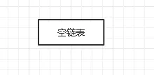

链表开始

**插入 level = 3，key = 1**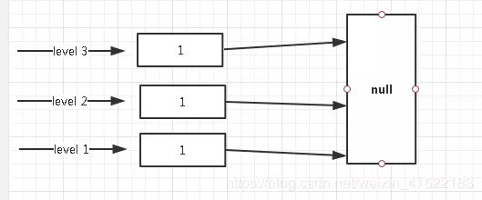

 level = 3，key = 1

**插入 level = 1，key = 2**
当继续插入 level = 1，key = 2 时，结果如下

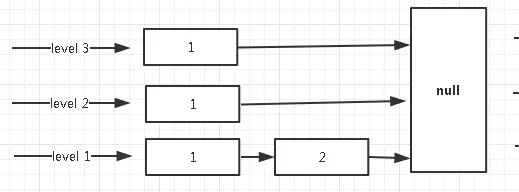

level = 1，key = 2

**插入 level = 2，key = 3**
当继续插入 level = 2，key = 3 时，结果如下

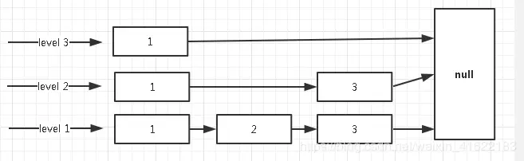

 level = 2，key = 3

**插入 level = 3，key = 5**
当继续插入 level = 3，key = 5 时，结果如下

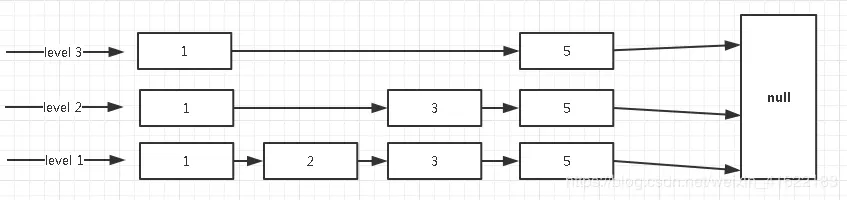

level = 3，key = 5

**插入 level = 1，key = 66**
当继续插入 level = 1，key = 66 时，结果如下

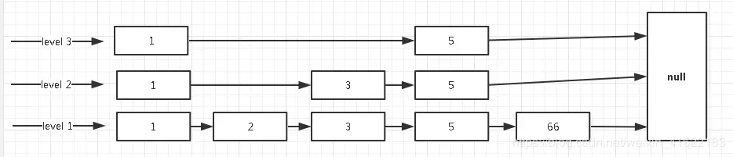

 level = 1，key = 66

**插入 level = 2，key = 100**
当继续插入 level = 2，key = 100 时，结果如下

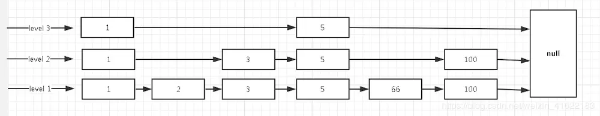

level = 2，key = 100

上述便是跳跃表插入原理，关键点就是层级–使用**抛硬币**的方式，感觉还真是挺随机的。每个层级最末端节点指向都是为 null，表示该层级到达末尾，可以往下一级跳。

#### 跳跃表用在哪

说真的，跳跃表在 Redis 中使用不是特别广泛，只用在了两个地方。

一是**实现有序集合键**，

二是**集群节点中用作内部数据结构**。

### 跳跃表的查询

现在我们要找键为 **66** 的节点的值。那跳跃表是如何进行查询的呢？

跳跃表的查询是从顶层往下找，那么会先从第顶层开始找，方式就是循环比较，如过顶层节点的下一个节点为空说明到达末尾，会跳到第二层，继续遍历，直到找到对应节点。

如下图所示红色框内，我们带着键 66 和 1 比较，发现 66 大于 1。继续找顶层的下一个节点，发现 66 也是大于五的，继续遍历。由于下一节点为空，则会跳到 level 2。

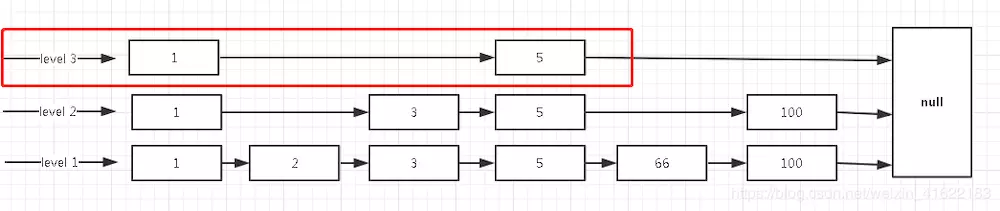

顶层遍历

上层没有找到 66，这时跳到 level 2 进行遍历，但是这里有一个点需要注意，遍历链表不是又重新遍历。而是从 5 这个节点继续往下找下一个节点。如下，我们遍历了 level 3 后，记录下当前处在 5 这个节点，那接下来遍历是 5 往后走，发现 100 大于目标 66，所以还是继续下沉。

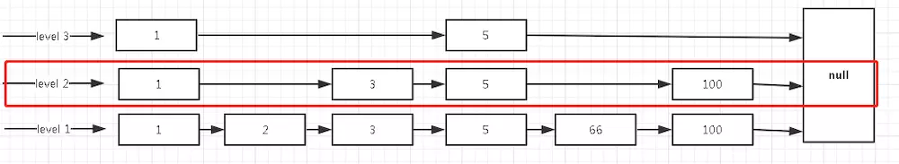

第二层遍历

当到 level 1 时，发现 5 的下一个节点恰恰好是 66 ，就将结果直接返回。

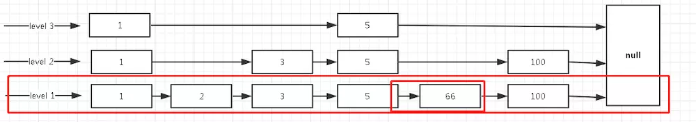

遍历第一层

**跳跃表删除**
跳跃表的删除和查找类似，都是一级一级找到相对应的节点，然后将 next 对象指向下下个节点，完全和链表类似。

现在我们来删除 66 这个节点，查找 66 节点和上述类似。

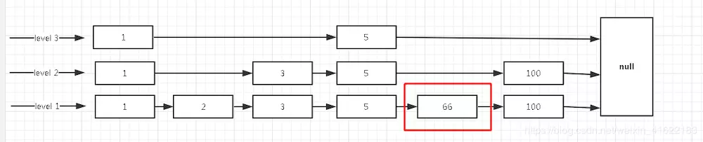

找到 66 节点

接下来是断掉 5 节点 next 的 66 节点，然后将它指向 100 节点。

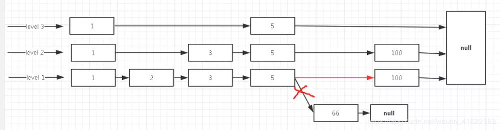

指向 100 节点

如上就是跳跃表的删除操作了，和我们平时接触的链表是一致的。当然，跳跃表的修改，也是和删除查找类似，只不过是将值修改罢了，就不继续介绍了。

