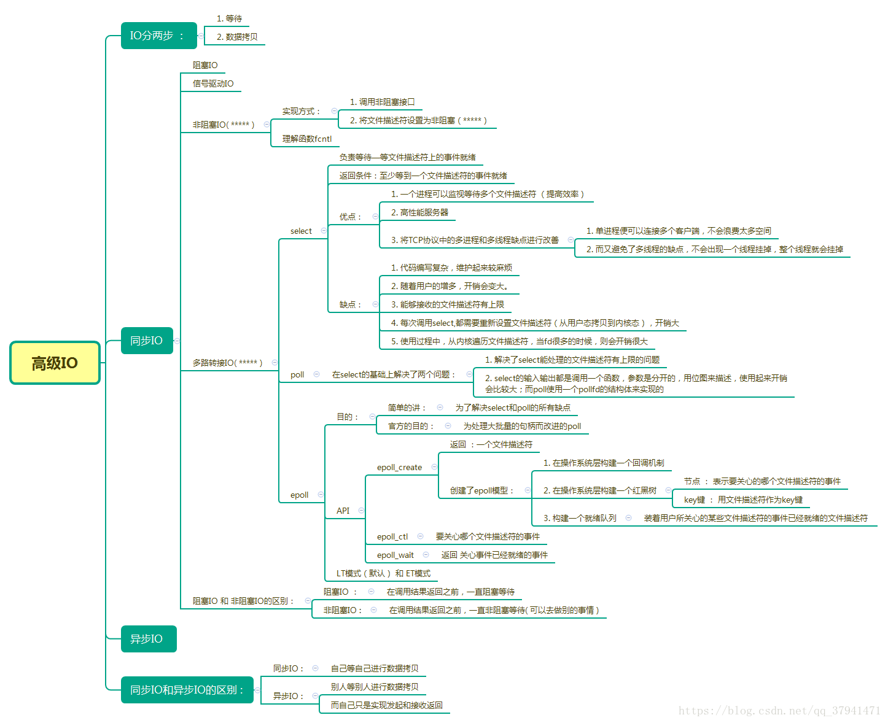
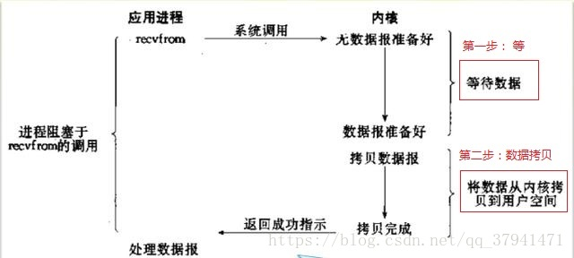
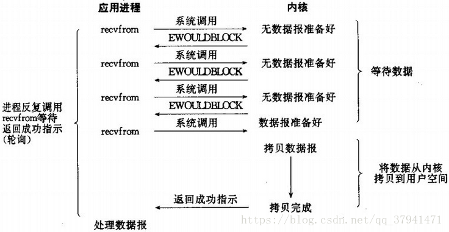
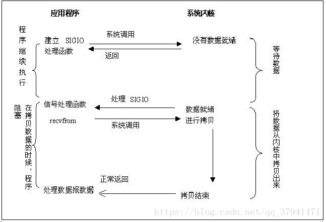
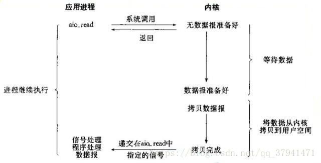
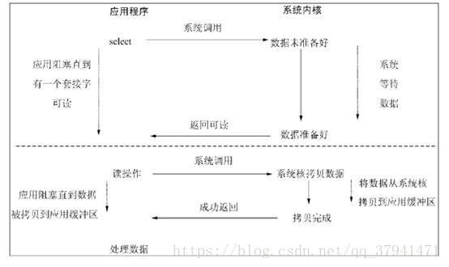

### [同步、异步、阻塞、非阻塞和IO多路复用是怎么回事？](https://www.cnblogs.com/wangzhaobo/articles/9596623.html)

​	要想更好了解socket编程，有一个不可绕过的环节就是IO．
	在Linux中，一切皆文件．实际上要文件干啥？不就是读写么？所以，这句话本质就是”IO才是王道”．用php的fopen打开文件关闭文件读读写写，这叫本地文件IO．在socket编程中，本质就是网络IO．
所以，在开始进一步的socket编程前，我们必须先从概念上认识好IO．
	如果到这里你还对IO没啥概念，那么我就通过几个词来给你一个大概的印象：同步，异步，阻塞，非阻塞，甚至是同步阻塞，同步非阻塞，异步阻塞，异步非阻塞．是不是晕了？截至到目前为止，你可以简单地认为只要搞明白这几个名词的含义以及区别，就算弄明白IO了，至少了可以继续往下看了．
先机械记忆一波儿：IO分为两大种，同步和异步．

- 同步IO：

- 阻塞IO

- 非阻塞IO

- IO多路复用（包括select，poll，epoll三种）

- 信号驱动IO

- 异步IO

  ​

​         那么如何理解区别这几个概念呢？尤其是同步和阻塞，异步和非阻塞，看起来就是一样的．
我先举个例子结合自己的理解来说明一下：

​	你去甜在心馒头店买太极馒头，阿梅说：＂暂时没，正在蒸呢，你自己看着点儿！＂．于是你就站在旁边只等馒头．此时的你，是阻塞的，是同步的．阻塞表现在你除了等馒头，别的什么都不做了．同步表现在等馒头的过程中，阿梅不提供通知服务，你不得不自己要等到＂馒头出炉＂的消息．
	你去甜在心馒头店买太极馒头，阿梅说：＂暂时没，正在蒸呢，你自己看着点儿！＂．于是你就站在旁边发微信，然后问一句：＂好了没？＂，然后发QQ，然后再问一句：＂好了没？＂．此时的你，是非阻塞的，是同步的．非阻塞表现在你除了等馒头，自己还干干别的时不时会主动问问馒头好没好．同步表现在等馒头的过程中，阿梅不提供通知服务，你不得不自己要等到＂馒头出炉＂的消息．
	你去甜在心馒头店买太极馒头，阿梅说：＂暂时没，正在蒸呢，蒸好了我打电话告诉你！＂．但你依然站在旁边只等馒头，此时的你，是阻塞的，是异步的．阻塞表现在你除了等馒头，别的什么都不做了．异步表现在等馒头的过程中，阿梅提供电话通知＂馒头出炉＂的消息，你只需要等阿梅的电话．
	你去甜在心馒头店买太极馒头，阿梅说：＂暂时没，正在蒸呢，蒸好了我打电话告诉你！＂．于是你就走了，去买了双新球鞋，看了看武馆，总之，从此不再过问馒头的事情，一心只等阿梅电话．此时的你，是非阻塞的，是异步的．非阻塞表现在你除了等馒头，自己还干干别的时不时会主动问问馒头好没好．异步表现在等馒头的过程中，阿梅提供电话通知＂馒头出炉＂的消息，你只需要等阿梅的电话．
	如果你仔细品过上面案例中的每一个字，你就能慢慢体会到之所以异步和非阻塞，同步和阻塞容易混淆，仅仅是因为二者的表现形式稍微有点儿相似而已．
	**==阻塞和非阻塞关注的是：在等馒头的过程中，你在干啥．==**
	==同步和异步关注的是：等馒头这件事，你是一直等到＂馒头出炉＂的结果，还是立即跑路等阿梅告诉你的＂馒头出炉＂．重点的是你是如何得知＂馒头出炉＂的==
	所以现实世界中，最傻的人才会采用异步阻塞的IO方式去写程序．其余三种方式，更多的人都会选择同步阻塞或者异步非阻塞．同步非阻塞最大的问题在于，你需要不断在各个任务中忙碌着，导致你的大脑混乱，非常累．

​	那么IO多路到底属于什么呢？比如epoll，其实严格意义上讲，epoll是同步非阻塞，而并不是异步，但是很多文章里都说这种为异步，其实也谈不上错误。说他是同步非阻塞是从严格意义上来考虑的，也就是严格按照unix环境高级编程的概念；说他异步非阻塞，实际上是从应用层面的同步异步来说的。
	那么nginx是什么呢？其实nginx就是典型epoll应用，这就是为什么nginx能够轻松应付并发过万的原因，也就是说nginx就是基于epoll的异步非阻塞编程；相对来说，apache就是同步阻塞的典型案例了。如果apache需要应付高并发，就需要配置多个apache worker进程；而nginx只需要开启少量worker就可以轻松应付！


[转载于](https://blog.csdn.net/qq_37941471/article/details/80952057)




#### 1. IO介绍：

1. I就是input输入,O就是output输出,一起就是基本输入输出设备；
2. 每个设备都会有一个专用的I/O地址，用来处理自己的输入输出信息。
   I/O地址绝对不能重复，如果两个设备的I/O地址有冲突，系统硬件就不能正常工作。

#### 2、IO模型 ：

==对于一次IO访问（以read举例），数据会先被拷贝到操作系统内核的缓冲区中，然后才会从操作系统内核的缓冲区拷贝到应用程序的地址空间。==

所以说，当一个read操作发生时，它会经历两个阶段： 
（1） 等待数据准备 
（2）将数据从内核拷贝到进程中 

在网络编程环境中，一次IO操作主要包括两个部分：
    1. 等数据准备
    2. 拷贝数据

 所以如果想要提高IO效率，就应该想办法让等的比重减少。


### 二 . 五种IO模型：

1. IO模型分类：同步IO 和 异步IO

2. 同步IO包括：
   （1）阻塞式I/O；

   （2）非阻塞I/O；

   （3）I/O多路转接（select poll epoll）;也叫 I/O多路复用

   （4）信号驱动I/O（SIGIO）；

3. 同步IO 和 异步IO的区别：  

   首先我们关注的是：消息通信机制

   同步IO : 发出一个调用时，在没有得到结果之前，该调用就不返回
           自己等自己进行数据拷贝

   异步IO ：发出一个调用，这个调用就直接返回了
            1. 自己不等也不进行数据拷贝
             2. 自己只是实现了发起和接受返回

4. 阻塞IO 和 非阻塞IO 的区别：

   关注的是：等待调用结果时的状态

   阻塞IO :  在内核数据准备好之前，系统调用会一直等待。 

   非阻塞IO ：在不能立刻得到结果之前，该调用不会阻塞当前线程


#### 1、阻塞IO



```c
在linux中，默认情况下所有的socket都是阻塞的；
在内核数据准备好之前，系统调用会一直等待。

具体流程如下：

（1）当用户进程调用了recvfrom这个系统调用，kernel就开始了IO的第一个阶段：
    准备数据（对于网络IO来说，很多时候数据在一开始还没有到达。
    比如，还没有收到一个完整的UDP包。这个时候kernel就要等待足够的数据到来）。 
    这个过程需要等待，也就是说数据被拷贝到操作系统内核的缓冲区中是需要一个过程的。 
    而在用户进程这边，整个进程会被阻塞（当然，是进程自己选择的阻塞）。 
（2）当kernel一直等到数据准备好了，它就会将数据从kernel中拷贝到用户内存， 
     然后kernel返回结果，用户进程才解除block的状态，重新运行起来。

```

#### 2、非阻塞IO



```c
如果内核还未将数据准备好，系统调用仍然会直接返回，
并且返回EWOULDBLOCK错误码。

轮询 ：非阻塞IO往往需要程序员用循环的方式去反复尝试读写文件描述符
      这个过程就是轮询

1. 一般非阻塞IO方式有两种：

    1. 调用非阻塞接口

    2. 将文件描述符设置为非阻塞的

2. 具体执行过程如下：

（1）当用户进程发出read操作时，如果kernel中的数据还没有准备好， 
     那么它并不会block用户进程，而是立刻返回一个error。 
（2）从用户进程角度讲 ，它发起一个read操作后，并不需要等待，而是马上就得到了一个结果 
     用户进程判断结果是一个error时，它就知道数据还没有准备好，于是它可以再次 
     发送read操作（这个反复尝试读写文件描述符的过程称为轮询）。 
（3）一旦kernel中的数据准备好了，并且又再次收到了用户进程的system call， 
    那么它马上就将数据拷贝到了用户内存，然后返回。 

```

#### 3、信号驱动IO




```c
内核将数据准备好之后，使用SIGIO信号通知程序进行IO操作

其具体过程如下： 

（1）首先开启套接口信号驱动I/O功能，并通过系统调用sigaction执行一个信号处理函数 

   （此系统调用立即返回，进程继续工作，它是非阻塞的）。 

（2）当数据准备就绪时，就为该进程生成一个SIGIO信号，通过信号回调  

     通知应用程序调用recvfrom来读取数据，并通知主循环函数处理数据。

```

#### 4、异步IO



```c
由内核在数据完成拷贝时，通知应用程序。

流程图如下： 

（1）用户进程发起read操作之后，立刻就可以开始去做其它的事。 
（2）而另一方面，从kernel的角度，当它受到一个asynchronous read之后， 
    首先它会立刻返回，所以不会对用户进程产生任何block。 
（3）然后，kernel会等待数据准备完成，然后将数据拷贝到用户内存，当这一切都完成之后，  
    kernel会给用户进程发送一个signal，告诉它read操作完成了。 

```


#### 5. 异步IO和信号驱动IO的区别 :

```c
信号驱动I/O : 由内核通知我们何时可以开始一个I/O操作；

   异步I/O : 由内核通知我们I/O操作何时已经完成。

一个是开始IO,一个是IO已经完成。
```


### 6 . IO多路转接：




#### 1. IO多路转接的作用—提高效率：

```c
在数据通信过程中，分为两部分：
    1. 是等待数据到达内核；
    2. 是将数据从内核拷贝到用户区。
而往往在实际应用中，等待的时间往往比拷贝的时间多，所以我们如果想要提高效率；
必然就是要将等的时间减少（在一定的时间内，减少等待的比重）

1. 这个时候，IO多路转接就是解决这个问题的：一次监视多个文件描述符
在IO多路转接中，由于一次等待多个文件描述符，
在单位时内就绪事件发生的概率就越大，所以等的比重就会越小。

2. 而这里我们会有一个问题：监视的文件描述符返回条件是什么？
答: 1. 监视的文件描述符都有自己要关注的事件（读/写/异常事件
    2. 返回条件就是：我们所监视（关心）的文件描述符的事件至少一个已经就绪
3.  IO多路转接的实现方式：
       1. select
       2. poll
       3. epoll等
     当然还有好多，具体下面我们来讲一下这三种实现方式以及之间的关系！

```

2. select模型及实现select版本的TCP服务器 ：
  https://blog.csdn.net/qq_37941471/article/details/80954592

3. poll模型及实现poll版本的TCP服务器 ：
  https://blog.csdn.net/qq_37941471/article/details/80962592

4. epoll模型及实现epoll版本的http服务器 ：
  https://blog.csdn.net/qq_37941471/article/details/80979422


#### select poll epoll 三者之间的优缺点对比：

```c
下面我讲一下我对select poll epoll的理解：

首先这三个都是实现 IO多路转接 的方式：一个进程同时监视多个文件描述符
   也就是三者之间的共同优点

   1. select  

      缺点： 

      1. 代码编写复杂，维护起来较麻烦
      2. 每次调用select,都需要重新设置文件描述符（从用户态拷贝到内核态），开销大
         为什么需要重新设置？
           因为select的输入输出都调用的是同一个函数select，并且输入和输出  
           是单独作为参数的这个时候我们就需要用一个第三方数组来保存之前的  
           所关心的文件描述符，以便进行select返回后，和fdset进行FDISSET
           判断哪一个所监听的描述符哪个就绪，进行accept操作，并且方便下一次监听

      3. 使用过程中，从内核遍历文件描述符，当fd很多的时候，则会开销很大

         需要以轮询的方式去获取就绪的文件描述符

      4. 能够接收的文件描述符有上限
         因为有第三方数组去维护，而这个数组开的最大空间就是：sizeof(fd_set)*8
         一般的操作系统，默认的是1024（一个bit位表示一个文件描述符
         （因为fd_set的底层是一个位图））
  2. poll

     优点 ：

     1. select的输入输出都是调用一个函数，参数是分开的，用位图来描述，
        使用起来开销会比较大；而poll使用一个pollfd的结构体来实现的 
     2. 解决了select能处理的文件描述符有上限的问题 
        因为poll解决了selec输入输出参数分开的问题，进而当然不需要再用第三方数组 
        去维护;所以poll能处理的文件描述符可以说是无上限了 
        （而这里肯定有它的一个上限，但是这个上限是操作系统的上限，和poll没有关系）

     缺点：

     除了解决了select的部分缺点以外，其他的缺点poll也是有的
 3. epoll

    在poll的基础上，又做了改进：处理了大批量句柄问题

所以这三个是一步一步改进的，最终epoll是最高效的IO多路的就绪通知机制；
（这个高效的基础是：多连接，少量活跃的机制；如果场景不合适的话，有可能适得其反）

```


### 三. 举例更好的理解五种IO模型：

```c
（1）阻塞式I/O ：
    张三在钓鱼，当鱼没有上钩时，便一直进行等待；当鱼上钩后，将鱼拿出。
    期间他一直在等待，不做任何事。

（2）非阻塞I/O ：
   张三在钓鱼，这次，当鱼没有上钩时，他便去干别的事：和旁边人聊天或者玩玩手机；
   当鱼上钩后，将鱼调出。
   这个时候他确实是自己等待了，但是他没有一直等待，而是在等待的过程中做了别的事。

（3）I/O多路转接：
   张三在钓鱼，这次他放了一百个鱼竿。依次检查这些鱼竿；
   当一个鱼竿有鱼上钩后，将鱼调出，然后继续检查所有鱼竿。 

   显然这个钓鱼的方式是效率很高的：因为别人都是一个人只拿一个鱼竿， 
   而张三用了100个鱼竿，放在鱼的角度，在100多的鱼竿中，当然张三的鱼竿被咬住的几率大

（4）信号驱动I/O模型 ：
    张三钓鱼时，将鱼竿上放一个铃铛，当鱼上钩后会响。  
    然后他便可以干自己的事情，当领响时，他知道上钩了，再去收鱼

（5）异步I/O ：
    张三准备钓鱼，这次他直接雇了个人给自己钓鱼。

    整个过程中，张三并没有做任何事，没有等，也没有将鱼拿起来；

```

### 四. 总结：

```c
1. 任何IO过程中，都包含两个步骤。一是等待，二是拷贝。 
    在实际的应用场景中，等待消耗的时间往往都远远高于拷贝的时间。 
    所以，让IO更高效， 最核心的办法就是 ：
    让等待的时间尽量少，也就是阻塞越少，理论上效率也是最优。 

2. 同步IO 和 异步IO的区别：  

   首先我们关注的是：消息通信机制

   同步IO : 发出一个调用时，在没有得到结果之前，该调用就不返回
           自己等自己进行数据拷贝

   异步IO ：发出一个调用，这个调用就直接返回了
            1. 自己不等也不进行数据拷贝
            2. 自己只是实现了发起和接受返回

3. 阻塞IO 和 非阻塞IO 的区别：

   关注的是：等待调用结果时的状态

   阻塞IO :  在内核数据准备好之前，系统调用会一直等待。 

   非阻塞IO ：在不能立刻得到结果之前，该调用不会阻塞当前线程

4. 异步IO和信号驱动IO的区别 :

   信号驱动I/O : 由内核通知我们何时可以开始一个I/O操作；

   异步I/O : 由内核通知我们I/O操作何时已经完成。

   一个是开始IO,一个是IO已经完成。

```

