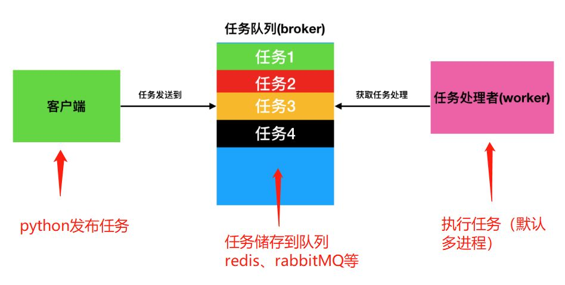

### celery介绍

#### [RabbitMQ](http://docs.jinkan.org/docs/celery/getting-started/first-steps-with-celery.html#id16)

[RabbitMQ](http://www.rabbitmq.com/) 功能完备、稳定、耐用，并且安装简便，是生产环境的绝佳选择。

#### [Redis](http://docs.jinkan.org/docs/celery/getting-started/first-steps-with-celery.html#id17)

[Redis](http://redis.io/) 也是功能完备的，但更易受突然中断或断电带来数据丢失的影响。使用 Redis 的详细信息见： 

如果你已经使用了 Django 的数据库后端，用它作为你的消息中间人在开发时会很方便，即使在生产环境中你会采用更稳健的系统。



#### [使用数据库](http://docs.jinkan.org/docs/celery/getting-started/first-steps-with-celery.html#id18)

不推荐把数据库用于消息队列，但对于很小的项目可能是合适的。

[转载于](https://blog.csdn.net/weixin_39726347/article/details/88558369)

Celery 本身不是任务队列，**它是管理分布式任务队列的工具，**或者换一种说法，**它封装好了操作常见任务队列的各种操作，**我们用它可以快速进行任务队列的使用与管理，当然你也可以自己看 rabbitmq 等队列的文档然后自己实现相关操作都是没有问题的。

#### celery角色及作用

##### Brokers

brokers 中文意思为中间人，在这里就是指任务队列本身，Celery 扮演生产者和消费者的角色，brokers 就是生产者和消费者存放/拿取产品的地方(队列)

##### 常见的 brokers 有 rabbitmq、redis、Zookeeper 等

##### Result Stores / backend

==顾名思义就是结果储存的地方，队列中的任务运行完后的结果或者状态需要被任务发送者知道，那么就需要一个地方储存这些结果，就是 Result Stores 了==

常见的 backend 有 redis、Memcached 甚至常用的数据都可以。

##### Workers

就是 Celery 中的工作者，类似与生产/消费模型中的消费者，其从队列中取出任务并执行

##### Tasks

就是我们想在队列中进行的任务咯，一般由用户、触发器或其他操作将任务入队，然后交由 workers 进行处理。

#### celery的特性

- 方便查看定时任务的执行情况, 如 是否成功, 当前状态, 执行任务花费的时间等.
- 使用功能齐备的管理后台或命令行添加,更新,删除任务.
- 方便把任务和配置管理相关联.
- 可选 多进程, Eventlet 和 Gevent 三种模型并发执行.
- 提供错误处理机制.
- 提供多种任务原语, 方便实现任务分组,拆分,和调用链.
- 支持多种消息代理和存储后端.
- Celery 是语言无关的.它提供了python 等常见语言的接口支持.

#### celery的适用场景

- 可以在 Request-Response 循环之外执行的操作：发送邮件、推送消息。
- 耗时的操作：调用第三方 API、视频处理（前端通过 AJAX 展示进度和结果）。
- 周期性任务：取代 crontab。

#### celery的优点

- 简单：一旦熟悉了Celery的工作流程后，配置和使用是比较简单的。
- 高可用：当任务执行失败或执行过程中发生连接中断，Celery 会自动尝试重新执行任务。
- 快速：一个单进程的Celery每分钟可处理上百万个任务。
- 灵活： Celery的大部分组件都可以被扩展及自定制。

### Celery的基本架构和工作流程

常用的Broker有RabbitMQ、Redis、数据库等，我们这里使用的是RabbitMQ

celery和rabbitMQ的协作流程

##### 创建celery实例

```python
# first.py
import time
from celery import Celery

celery_app = Celery("<main>", backend="redis://60.205.191.241:6379/3", broker="redis://60.205.191.241:6379/4")
# backend: 
# broker: 代理人, 消息队列, 是 Celery 记录task的地方。

@celery_app.task
def task_add(x, y):
    result = x + y
    time.sleep(5)
    print(f"{task_add.__name__}任务执行结果: ", result)
    return result
```


**delay是使用异步的方式，会将任务压入到消息队列。否则，不会使用消息队列**


#### 启动celery

在win下cmd执行

celery -A fisrt worker --loglevel=info -P eventlet

windows平台下需要执行-P eventlet

##### 命令行参数:

worker: 运行 worker 模块。

-A: –app=APP, 指定使用的 Celery 实例。

-l: –loglevel=INFO, 指定日志级别，可选：DEBUG, INFO, WARNING, ERROR, CRITICAL, FATAL

其它常用的选项：

-P: –pool=prefork, 并发模型，可选：prefork (默认，multiprocessing), eventlet, gevent, threads.

-c: –concurrency=10, 并发级别，prefork 模型下就是子进程数量，默认等于 CPU 核心数

#### 提交任务到队列

```python
切换到和first.py在同一个目录下, 进入python解释器
from first import task_add

task_add.delay(4, 6)	# 此时任务会被提交到broker中
```


在图中可以看到返回了一个Asyncresult实例, 这个实例包括一个key, 就是在队列中任务对应的key

delay 返回的是一个 AsyncResult 对象，里面存的就是一个异步的结果，当任务完成时result.ready() 为 true，然后用 result.get() 取结果即可。

##### 提交任务的方式

##### 1.delay()

1. ```python
   task.delay(args1, args2, kwargs=value_1, kwargs2=value_2)

   ```

   ​

**2.apply_async()**

delay 实际上是 apply_async 的别名, 还可以使用如下方法调用, 但是 apply_async 支持更多的参数:

```python
task.apply_async(args=[arg1, arg2], kwargs={key:value, key:value})
```

**支持的参数 :**

- countdown : 等待一段时间再执行.

```python
add.apply_async((2,3), countdown=5)
```

- eta : 定义任务的开始时间.

- ```python
  add.apply_async((2,3), eta=now+tiedelta(second=10))
  ```

- expires : 设置超时时间.

- ```python
  add.apply_async((2,3), expires=60)
  ```

- retry : 定时如果任务失败后, 是否重试.

- ```python
  add.apply_async((2,3), retry=False)
  ```

  ​

##### retry_policy : 重试策略.

- max_retries : 最大重试次数, 默认为 3 次.
- interval_start : 重试等待的时间间隔秒数, 默认为 0 , 表示直接重试不等待.
- interval_step : 每次重试让重试间隔增加的秒数, 可以是数字或浮点数, 默认为 0.2
- interval_max : 重试间隔最大的秒数, 即 通过 interval_step 增大到多少秒之后, 就不在增加了, 可以是数字或者浮点数, 默认为 0.2 .

自定义发布者,交换机,路由键, 队列, 优先级,序列方案和压缩方法:

```python
task.apply_async((2,2), compression='zlib', serialize='json',    queue='priority.high',    routing_key='web.add',priority=0,exchange='web_exchange')

```


#### 以python first 的方式启动celery

#### 一次性提交多个任务

celery是异步的, 首先在提交任务时, 不需要等待, 上面的task_add()这个任务中sleep(5), 我执行5次, 正常说应该会等待26秒, 但是使用了celery之后就不是这样了

下面是我抛出任务的脚本

```python
from second import *

rev = []

for n in range(4):
    rev.append(task_add.delay(10, n))

print(rev, len(rev))

while 1:
    tag = 1
    for key in rev:
        if not key.ready():
            tag = 0
            time.sleep(1)
            print("sleep 1")
    if tag:
        break

```


```python
最后执行结果为:

提交任务的过程是异步的
在执行这个5个任务时, 用时5秒作用, 可以说这个五个任务时并发执行的, python中没有真正的并行
这就是使用celery的好处
```


#### celery之signature

通过 delay 和 apply_async 来执行一个任务，多数情况下这已经足够使用，但是有时候你希望能够将任务及其参数传递给其它函数时，现有的方法就不够用了。

在 Celery 中，提供了 signature 方法将函数和参数打包起来成为一个 signature 对象，在这个对象中可以保存函数的参数以及任务执行的参数。

##### 将任务进行打包

##### 方式一

传递所有参数, 经任务函数和参数进行打包

```python
from celery import signature

from second import task_add	# 导入任务函数

res = signature("second.task_add", args=(8, 6), )
# second.task_add	某个模块下的某个任务
# args=(8, 6)	执行该任务所需要的参数
res.apply_async()	# 向队列中提交任务
# res.delay()	# 向队列中提交任务

```


**方式二**

使用类似有偏函数的方式, 将函数和参数进行打包, 打包时不要指定所有所需参数, 可以执行部分参数, 然后在提交任务在传递剩下的参数

```python
from celery import signature

from second import task_add	# 导入任务函数

res = signature("second.task_add", args=(8,))
# second.task_add	某个模块下的某个任务
# args=(8, 6)	执行该任务所需要的参数
res.apply_async(4)	# 向队列中提交任务
# res.delay(4)	# 向队列中提交任务

```


#### celery之apply_async(“task”, link=)

link参数用来指定子任务, 执行完这个任务, 下一个任务是什么

有两种情况, 一种是将上一个任务的返回值, 以参数的形式传递到下一个中, 这样在子任务函数中就需要接受一个参数, 这种情况子任务对父任务的返回值有依赖的情况下使用

定义两个任务

```python
import time

from celery import Celery

celery_app = Celery("task1", backend="redis://192.168.233.128:6379/1", broker="redis://192.168.233.128:6379/2")


@celery_app.task
def task_add(x, y):
    result = x + y
    time.sleep(5)
    print(x, y, 1, 2, 3)
    return result


@celery_app.task
def task_reduce(*args):
    res = sum(args)
    return res

```

**将父任务的返回值传递到子任务中**

调用task_add, 然后将task_reduce作为子任务进行调用, 并将task_add的返回值传入task_reduce

```python
from celery import signature
from second import task_add, task_reduce

task_add.apply_async((3, 7), link=signature("second.task_reduce", args=(111, 222)))
```

任务执行时会打印一下内容

```python
args =  (10, 111, 222)
```

**不传递父任务的返回值为子任务的参数**

```python
task_add.apply_async((3, 7), link=signature("second.task_reduce", args=(111, 222),immutable=True))
```

此时自子任务中args就只有(111, 222)

### celery之chain任务的链式执行

任务

```python
import time

from celery import Celery

celery_app = Celery("task1", backend="redis://192.168.233.128:6379/1", broker="redis://192.168.233.128:6379/2")


@celery_app.task
def task_add(x, y):
    result = x + y
    time.sleep(5)
    print(">>>>>>>>>>>")
    print(x, y)
    print(">>>>>>>>>>>>>>")
    return result

```

**构建链式任务**

```python
from second import task_add
from celery import chain

res = chain(task_add.s(1, 2), task_add.s(3), task_add.s(4))	# 这是构建链式任务, 并没有提交任务
res()	# 这样才是将链式任务进行提交
res().get()	# 可以获取链式任务的最后一个任务的返回值

# 链式任务会将上一个任务的返回值, 当做参数传给下一个任务, 所以第一个任务传了2个任务后面都传递了1个参数
1+2+3+4=10

```

**获取父任务的执行结果, 返回值**

```python
res().parent.get()
# 6
res().parent.parent.get()
# 3

```

### celery之group并发任务

group 函数也接受一个任务列表，这些任务会同时加入到任务队列中，且执行顺序没有任何保证。在 AsynResult 上执行 get 会得到一个包含了所有返回值的列表。

```python
from second import task_add
from celery import group


res = group(task_add.s(1, 2), task_add.s(3, 4), task_add.s(5, 6))  # 构建并发任务
a = res()  # 将构建到的并发任务进行提交
a.get()  # 返回并发任务的执行结果集合, 放在一个列表中
# [3, 7, 11]
# 1+2=3
# 3+4=7
# 5+6=11

```

### celery之chord 带回调的group

chord 基本功能和 group 类似，只是有一个额外的回调函数。回调函数会在前面的任务全部结束时执行，回调的参数是一个包含了所有任务返回值的列表。在 AsynResult 上执行 get 会得到回调函数的返回值。

```python
from second import task_add, task_reduce
from celery import chord


ret = chord((task_add.s(n, n) for n in range(1, 13)), task_reduce.s())  # 构建有回调的并发任务
a = ret()  # 提交构建好的任务
a.get()  # 获取回调函数的返回值
```

### celery之chunks

和前面三个函数不同， chunks 是在 app.task 对象上的方法，它将多个任务分成几块执行，每一块是一个单独的任务由一个 worker 执行。

```python
from second import task_add, task_reduce

res = task_add.chunks(zip(range(10), range(10)), 5)  # 构建任务, 5个任务为一组
# 第一个参数表示, 任务所需的参数, task_add任务需要两个参数,((0,0),(1,1),(2,2)), 每一对参数就代表要执行一次任务
# 第二个参数5代表将任务进行分段, 5就代表成5段,[[0, 1, 2, 3, 4], [5, 6, 7, 8, 9]], 每次可以并发2个任务, 默认并发数是根据CPU核数设定
# 执行的顺序为0 5 - 1 6 - 2 7 - 3 8 - 4 9
a = res()  # 提交任务
a.get()  #
# [[0, 2, 4, 6, 8], [10, 12, 14, 16, 18]]   所有任务的执行结果

```

### celery常用接口

```python
tasks.add(4,6) ---> 本地执行

tasks.add.delay(3,4) --> worker执行

t=tasks.add.delay(3,4)  --> t.get()  获取结果，或卡住，阻塞

t.ready()---> False：未执行完，True：已执行完

t.get(propagate=False) 抛出简单异常，但程序不会停止

t.traceback 追踪完整异常

```


### celery执行周期性任务

```python
from celery import Celery
from celery.schedules import crontab

celery_task = Celery("task",
                     broker="redis://127.0.0.1:6379",
                     backend="redis://127.0.0.1:6379",
                     include=["Celery_task.task_one","Celery_task.task_two"])

#我要要对beat任务生产做一个配置,这个配置的意思就是每10秒执行一次Celery_task.task_one任务参数是(10,10)
celery_task.conf.beat_schedule={
    "each10s_task":{
        "task":"Celery_task.task_one.one",
        "schedule":10, # 每10秒钟执行一次
        "args":(10,10)
    },
    "each1m_task": {
        "task": "Celery_task.task_one.one",
        "schedule": crontab(minute=1), # 每一分钟执行一次
        "args": (10, 10)
    },
    "each24hours_task": {
        "task": "Celery_task.task_one.one",
        "schedule": crontab(hour=24), # 每24小时执行一次
        "args": (10, 10)
    }

}


```

- 以上配置完成之后,还有一点非常重要
- 不能直接创建Worker了,因为我们要执行周期任务,所以首先要先有一个任务的生产方
- celery beat -A Celery_task
- celery worker -A Celery_task -l INFO -P eventlet