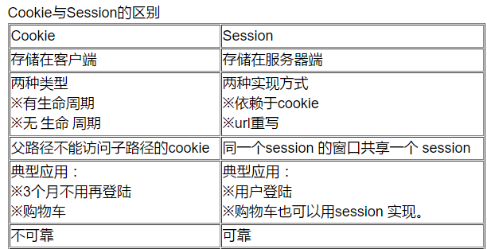
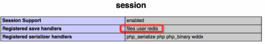

[flask cookie设置](https://www.cnblogs.com/xxtalhr/p/9053906.html)


A．保存session id的方式可以采用cookie，这样在交互过程中浏览器可以自动的按照规则把这个标识发送给服务器。

B．由于cookie可以被人为的禁止，必须有其它的机制以便在cookie被禁止时仍然能够把session id传递回服务器，经常采用的一种技术叫做URL重写，就是把session id附加在URL路径的后面，附加的方式也有两种，一种是作为URL路径的附加信息，另一种是作为查询字符串附加在URL后面。网络在整个交互过程中始终保持状态，就必须在每个客户端可能请求的路径后面都包含这个session id。

C．另一种技术叫做表单隐藏字段。就是服务器会自动修改表单，添加一个隐藏字段，以便在表单提交时能够把session id传递回服务器。


**2、  session产生的session_id放在cookie里面，如果用户把cookie禁止掉，是不是session也不能用了呢？**

​	禁止掉cookie后，session当然可以用，不过通过其他的方式来获得这个sessionid，比如，可以跟在url的后面，或者以表单的形势提交到服务器端。从而使服务器端了解客户端的状态。


**3、  为什么说session 比cookie更安全？**

真正的cookie存在于客户端硬盘上的一个文本文件，如果两者一样的话，只要cookie就好了，让客户端来分提服务器的负担，并且对于用户来说又是透明的。但实际上不是。

session的sessionID是放在cookie里，要想功破session的话，得分两步：

第一要得到sessionID。攻破cookie后，你要得到sessionID,sessionID是要有人登录，或者启动session_start才会有，你不知道什么时候会有人登录。

第二取有效sessionID。sessionID是加密的，第二次session_start的时候，前一次的sessionID就没有用了，session过期时sessionid也会失效，想在短时间内功破加了密的 sessionID很难。session是针对某一次通信而言，会话结束session也就随着消失了。


#### cookie和session的区别：

①存在的位置：

cookie 存在于客户端，临时文件夹中；  session存在于服务器的内存中，一个session域对象为一个用户浏览器服务

②安全性
cookie是以明文的方式存放在客户端的，安全性低，可以通过一个加密算法进行加密后存放；  session存放于服务器的内存中，所以安全性好

③网络传输量
cookie会传递消息给服务器；  session本身存放于服务器，不会有传送流量

④生命周期(以20分钟为例)
cookie的生命周期是累计的，从创建时，就开始计时，20分钟后，cookie生命周期结束；
session的生命周期是间隔的，从创建时，开始计时如在20分钟，没有访问session，那么session生命周期被销毁。但是，如果在20分钟内（如在第19分钟时）访问过session，那么，将重新计算session的生命周期。关机会造成session生命周期的结束，但是对cookie没有影响

5.单个cookie保存的数据不能超过4K，很多浏览器都限制一个站点最多保存20个cookie。



​    **面试题：浏览器关闭，****session就销毁了？** 

​        **不对，浏览器关闭和服务器session销毁没有任何关系！**


#### 6.跨域支持上的不同

Cookie支持跨域名访问，例如将domain属性设置为“.biaodianfu.com”，则以“.biaodianfu.com”为后缀的一切域名均能够访问该Cookie。跨域名Cookie如今被普遍用在网络中，例如Google、Baidu、Sina等。而Session则不会支持跨域名访问。Session仅在他所在的域名内有效。

仅运用Cookie或者仅运用Session可能完成不了理想的效果。这时应该尝试一下同时运用Cookie与Session。Cookie与Session的搭配运用在实践项目中会完成很多意想不到的效果。


#### cookie跨域问题

这个可以说是cookie中一个比较热门的问题，面试的时候一般很爱聊这方面的问题。

跨域的业务需求大概是酱紫：用户在a.com进行了登录，希望在b.com也同步进行了登录。如果是同一个主域比较简单，可以通过setcookie中的domain参数进行设定：例如有x.a.com和xx.a.com，可以通过设置domain为a.com，从而a.com的所有二级域名都可以共享这一个cookie。基于安全方面的原因，在a.com下面设置domain为b.com是无效的。

那么是否真的没有办法可以实现这个了呢？这个还是有一些奇巧淫技的，这里介绍一种使用内框iframe的方法。


#### session服务器共享

这个问题和cookie的跨域类似，面试的时候也很爱聊这个问题。

以前在做服务器集群的时候会碰到这样的一样问题，就是用户一会访问是处于正常登录状态，一会访问又没有登录了。这个问题偶尔才会出现。跟踪代码下去才发现session没有取到相应的值，想想也是醉了：原来服务器session没有设置共享，session存在在本地文件目录，当用户访问另外一台服务器的时候自然就取不到session了。

解决方法也不难，通过共享的存储在进行服务器之间的共享。这里使用redis的进行session存储。可以通过php.ini配置文件进行调整，也可以在代码中通过ini_set进行调整

```
ini_set("session.save_handler", "redis");
ini_set("session.save_path", "tcp://127.0.0.1:6379”);12
```

如果需要使用redis进行存储，需要session中的Registered save handlers支持redis 
 
php中session是否支持redis

当这样设置之后，session就会保存在redis中了，不同的集群服务器之间就可以通过该redis服务器进行共享了。