[http1.0和http1.1区别](https://www.jianshu.com/p/ac628fda40f2?utm_campaign=maleskine&utm_content=note&utm_medium=seo_notes&utm_source=recommendation)

HTTP是一个基于TCP/IP通信协议来传递数据（HTML 文件, 图片文件, 查询结果等）。

#### HTTP三点注意事项：

- HTTP是无连接：无连接的含义是限制每次连接只处理一个请求。服务器处理完客户的请求，并收到客户的应答后，即断开连接。采用这种方式可以节省传输时间。
- HTTP是媒体独立的：这意味着，只要客户端和服务器知道如何处理的数据内容，任何类型的数据都可以通过HTTP发送。客户端以及服务器指定使用适合的MIME-type内容类型。
- HTTP是无状态：HTTP协议是无状态协议。无状态是指协议对于事务处理没有记忆能力。缺少状态意味着如果后续处理需要前面的信息，则它必须重传，这样可能导致每次连接传送的数据量增大。另一方面，在服务器不需要先前信息时它的应答就较快。


#### ● 请你讲讲http1.1和1.0的区别

考察点：http

##### 参考回答：

**1、HTTP 1.1支持长连接（PersistentConnection）和请求的流水线（Pipelining）处理**

**HTTP 1.0规定浏览器与服务器只保持短暂的连接，浏览器的每次请求都需要与服务器建立一个TCP连接，服务器完成请求处理后立即断开TCP连接，服务器不跟踪每个客户也不记录过去的请求。**

HTTP 1.1则支持持久连接Persistent Connection, 并且默认使用persistent  connection. 在同一个tcp的连接中可以传送多个HTTP请求和响应. 多个请求和响应可以重叠，多个请求和响应可以同时进行. 更加多的请求头和响应头(比如HTTP1.0没有host的字段).

在1.0时的会话方式：

  1. 建立连接
  2. 发出请求信息

3. 回送响应信息
4. 关掉连接


（在request和response中的header中的connection是close或者Keep-Alive进行控制）

 **HTTP 1.1的持续连接，也需要增加新的请求头来帮助实现，例如，默认Connection请求头的值为Keep-Alive时，客户端通知服务器返回本次请求结果后保持连接；Connection请求头的值为close时，客户端通知服务器返回本次请求结果后关闭连接。****HTTP 1.1还提供了与身份认证、状态管理和Cache缓存等机制相关的请求头和响应头。**

请求的流水线（Pipelining）处理，在一个TCP连接上可以传送多个HTTP请求和响应，减少了建立和关闭连接的资源消耗和时间延迟。例如：一个包含有许多图像的网页文件的多个请求和应答可以在一个连接中传输，但每个单独的网页文件的请求和应答仍然需要使用各自的连接。  HTTP 1.1还允许客户端不用等待上一次请求结果返回，就可以发出下一次请求，但服务器端必须按照接收到客户端请求的先后顺序依次回送响应结果，以保证客户端能够区分出每次请求的响应内容。


**2.HTTP 1.1增加host字段**

在HTTP1.0中认为每台服务器都绑定一个唯一的IP地址，因此，请求消息中的URL并没有传递主机名（hostname）。但随着虚拟主机技术的发展，在一台物理服务器上可以存在多个虚拟主机（Multi-homed Web Servers），并且它们共享一个IP地址。

 HTTP1.1的请求消息和响应消息都应支持Host头域，且请求消息中如果没有Host头域会报告一个错误（400 Bad Request）。此外，服务器应该接受以绝对路径标记的资源请求。

##### http 1.1 增加了请求头和响应头来扩充功能

​	a. 支持Host请求：

​	b. Connection: 请求头的值为Connection时，客户端通知服务器返回本次请求结果后保持连接；Connection请求头的值为close 时，客户端通知服务器返回本次请求结果后关闭连接

​	c. 支持断点续传:

​	d.身份认证：

​	e.状态管理:

​	f. 缓存处理：


**3、100(Continue) Status(节约带宽)**

HTTP/1.1加入了一个新的状态码100（Continue）。客户端事先发送一个只带头域的请求，如果服务器因为权限拒绝了请求，就回送响应码401（Unauthorized）；如果服务器接收此请求就回送响应码100，客户端就可以继续发送带实体的完整请求了。100 (Continue) 状态代码的使用，允许客户端在发request消息body之前先用request header试探一下server，看server要不要接收request body，再决定要不要发request body。


**4**、HTTP/1.1中引入了Chunked transfer-coding来解决上面这个问题，发送方将消息分割成若干个任意大小的数据块，每个数据块在发送时都会附上块的长度，最后用一个零长度的块作为消息结束的标志。这种方法允许发送方只缓冲消息的一个片段，避免缓冲整个消息带来的过载。


**5.支持http管道**

不使用管道的http请求，在使用持久链接时，必须严格满足先进先出的队列顺序（FIFO），即发送请求，等待响应完成，再发送客户端队列中的下一个请求。管道可以让我们把 FIFO 队列从客户端（请求队列）迁移到服务器（响应队列），即客户端可以并行，服务端串行。客户端可以不用等待前一个请求返回，发送请求，但服务器端必须顺序的返回客户端的请求响应结果。

##### 缺点：

​	a. 一个请求响应阻塞，就会阻塞后续所有请求

​	b. 并行处理请求时，服务器必须缓冲管道中的响应，从而占用服务器资源，如果有个响应非常大，则很容易形成服务器的受攻击面；

​	c. 响应失败可能终止 TCP 连接，从页强迫客户端重新发送对所有后续资源的请求，导致重复处理；

​	d. 由于可能存在中间代理，因此检测管道兼容性，确保可靠性很重要；

​	e. 如果中间代理不支持管道，那它可能会中断连接，也可能会把所有请求串联起来。	


##### 6. 使用多个TCP链接

http1.1 在客户端排队所有请求，然后通过一个TCP持久链接，一个接一个的发送请求（如果有http管道还必须顺序等待服务端的顺序返回结果）。但实际中，浏览器的开发时不会这么笨，浏览器允许我们打开N个TCP链接（大多说浏览器是6个TCP链接，这个数字越大，客户端和服务器的资源占用越多，这个数据也只是感觉安全的数字而已）。

​	 **带来的好处：**

   1.客户端可以并行发送最多 N个请求；

1. 服务器可以并行处理最多 N个请求；
2. 第一次往返可以发送的累计分组数量（TCP cwnd）增长为原来的 N 倍。

##### 代价：

1.更多的套接字会占用客户端、服务器以及代理的资源，包括内存缓冲区和 CPU时钟周期；

2.并行 TCP 流之间竞争共享的带宽；

3.由于处理多个套接字，实现复杂性更高；

4.即使并行 TCP 流，应用的并行能力也受限制。

因此使用多个TCP链接只是权宜之计，后续的http 2.0支持多路复用，很好的解决了上述问题。


### 一、HTTP1.0和HTTP2.0的区别

##### ①HTTP2.0使用了多路复用的技术，做到同一个连接并发处理多个请求，而且并发请求的数量比HTTP1.1大了好几个数量级。

当然HTTP1.1也可以多建立几个TCP连接，来支持处理更多并发的请求，但是创建TCP连接本身也是有开销的。

##### 2.首部压缩

在 HTTP/1 中，HTTP 请求和响应都是由「状态行、请求 / 响应头部、消息主体」三部分组成。一般而言，消息主体都会经过 gzip 压缩，或者本身传输的就是压缩过后的二进制文件（例如图片、音频），但状态行和头部却没有经过任何压缩，直接以纯文本传输。

随着 Web 功能越来越复杂，每个页面产生的请求数也越来越多，导致消耗在头部的流量越来越多，尤其是每次都要传输 UserAgent、Cookie 这类不会频繁变动的内容，完全是一种浪费。

我们再用通俗的语言解释下，压缩的原理。头部压缩需要在支持 HTTP/2 的浏览器和服务端之间：

维护一份相同的静态字典（Static Table），包含常见的头部名称，以及特别常见的头部名称与值的组合；

维护一份相同的动态字典（Dynamic Table），可以动态的添加内容；

支持基于静态哈夫曼码表的哈夫曼编码（Huffman Coding）；

静态字典的作用有两个：

1）对于完全匹配的头部键值对，例如 “:method :GET”，可以直接使用一个字符表示；

2）对于头部名称可以匹配的键值对，例如 “cookie :xxxxxxx”，可以将名称使用一个字符表示。

HTTP/2 中的静态字典如下（以下只截取了部分，完整表格在这里）：

同时，浏览器和服务端都可以向动态字典中添加键值对，之后这个键值对就可以使用一个字符表示了。需要注意的是，动态字典上下文有关，需要为每个 HTTP/2 连接维护不同的字典。在传输过程中使用，使用字符代替键值对大大减少传输的数据量。 


③当我们对支持HTTP2.0的web server请求数据的时候，服务器会顺便把一些客户端需要的资源一起推送到客户端，免得客户端再次创建连接发送请求到服务器端获取。这种方式非常合适加载静态资源。

##### HTTP2支持服务器推送

服务端推送是一种在客户端请求之前发送数据的机制。当代网页使用了许多资源:HTML、样式表、脚本、图片等等。在HTTP/1.x中这些资源每一个都必须明确地请求。这可能是一个很慢的过程。浏览器从获取HTML开始，然后在它解析和评估页面的时候，增量地获取更多的资源。因为服务器必须等待浏览器做每一个请求，网络经常是空闲的和未充分使用的。

为了改善延迟，HTTP/2引入了server push，它允许服务端推送资源给浏览器，在浏览器明确地请求之前。一个服务器经常知道一个页面需要很多附加资源，在它响应浏览器第一个请求的时候，可以开始推送这些资源。这允许服务端去完全充分地利用一个可能空闲的网络，改善页面加载时间。

其实说白了，就是HTTP2.0中，浏览器在请求HTML页面的时候，服务端会推送css、js等其他资源给浏览器，减少网络空闲浪费。 


#### ● 请说明一下http和https的区别

考察点：http协议

**参考回答；**

​	1、https协议需要到ca申请证书，一般免费证书较少，因而需要一定费用。

​	2、http是超文本传输协议，信息是明文传输，https则是具有安全性的ssl加密传输协议。

​	3、http和https使用的是完全不同的连接方式，用的端口也不一样，前者是80，后者是443。

​	4、http的连接很简单，是无状态的；HTTPS协议是由SSL+HTTP协议构建的可进行加密传输、身份认证的网络协议，比http协议安全。


#### ● 请解释一下，http请求中的304状态码的含义

考察点：http

##### 参考回答：

304(未修改)自从上次请求后，请求的网页未修改过。服务器返回此响应时，不会返回网页内容。如果网页自请求者上次请求后再也没有更改过，您应将服务器配置为返回此响应(称为 If-Modified-Since HTTP 标头)。服务器可以告诉 Googlebot 自从上次抓取后网页没有变更，进而节省带宽和开销。


[http经典文章](https://www.cnblogs.com/lauhp/p/8979393.html#top)

## HTTP简介

HTTP协议是Hyper Text Transfer Protocol（超文本传输协议）的缩写,是用于从万维网（WWW:World Wide Web ）服务器传输超文本到本地浏览器的传送协议。。
HTTP是一个基于TCP/IP通信协议来传递数据（HTML 文件, 图片文件, 查询结果等）。

#### HTTP工作原理

HTTP三点注意事项：

- HTTP是无连接：无连接的含义是限制每次连接只处理一个请求。服务器处理完客户的请求，并收到客户的应答后，即断开连接。采用这种方式可以节省传输时间。
- HTTP是媒体独立的：这意味着，只要客户端和服务器知道如何处理的数据内容，任何类型的数据都可以通过HTTP发送。客户端以及服务器指定使用适合的MIME-type内容类型。
- HTTP是无状态：HTTP协议是无状态协议。无状态是指协议对于事务处理没有记忆能力。缺少状态意味着如果后续处理需要前面的信息，则它必须重传，这样可能导致每次连接传送的数据量增大。另一方面，在服务器不需要先前信息时它的应答就较快。


#### HTTP消息结构

##### HTTP请求消息

一个HTTP请求报文由请求行（request line）、请求头（header）、空行和请求数据4个部分组成，下图给出了请求报文的一般格式。

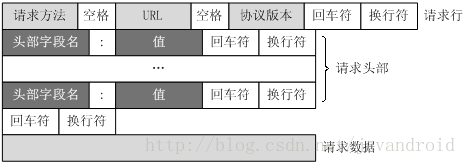

 

##### 1.请求行

请求行由请求方法字段、URL字段和HTTP协议版本字段3个字段组成，它们用空格分隔。例如，GET /index.html HTTP/1.1。

根据HTTP标准，HTTP请求可以使用多种请求方法。
HTTP1.0定义了三种请求方法： GET, POST 和 HEAD方法。
HTTP1.1新增了五种请求方法：OPTIONS, PUT, DELETE, TRACE 和 CONNECT 方法。

 

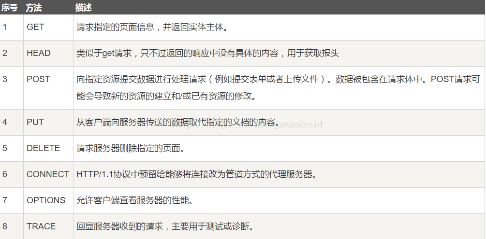

而常见的有如下几种：

1).GET

最常见的一种请求方式，当客户端要从服务器中读取文档时，当点击网页上的链接或者通过在浏览器的地址栏输入网址来浏览网页的，使用的都是GET方式。GET方法要求服务器将URL定位的资源放在响应报文的数据部分，回送给客户端。使用GET方法时，请求参数和对应的值附加在URL后面，利用一个问号（“?”）代表URL的结尾与请求参数的开始，传递参数长度受限制。例如，/index.jsp?id=100&op=bind,这样通过GET方式传递的数据直接表示在地址中，所以我们可以把请求结果以链接的形式发送给好友。以用google搜索domety为例，Request格式如下：

```http
1. GET /search?hl=zh-CN&source=hp&q=domety&aq=f&oq= HTTP/1.1    
2. Accept: image/gif, image/x-xbitmap, image/jpeg, image/pjpeg, application/vnd.ms-excel, application/vnd.ms-powerpoint,   
3. application/msword, application/x-silverlight, application/x-shockwave-flash, /    
4. Referer: http://www.google.cn/
5. Accept-Language: zh-cn    
6. Accept-Encoding: gzip, deflate    
7. User-Agent: Mozilla/4.0 (compatible; MSIE 6.0; Windows NT 5.1; SV1; .NET CLR 2.0.50727; TheWorld)    
8. Host: www.google.cn
9. Connection: Keep-Alive    
10. Cookie: PREF=ID=80a06da87be9ae3c:U=f7167333e2c3b714:NW=1:TM=1261551909:LM=1261551917:S=ybYcq2wpfefs4V9g;   
11. NID=31=ojj8d-IygaEtSxLgaJmqSjVhCspkviJrB6omjamNrSm8lZhKy_yMfO2M4QMRKcH1g0iQv9u-2hfBW7bUFwVh7pGaRUb0RnHcJU37y-  
12. FxlRugatx63JLv7CWMD6UB_O_r   
```


可以看到，GET方式的请求一般不包含”请求内容”部分，请求数据以地址的形式表现在请求行。地址链接如下：

```html
1. <a href="http://www.google.cn/search?hl=zh-CN&source=hp&q=domety&aq=f&oq=">http://www.google.cn/search?hl=zh-CN&source=hp  
2. &q=domety&aq=f&oq=</a>  
```

地址中”?”之后的部分就是通过GET发送的请求数据，我们可以在地址栏中清楚的看到，各个数据之间用”&”符号隔开。显然，这种方式不适合传送私密数据。另外，由于不同的浏览器对地址的字符限制也有所不同，一般最多只能识别1024个字符，所以如果需要传送大量数据的时候，也不适合使用GET方式。

2).POST

对于上面提到的不适合使用GET方式的情况，可以考虑使用POST方式，因为使用POST方法可以允许客户端给服务器提供信息较多。POST方法将请求参数封装在HTTP请求数据中，以名称/值的形式出现，可以传输大量数据，这样POST方式对传送的数据大小没有限制，而且也不会显示在URL中。还以上面的搜索domety为例，如果使用POST方式的话，格式如下：

```http
1. POST /search HTTP/1.1    
2. Accept: image/gif, image/x-xbitmap, image/jpeg, image/pjpeg, application/vnd.ms-excel, application/vnd.ms-powerpoint,   
3. application/msword, application/x-silverlight, application/x-shockwave-flash, /    
4. Referer: http://www.google.cn/
5. Accept-Language: zh-cn    
6. Accept-Encoding: gzip, deflate    
7. User-Agent: Mozilla/4.0 (compatible; MSIE 6.0; Windows NT 5.1; SV1; .NET CLR 2.0.50727; TheWorld)    
8. Host: www.google.cn
9. Connection: Keep-Alive    
10. Cookie: PREF=ID=80a06da87be9ae3c:U=f7167333e2c3b714:NW=1:TM=1261551909:LM=1261551917:S=ybYcq2wpfefs4V9g;   
11. NID=31=ojj8d-IygaEtSxLgaJmqSjVhCspkviJrB6omjamNrSm8lZhKy_yMfO2M4QMRKcH1g0iQv9u-2hfBW7bUFwVh7pGaRUb0RnHcJU37y-  
12. FxlRugatx63JLv7CWMD6UB_O_r    
13.   
14. hl=zh-CN&source=hp&q=domety  

```

可以看到，POST方式请求行中不包含数据字符串，这些数据保存在”请求内容”部分，各数据之间也是使用”&”符号隔开。POST方式大多用于页面的表单中。因为POST也能完成GET的功能，因此多数人在设计表单的时候一律都使用POST方式，其实这是一个误区。GET方式也有自己的特点和优势，我们应该根据不同的情况来选择是使用GET还是使用POST。

3).HEAD

HEAD就像GET，只不过服务端接受到HEAD请求后只返回响应头，而不会发送响应内容。当我们只需要查看某个页面的状态的时候，使用HEAD是非常高效的，因为在传输的过程中省去了页面内容。

#### 2.请求头

请求头部由关键字/值对组成，每行一对，关键字和值用英文冒号“:”分隔。请求头部通知服务器有关于客户端请求的信息，典型的请求头有：

- User-Agent：产生请求的浏览器类型。
- Accept：客户端可识别的内容类型列表。
- Host：请求的主机名，允许多个域名同处一个IP地址，即虚拟主机。

#### 3.空行

最后一个请求头之后是一个空行，发送回车符和换行符，通知服务器以下不再有请求头。

#### 4.请求数据

请求数据不在GET方法中使用，而是在POST方法中使用。POST方法适用于需要客户填写表单的场合。与请求数据相关的最常使用的请求头是Content-Type和Content-Length。

#### 实例

1).GET

 ```http
//请求首行
GET /hello/index.jsp HTTP/1.1
//请求头信息，因为GET请求没有正文
Host: localhost
User-Agent: Mozilla/5.0 (Windows NT 5.1; rv:5.0) Gecko/20100101 Firefox/5.0
Accept: text/html,application/xhtml+xml,application/xml;q=0.9,*/*;q=0.8
Accept-Language: zh-cn,zh;q=0.5
Accept-Encoding: gzip, deflate
Accept-Charset: GB2312,utf-8;q=0.7,*;q=0.7
Connection: keep-alive
Cookie: JSESSIONID=369766FDF6220F7803433C0B2DE36D98
//空行
//因为GET没有正文，所以下面为空
 ```

2).POST

```http
// 请求首行
POST /hello/index.jsp HTTP/1.1
//请求头信息
Host: localhost
User-Agent: Mozilla/5.0 (Windows NT 5.1; rv:5.0) Gecko/20100101 Firefox/5.0
Accept: text/html,application/xhtml+xml,application/xml;q=0.9,*/*;q=0.8
Accept-Language: zh-cn,zh;q=0.5
Accept-Encoding: gzip, deflate
Accept-Charset: GB2312,utf-8;q=0.7,*;q=0.7
Connection: keep-alive
Referer: http://localhost/hello/index.jsp
Cookie: JSESSIONID=369766FDF6220F7803433C0B2DE36D98
Content-Type: application/x-www-form-urlencoded 
Content-Length: 14 
// 这里是空行
//POST有请求正文
username=hello
```


#### HTTP响应消息

HTTP响应也由三个部分组成，分别是：状态行、响应头、空行、响应正文。
正如你所见，在响应中唯一真正的区别在于第一行中用状态信息代替了请求信息。状态行（status line）通过提供一个状态码来说明所请求的资源情况。
状态行格式如下：

 ```http
HTTP-Version    Status-Code    Reason-Phrase    CRLF  
 ```

其中，HTTP-Version表示服务器HTTP协议的版本；
Status-Code表示服务器发回的响应状态代码；
Reason-Phrase表示状态代码的文本描述。

 

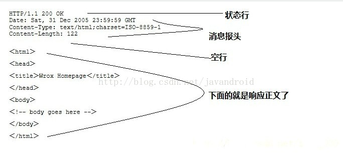

#### HTTP状态码

当浏览者访问一个网页时，浏览者的浏览器会向网页所在服务器发出请求。当浏览器接收并显示网页前，此网页所在的服务器会返回一个包含HTTP状态码的信息头（server header）用以响应浏览器的请求。
HTTP状态码的英文为HTTP Status Code。状态代码由三位数字组成，第一个数字定义了响应的类别，且有五种可能取值。

- 1xx：指示信息--表示请求已接收，继续处理。(跨域问题,预检)
- 2xx：成功--表示请求已被成功接收、理解、接受。
- 3xx：重定向--要完成请求必须进行更进一步的操作。
- 4xx：客户端错误--请求有语法错误或请求无法实现。
- 5xx：服务器端错误--服务器未能实现合法的请求。

常见状态代码、状态描述的说明如下。

重点：200,304,403，404,500

- 200 OK：客户端请求成功。
- 304 (未修改) 自从上次请求后，请求的网页未修改过。 服务器返回此响应时，不会返回网页内容。
- 400 Bad Request：客户端请求有语法错误，不能被服务器所理解。
- 401 Unauthorized：请求未经授权，这个状态代码必须和WWW-Authenticate报头域一起使用。
- **403 Forbidden**：服务器收到请求，但是拒绝提供服务。
- 404 Not Found：请求资源不存在，举个例子：输入了错误的URL。
- 500 Internal Server Error：服务器发生不可预期的错误。
- 503 Server Unavailable：服务器当前不能处理客户端的请求，比如负载过大，或者停机维护，一段时间后可能恢复正常，举个例子：HTTP/1.1 200 OK（CRLF）。

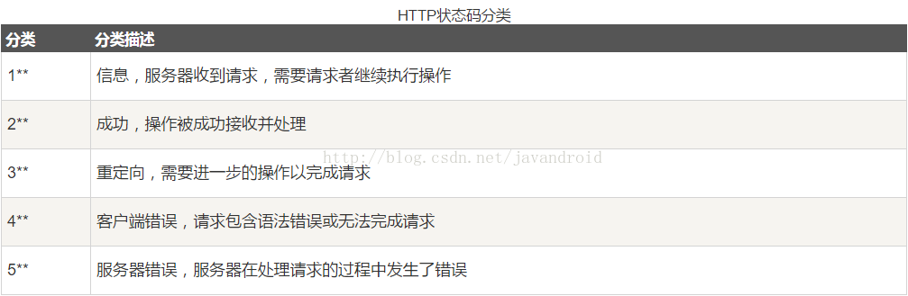

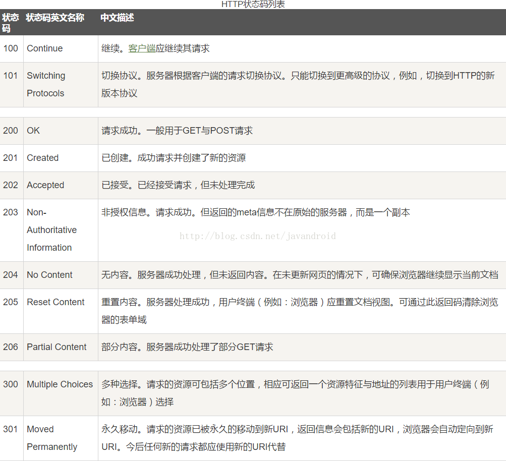

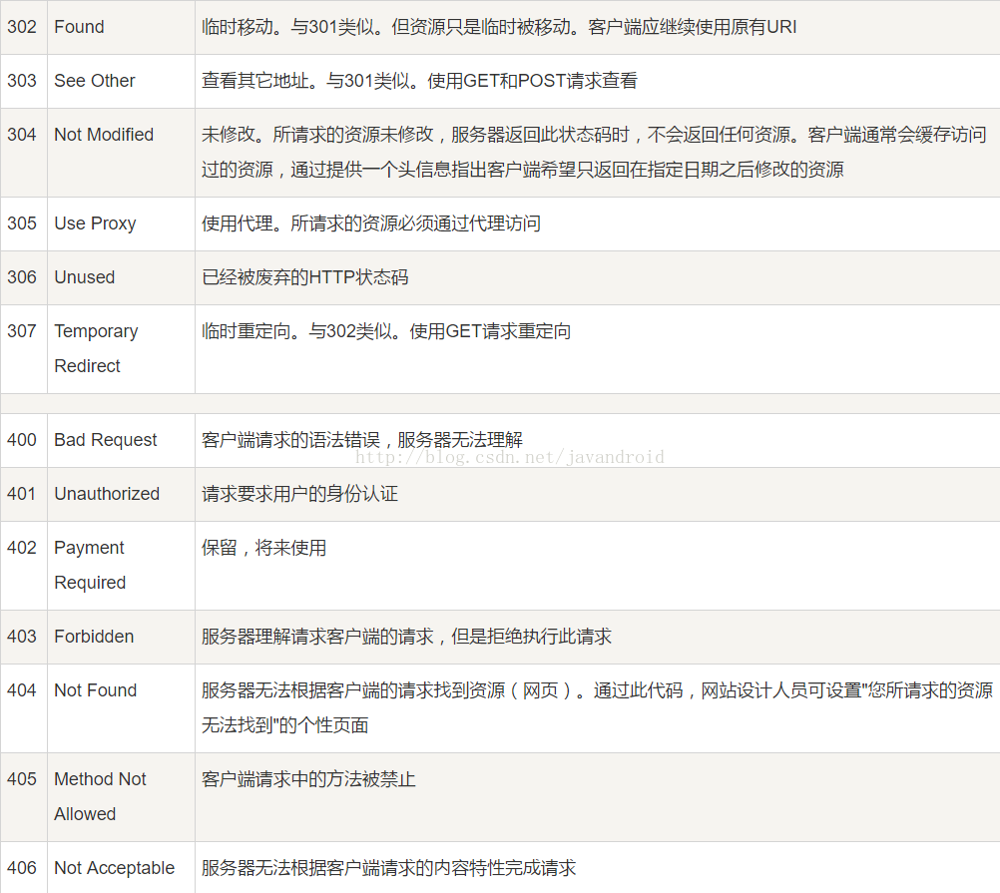

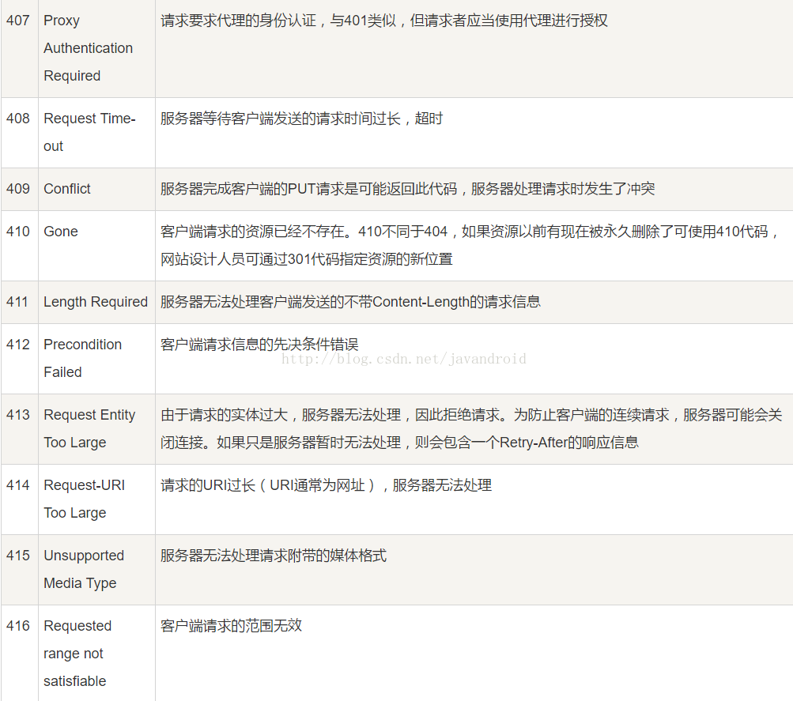

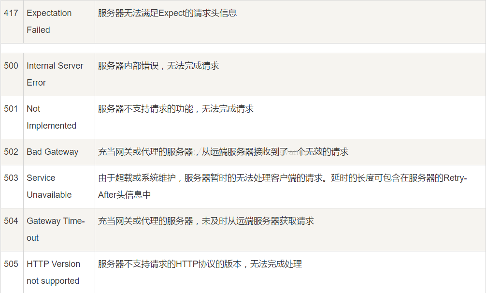

 

### HTTP响应头

 

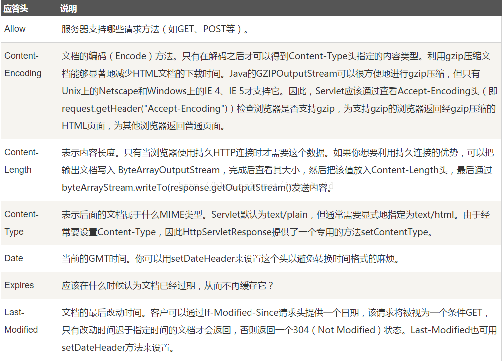

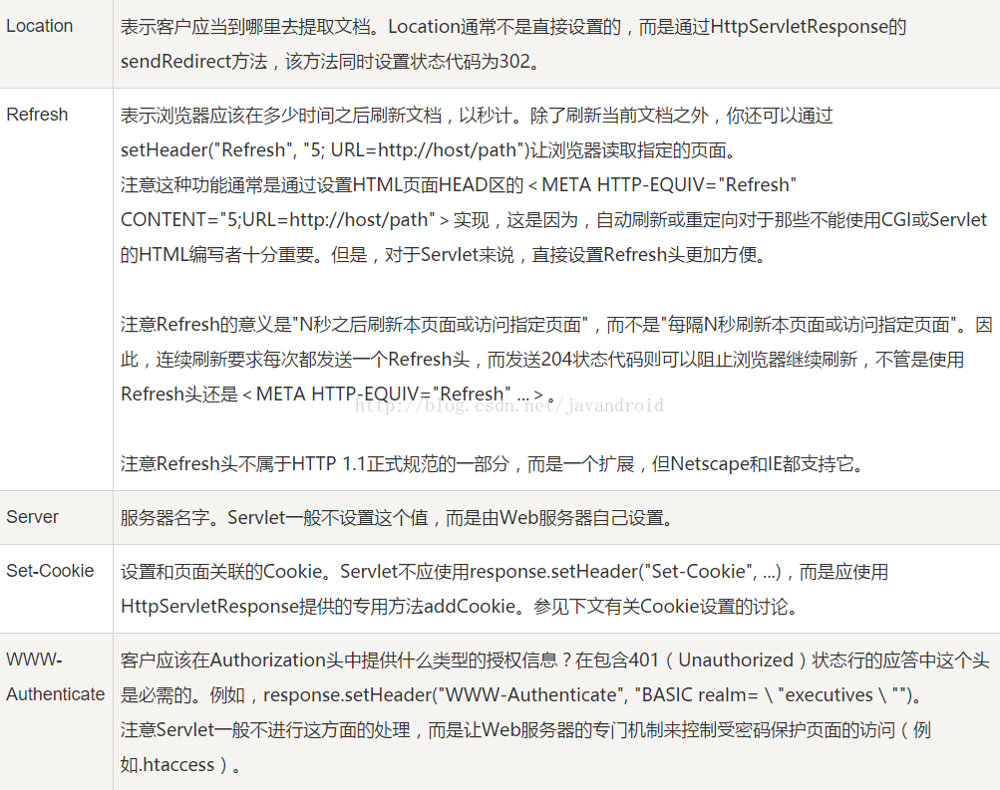

#### HTTP content-Type

Content-Type，内容类型，一般是指网页中存在的Content-Type，用于定义网络文件的类型和网页的编码，决定浏览器将以什么形式、什么编码读取这个文件，这就是经常看到一些Asp网页点击的结果却是下载到的一个文件或一张图片的原因。

[HTTP content-type 对照表](http://www.runoob.com/http/http-content-type.html)

 

#### 关于HTTP请求GET和POST的区别

- 1.GET提交，请求的数据会附在URL之后（就是把数据放置在HTTP协议头＜request-line＞中），以?分割URL和传输数据，多个参数用&连接;例如：login.action?name=hyddd&password=idontknow&verify=%E4%BD%A0 %E5%A5%BD。如果数据是英文字母/数字，原样发送，如果是空格，转换为+，如果是中文/其他字符，则直接把字符串用BASE64加密，得出如： %E4%BD%A0%E5%A5%BD，其中％XX中的XX为该符号以16进制表示的ASCII。

    POST提交：把提交的数据放置在是HTTP包的包体＜request-body＞中。上文示例中红色字体标明的就是实际的传输数据

    因此，GET提交的数据会在地址栏中显示出来，而POST提交，地址栏不会改变

- 2.传输数据的大小：

   首先声明,HTTP协议没有对传输的数据大小进行限制，HTTP协议规范也没有对URL长度进行限制。 而在实际开发中存在的限制主要有：

   GET:特定浏览器和服务器对URL长度有限制，例如IE对URL长度的限制是2083字节(2K+35)。对于其他浏览器，如Netscape、FireFox等，理论上没有长度限制，其限制取决于[操作系统](http://lib.csdn.net/base/operatingsystem)的支持。

   因此对于GET提交时，传输数据就会受到URL长度的限制。

   POST:由于不是通过URL传值，理论上数据不受限。但实际各个WEB服务器会规定对post提交数据大小进行限制，Apache、IIS6都有各自的配置。

- 3.安全性：

​    POST的安全性要比GET的安全性高。注意：这里所说的安全性和上面GET提到的“安全”不是同个概念。上面“安全”的含义仅仅是不作数据修改，而这里安全的含义是真正的Security的含义，比如：通过GET提交数据，用户名和密码将明文出现在URL上，因为(1)登录页面有可能被浏览器缓存，GET请求会被浏览器主动cache，而POST不会，除非手动设置。 (2)其他人查看浏览器的历史纪录，那么别人就可以拿到你的账号和密码了，GET请求参数会被完整保留在浏览器历史记录里，而POST中的参数不会被保留。


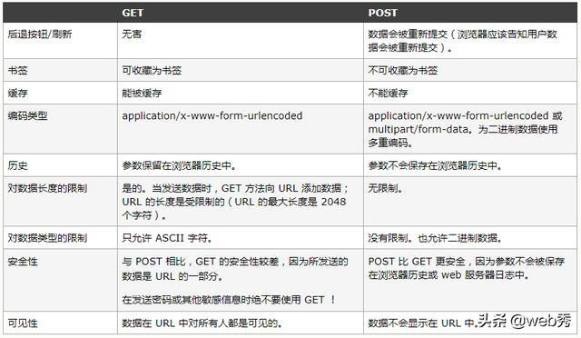


[GET和POST区别](https://www.cnblogs.com/logsharing/p/8448446.html)

HTTP的底层是TCP/IP。所以GET和POST的底层也是TCP/IP，也就是说，GET/POST都是TCP链接。GET和POST能做的事情是一样一样的。你要给GET加上request body，给POST带上url参数，技术上是完全行的通的。

在我大万维网世界中，TCP就像汽车，我们用TCP来运输数据，它很可靠，从来不会发生丢件少件的现象。但是如果路上跑的全是看起来一模一样的汽车，那这个世界看起来是一团混乱，送急件的汽车可能被前面满载货物的汽车拦堵在路上，整个交通系统一定会瘫痪。为了避免这种情况发生，交通规则HTTP诞生了。HTTP给汽车运输设定了好几个服务类别，有GET, POST, PUT, DELETE等等，HTTP规定，当执行GET请求的时候，要给汽车贴上GET的标签（设置method为GET），而且要求把传送的数据放在车顶上（url中）以方便记录。如果是POST请求，就要在车上贴上POST的标签，并把货物放在车厢里。当然，你也可以在GET的时候往车厢内偷偷藏点货物，但是这是很不光彩；也可以在POST的时候在车顶上也放一些数据，让人觉得傻乎乎的。HTTP只是个行为准则，而TCP才是GET和POST怎么实现的基本。

 

但是，我们只看到HTTP对GET和POST参数的传送渠道（url还是requrest body）提出了要求。“标准答案”里关于参数大小的限制又是从哪来的呢？

在我大万维网世界中，还有另一个重要的角色：运输公司。不同的浏览器（发起http请求）和服务器（接受http请求）就是不同的运输公司。 虽然理论上，你可以在车顶上无限的堆货物（url中无限加参数）。但是运输公司可不傻，装货和卸货也是有很大成本的，他们会限制单次运输量来控制风险，数据量太大对浏览器和服务器都是很大负担。业界不成文的规定是，（大多数）浏览器通常都会限制url长度在2K个字节，而（大多数）服务器最多处理64K大小的url。超过的部分，恕不处理。如果你用GET服务，在request body偷偷藏了数据，不同服务器的处理方式也是不同的，有些服务器会帮你卸货，读出数据，有些服务器直接忽略，所以，虽然GET可以带request body，也不能保证一定能被接收到哦。

 

好了，现在你知道，GET和POST本质上就是TCP链接，并无差别。但是由于HTTP的规定和浏览器/服务器的限制，导致他们在应用过程中体现出一些不同。 


#### GET 方法的长度限制是怎么回事？

网络上都会提到浏览器地址栏输入的参数是有限的。

首先说明一点，HTTP 协议没有 Body 和 URL 的长度限制，对 URL 限制的大多是浏览器和服务器的原因。

浏览器原因就不说了，服务器是因为处理长 URL 要消耗比较多的资源，为了性能和安全（防止恶意构造长 URL 来攻击）考虑，会给 URL 长度加限制。

#### POST 方法比 GET 方法安全？

有人说POST 比 GET 安全，因为数据在地址栏上不可见。

然而，从传输的角度来说，他们都是不安全的，因为 HTTP 在网络上是明文传输的，只要在网络节点上捉包，就能完整地获取数据报文。

要想安全传输，就只有加密，也就是 HTTPS。

#### GET幂等

GET 用于获取信息，是无副作用的，是幂等的，且可缓存 POST 用于修改服务器上的数据，有副作用，非幂等，不可缓存

#### POST 方法会产生两个 TCP 数据包？

有些文章中提到，post 会将 header 和 body 分开发送，先发送 header，服务端返回 100 状态码再发送 body。

HTTP 协议中没有明确说明 POST 会产生两个 TCP 数据包，而且实际测试(Chrome)发现，header 和 body 不会分开发送。

所以，header 和 body 分开发送是部分浏览器或框架的请求方法，不属于 post 必然行为。

对于GET方式的请求，浏览器会把http header和data一并发送出去，服务器响应200（返回数据）；

而对于POST，浏览器先发送header，服务器响应100 continue，浏览器再发送data，服务器响应200 ok（返回数据）。

 

也就是说，GET只需要汽车跑一趟就把货送到了，而POST得跑两趟，第一趟，先去和服务器打个招呼“嗨，我等下要送一批货来，你们打开门迎接我”，然后再回头把货送过去。


因为POST需要两步，时间上消耗的要多一点，看起来GET比POST更有效。因此Yahoo团队有推荐用GET替换POST来优化网站性能。但这是一个坑！跳入需谨慎。为什么？

1. GET与POST都有自己的语义，不能随便混用。
2. 据研究，在网络环境好的情况下，发一次包的时间和发两次包的时间差别基本可以无视。而在网络环境差的情况下，两次包的TCP在验证数据包完整性上，有非常大的优点。
3. 并不是所有浏览器都会在POST中发送两次包，Firefox就只发送一次。


### **HTTP长连接与短链接**

 

**在HTTP/1.0中默认使用短连接。也就是说，客户端和服务器每进行一次HTTP操作，就建立一次连接，任务结束就中断连接**。当客户端浏览器访问的某个HTML或其他类型的Web页中包含有其他的Web资源（如JavaScript文件、图像文件、CSS文件等），每遇到这样一个Web资源，浏览器就会重新建立一个HTTP会话。

而从HTTP/1.1起，默认使用长连接，用以保持连接特性。使用长连接的HTTP协议，会在响应头加入这行代码：

```
Connection:keep-alive
```

 

**在使用长连接的情况下，当一个网页打开完成后，客户端和服务器之间用于传输HTTP数据的TCP连接不会关闭，客户端再次访问这个服务器时，会继续使用这一条已经建立的连接**。Keep-Alive不会永久保持连接，它有一个保持时间，可以在不同的服务器软件（如Apache）中设定这个时间。实现长连接需要客户端和服务端都支持长连接。

 

**HTTP协议的长连接和短连接，实质上是TCP协议的长连接和短连接。**