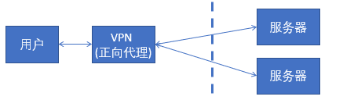

　Nginx是一款**轻量级**的网页服务器、反向代理器以及电子邮件代理服务器。


[转载于Edison Zhou,里面有实战](https://www.cnblogs.com/edisonchou/p/4126742.html)

### [正向代理与反向代理区别图解 (nginx)](https://www.cnblogs.com/xudong-bupt/p/8661523.html)

**1. 背景**

经常听到代理，比如通常我们要上国外的网站时，需要买vpn作为跳板机器进行访问。

但是在公司里面也听到了nginx支持反向代理。

那什么是正向代理，什么是反向代理？在网上看了写内容，说一下自己的理解。

**2. 正向代理**

正向代理，是在用户端的。比如需要访问某些国外网站，我们可能需要购买vpn。

并且**vpn是在我们的用户浏览器端设置的**(并不是在远端的服务器设置)。

浏览器先访问vpn地址，vpn地址转发请求，并最后将请求结果原路返回来。

==代理设置在客服端这百年进行==



 

**3. 反向代理**

有正向代理，就有反向代理。(哈哈，因为起名字的人也会考虑，为什么不叫代理，而是取名"正向"代理)。

**反向代理是作用在服务器端的，是一个虚拟ip(VIP)**。对于用户的一个请求，会转发到多个后端处理器中的一台来处理该具体请求。

大型网站都有DNS(域名解析服务器)，load balance(负载均衡器)等。

==代理服务器在服务器那边进行设置==


 

总结，nginx作为软件能支持反向代理，也就是说nginx可以作为负载均衡器。

(负载均衡器可以提高网站性能，支持更高并发请求)


#### 1.1 反向代理初印象

　　反向代理（Reverse Proxy）方式是指以**代理服务器来**接受internet上的连接请求，然后将**请求转发**给内部网络上的服务器，并将从服务器上得到的结果返回给internet上请求连接的客户端，此时代理服务器对外就表现为**\*一个服务器***。


　　从上图可以看出：反向代理服务器位于**网站机房**，代理网站Web服务器接收Http请求，对请求进行转发。

#### 1.2 反向代理的作用

　　①**保护网站安全：**任何来自Internet的请求都必须先经过代理服务器；


　　②**通过配置缓存功能加速Web请求：**可以缓存真实Web服务器上的某些静态资源，减轻真实Web服务器的负载压力；


　　③**实现负载均衡：**充当负载均衡服务器均衡地分发请求，平衡集群中各个服务器的负载压力；


#### 2.3 Nginx的核心特点

　　（1）**跨平台：**Nginx 可以在大多数 Unix like OS编译运行，而且也有Windows的移植版本；

　　（2）**配置异常简单：**非常容易上手。配置风格跟程序开发一样，神一般的配置；

　　（3）**非阻塞、高并发连接：**数据复制时，磁盘I/O的第一阶段是非阻塞的。官方测试能够支撑**5万**并发连接，在实际生产环境中跑到**2～3**万并发连接数。（这得益于Nginx使用了最新的epoll模型）；

​	（4）**事件驱动：**通信机制采用**epoll**模型，支持更大的并发连接。

​	（5）**Master/Worker结构**：一个master进程，生成一个或多个worker进程。


```python
PS：Master-Worker设计模式核心思想是将原来串行的逻辑并行化，并将逻辑拆分成很多独立模块并行执行。其中主要包含两个主要组件Master和Worker，Master主要将逻辑进行拆分，拆分为互相独立的部分，同时维护了Worker队列，将每个独立部分下发到多个Worker并行执行，Worker主要进行实际逻辑计算，并将结果返回给Master。

问：nginx采用这种进程模型有什么好处？

答：采用独立的进程，可以让互相之间不会影响，一个进程退出后，其它进程还在工作，服务不会中断，Master进程则很快重新启动新的Worker进程。当然，Worker进程的异常退出，肯定是程序有bug了，异常退出，会导致当前Worker上的所有请求失败，不过不会影响到所有请求，所以降低了风险。
```

​	（6）**内存消耗小：**处理大并发的请求内存消耗非常小。在3万并发连接下，开启的10个Nginx 进程才消耗150M内存（15M*10=150M）。

　　（7）**内置的健康检查功能：**如果 Nginx 代理的后端的某台 Web 服务器宕机了，会做一个健康检查，再发送的请求就不会发送到宕机的服务器了。重新将请求提交到其他的节点上。

　　（8）**节省带宽：**支持 GZIP 压缩，可以添加浏览器本地缓存的 Header 头。

​	 	这东西会把你的静态[文件压缩](https://www.baidu.com/s?wd=%E6%96%87%E4%BB%B6%E5%8E%8B%E7%BC%A9&tn=SE_PcZhidaonwhc_ngpagmjz&rsv_dl=gh_pc_zhidao)成gz格式的，然后[浏览器](https://www.baidu.com/s?wd=%E6%B5%8F%E8%A7%88%E5%99%A8&tn=SE_PcZhidaonwhc_ngpagmjz&rsv_dl=gh_pc_zhidao)会自动解压出来，优点是传输速度快了一些，缺点是会增加Server和Client双方的overhead

　　（9）**稳定性高：**用于反向代理，宕机的概率微乎其微。

​	（10）**静态资源配置**


#### nginx负载均衡实现算法

​	nginx 的 upstream目前支持 4 种方式的分配 

- 轮询（默认）

​      每个请求按时间顺序逐一分配到不同的后端服务器，如果后端服务器down掉，能自动剔除。 

- weight 

​      指定轮询几率，weight和访问比率成正比，用于后端服务器性能不均的情况。 

- ip_hash 

​      每个请求按访问ip的hash结果分配，这样每个访客固定访问一个后端服务器，可以解决session的问题。  

- fair（第三方） 

​      按后端服务器的响应时间来分配请求，响应时间短的优先分配。  

- url_hash（第三方）


##### 六、内存池的设计

​     为了减少避免出现内存碎片、减少向操作系统申请内存的次数、降低各个模块的开发复杂度，Nginx采用了简单的内存池（统一申请，统一释放）。比如为每个http请求分配一个内存池，请求结束时销毁整个内存池。


##### 5、Nginx是如何处理一个请求的呢？

​    首先，nginx在启动时，会解析配置文件，得到需要监听的端口与ip地址，然后在nginx的master进程里面

​    先初始化好这个监控的socket，再进行listen

​    然后再fork出多个子进程出来,  子进程会竞争accept新的连接。

此时，客户端就可以向nginx发起连接了。当客户端与nginx进行三次握手，与nginx建立好一个连接后

​    此时，某一个子进程会accept成功，然后创建nginx对连接的封装，即ngx_connection_t结构体
    接着，根据事件调用相应的事件处理模块，如http模块与客户端进行数据的交换。

最后，nginx或客户端来主动关掉连接，到此，一个连接就寿终正寝了

##### 9、为什么要做动、静分离？

​    在我们的软件开发中，有些请求是需要后台处理的（如：.jsp,.do等等），有些请求是不需要经过后台处理的（如：css、html、jpg、js等等文件）
    这些不需要经过后台处理的文件称为静态文件，否则动态文件。因此我们后台处理忽略静态文件。这会有人又说那我后台忽略静态文件不就完了吗
    当然这是可以的，但是这样后台的请求次数就明显增多了。在我们对资源的响应速度有要求的时候，我们应该使用这种动静分离的策略去解决
    动、静分离将网站静态资源（HTML，JavaScript，CSS，img等文件）与后台应用分开部署，提高用户访问静态代码的速度，降低对后台应用访问