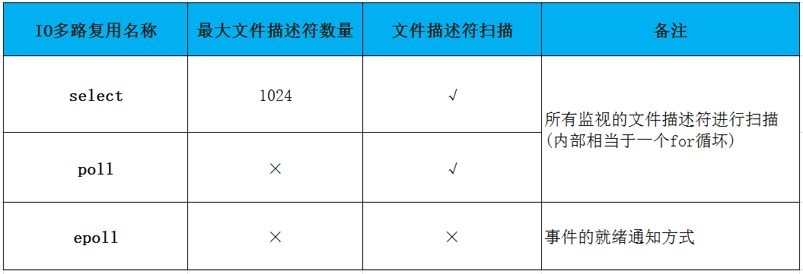

我们之前采用的多进程方式实现的服务器端，一次创建多个工作子进程来给客户端提供服务。其实这种方式是存在问题的。

可以打个比方：如果我们先前创建的几个进程承载不了目前快速发展的业务的话，是不是还得增加进程数？我们都知道系统创建进程是需要消耗大量资源的，所以这样就会导致系统资源不足的情况。

那么有没有一种方式可以让一个进程同时为多个客户端端提供服务？

接下来要讲的IO复用技术就是对于上述问题的最好解答。

<<<<<<< HEAD
## 一、前言

通常，我们写服务器处理模型的程序时，有以下几种模型：

（1）每收到一个请求，创建一个新的进程，来处理该请求；

（2）每收到一个请求，创建一个新的线程，来处理该请求；

（3）每收到一个请求，放入一个事件列表，让主进程通过非阻塞I/O方式来处理请求

上面的几种方式，各有千秋，

第（1）中方法，由于创建新的进程的开销比较大，所以，会导致服务器性能比较差,但实现比较简单。

第（2）种方式，由于要涉及到线程的同步，有可能会面临[死锁](https://baike.baidu.com/item/%E6%AD%BB%E9%94%81/2196938)等问题。

第（3）种方式，在写应用程序代码时，逻辑比前面两种都复杂。

综合考虑各方面因素，一般普遍认为第（3）种方式是大多数[网络服务器](http://baike.baidu.com/view/813.htm)采用的方式,第三种就是协程、事件驱动的方式，一般普遍认为第（3）种方式是大多数网络服务器采用的方式 


#### IO多路复用提出原因？

==IO多路复用细分的话，可以分为文件读写多路复用，和socket连接多路复用==

在数据通信过程中，分为两部分：

- 是等待数据到达内核缓冲区；
- 是将数据从内核缓冲区拷贝到用户区。

而往往在实际应用中，==等待数据到达内核缓冲区的时间往往比拷贝的时间多，所以我们如果想要提高效率；==
必然就是要将等的时间减少（在一定的时间内，减少等待的比重）

- 这个时候，IO多路转接就是解决这个问题的：一次监视多个文件描述符
- 在IO多路转接中，由于一次等待多个文件描述符，在单位时内就绪事件发生的概率就越大，所以等的比重就会越小。

而这里我们会有一个问题：监视的文件描述符返回条件是什么？

- 答: 1. 监视的文件描述符都有自己要关注的事件（读/写/异常事件)
- 返回条件就是：我们所监视（关心）的文件描述符的事件至少一个已经就绪
- IO多路转接的实现方式：
     1. select
     2. poll
     3. epoll等


=======
>>>>>>> d868fb1c03922a5988a4866b23e83bae94f00337
==**目前的常用的IO复用模型有三种：select，poll，epoll。**==


<<<<<<< HEAD
### 另一个版本

#### IO多路复用（select、poll、epoll）介绍及select、epoll的实现

IO多路复用中包括 select、pool、epoll，这些都属于同步，还不属于异步

#### 一、IO多路复用介绍

**1、select**

select最早于1983年出现在4.2BSD中，它通过一个select()系统调用来监视多个文件描述符的数组，当select()返回后，该数组中就绪的文件描述符便会被内核修改标志位，使得进程可以获得这些文件描述符从而进行后续的读写操作。

　　select目前几乎在所有的平台上支持，其良好跨平台支持也是它的一个优点，事实上从现在看来，这也是它所剩不多的优点之一。

　　select的一个缺点在于单个进程能够监视的文件描述符的数量存在最大限制，在Linux上一般为1024，不过可以通过修改宏定义甚至重新编译内核的方式提升这一限制。

　　另外，select()所维护的存储大量文件描述符的数据结构，随着文件描述符数量的增大，其复制的开销也线性增长。同时，由于网络响应时间的延迟使得大量TCP连接处于非活跃状态，但调用select()会对所有socket进行一次线性扫描，所以这也浪费了一定的开销。

**2、poll**

poll在1986年诞生于System V Release 3，它和select在本质上没有多大差别，但是poll没有最大文件描述符数量的限制。

　　poll和select同样存在一个缺点就是，包含大量文件描述符的数组被整体复制于用户态和内核的地址空间之间，而不论这些文件描述符是否就绪，它的开销随着文件描述符数量的增加而线性增大。

　　另外，select()和poll()将就绪的文件描述符告诉进程后，如果进程没有对其进行IO操作，那么下次调用select()和poll()的时候将再次报告这些文件描述符，所以它们一般不会丢失就绪的消息，这种方式称为水平触发（Level Triggered）。

**3、epoll**

直到Linux2.6才出现了由内核直接支持的实现方法，那就是epoll，它几乎具备了之前所说的一切优点，被公认为Linux2.6下性能最好的多路I/O就绪通知方法。

　　epoll可以同时支持水平触发和边缘触发（Edge Triggered，只告诉进程哪些文件描述符刚刚变为就绪状态，它只说一遍，如果我们没有采取行动，那么它将不会再次告知，这种方式称为边缘触发），理论上边缘触发的性能要更高一些，但是代码实现相当复杂。

　　epoll同样只告知那些就绪的文件描述符，而且当我们调用epoll_wait()获得就绪文件描述符时，返回的不是实际的描述符，而是一个代表就绪描述符数量的值，你只需要去epoll指定的一个数组中依次取得相应数量的文件描述符即可，这里也使用了内存映射（mmap）技术，这样便彻底省掉了这些文件描述符在系统调用时复制的开销。

　　另一个本质的改进在于epoll采用基于事件的就绪通知方式。在select/poll中，进程只有在调用一定的方法后，内核才对所有监视的文件描述符进行扫描，而epoll事先通过epoll_ctl()来注册一个文件描述符，一旦基于某个文件描述符就绪时，内核会采用类似callback的回调机制，迅速激活这个文件描述符，当进程调用epoll_wait()时便得到通知。

**4、sellect、poll、epoll三者的区别**



==epoll的方式，这种效率更高，但是这种方式在Windows下不支持，在Linux是支持的==


#### select模型：

##### 缺点：

- 代码编写复杂，维护起来较麻烦
- 每次调用select,都需要重新设置文件描述符（从用户态拷贝到内核态），开销大.
- 为什么需要重新设置？
  - 因为select的输入输出都调用的是同一个函数select，并且输入和输出是单独作为参数的这个时候我们就需要用一个第三方数组来保存之前的所关心的文件描述符，以便进行select返回后，和fdset进行FDISSET判断哪一个所监听的描述符哪个就绪，进行accept操作，并且方便下一次监听
- 使用过程中，从内核遍历文件描述符，当fd很多的时候，则会开销很大,
- 需要以轮询的方式去获取就绪的文件描述符
  - 能够接收的文件描述符有上限
     因为有第三方数组去维护，而这个数组开的最大空间就是：sizeof(fd_set)*8
     一般的操作系统，默认的是1024（一个bit位表示一个文件描述符
     （因为fd_set的底层是一个位图））


#### poll模型：

#####  优点 ：

- select的输入输出都是调用一个函数，参数是分开的，用位图来描述，使用起来开销会比较大；而poll使用一个pollfd的结构体来实现的 
- 解决了select能处理的文件描述符有上限的问题 因为poll解决了selec输入输出参数分开的问题，进而当然不需要再用第三方数组 去维护;所以poll能处理的文件描述符可以说是无上限了 （而这里肯定有它的一个上限，但是这个上限是操作系统的上限，和poll没有关系）

#####  缺点：

- 除了解决了select的部分缺点以外，其他的缺点poll也是有的


#### 但 select 和 poll 方式有一个很大的问题

​	我们不难看出来 select 是通过轮训的方式来查找是否可读或者可写，打个比方==，如果同时有100万个连接都没有断开，而只有一个客户端发送了数据，==所以这里它还是需要循环这么多次，造成资源浪费。

​	所以后来出现了 epoll系统调用。


#### epoll模型：

- epoll 是 select 和 poll 的增强版，epoll 同 poll 一样，文件描述符数量无限制。
- epoll是基于内核的反射机制，在有活跃的 socket 时，系统会调用我们提前设置的回调函数。而 poll 和 select 都是遍历。

#### 但是也并不是所有情况下 epoll 都比 select/poll 好，比如在如下场景：

在大多数客户端都很活跃的情况下，系统会把所有的回调函数都唤醒，所以会导致负载较高。既然要处理这么多的连接，那倒不如 select 遍历简单有效。

​	

==所以这三个是一步一步改进的，最终epoll是最高效的IO多路的就绪通知机制；==

==（这个高效的基础是：多连接，少量活跃的机制；如果场景不合适的话，有可能适得其反）==


##### 有些人说优点还有一个内存映射机制,这样的说法正确吗？：

1. 内存映射机制： 内存直接把就绪队列映射到用户态，

2. 但是我觉得这种说法是错误的。

    1. 就绪队列是操作系统在管理
    2. 而操作系统就不会把自己的内部暴露给用户态，如果暴露出去就不安全， 
    3. 我们在使用epoll_wait时，会告诉了我们所关心的文件描述符的事件已经就绪
       而这个时候有一个回调机制会告诉我们：所关心的哪个文件描述符的事件已经就绪
       不用操作系统一一去找，减少的操作系统的开销；
    4. 接下来就是把该文件描述符拷贝到就绪队列中；等我们处理的时候
       就不用轮询的去找就绪事件，而是 从就绪队列的开始找epoll_wait（） 
       的返回值（>0,成功的情况下）这么大的一个区间，这段区间就是当前的就绪事件
    5. 这个过程中，并没有映射，如果有映射的话，再传一个缓冲区，岂不是多此一举

    ​

[转载于](https://blog.csdn.net/qq_37941471/article/details/80954592)

#### 1. select的函数原型

```C++
 #include <sys/select.h>

int select(int nfds, fd_set *readfds, fd_set *writefds,\
           fd_set *exceptfds, struct timeval *timeout);
```

##### 2. 参数说明：

```c++
1. nfds ：表示的是等待的文件描述符中的最大的那个+1；  
         用于限定操作系统遍历的区间（只关心的那部分，其他的就不会去遍历，减少了开销） 

2. fd_set：该结构实际是一个位图；
          因为文件描述符其实是数组下标，也就是从0开始的整数；
          所以对于位图的每一个比特位表示的是一个文件描述符的状态；
          如果是1表示关心该文件描述符上的事件，是0，表示不关心该文件描述符上的事件。
          而具体关心文件描述符上的什么事件，则由中间三个参数决定。

3. readfds ：表示的是需要等待的读事件的文件描述符集；
4. writefds ：表示的是需要等待的写事件的文件描述符集；
5. exceptfds ：表示的是需要等待的异常事件的文件描述符集； 

   注意：以上三个位图参数都是输入输出型参数 ：
        1.作为输入参数：告诉系统我要关心的文件描述符的哪些事件
        2.作为输出参数：关心的文件描述符中哪些事件就绪
6. timeout：用于设置select阻塞等待的时间。
   取值如下：
   1. NULL：表示select阻塞等待，关心的多个文件描述符上没有时间发生时，
            进程会一直阻塞在select的函数调用处。
            如果至少有一个文件描述符上有事件发生，则select返回。 

            eg:
             select(max_fd+1,&rfds,NULL,NULL,NULL) 
            // 表示只监视该文件描述符的读事件 

   2. 0：表示select非阻塞等待，只是用于检测等待事件的状态。  
         当调用该函数时，不管有无事件发生，该函数都会立即返回，
         进程不会挂起等待事件的发生。 

        eg :
          // 设置select()的等待事件
          struct timeval timeout = {0,0};
          // 开始调用select等待所关心的文件描述符集
          select(max_fd+1,&rfds,NULL,NULL,&timeout)
          // 表示只监视该文件描述符的读事件

   3.特定的时间值：表示select只会阻塞等待一定的时间；
                 在该时间段内，如果有事件发生，则select返回，进程结束阻塞。 
                 如果达到规定的时间，还没有事件发生，此时select将会超时返回。  

          eg :
          // 设置select()的等待事件
          struct timeval timeout = {5,0};
          // 开始调用select等待所关心的文件描述符集
          select(max_fd+1,&rfds,NULL,NULL,&timeout)
          // 表示只监视该文件描述符的读事件
timeval的结构如下：
struct timeval {
               long    tv_sec;         /* seconds ：秒*/
               long    tv_usec;        /* microseconds：微秒 */
           };//头文件<sys/time.h>

```

##### 3. 返回值的含义：

```c
1. > 0 :满足就绪条件的事件个数
2. 0 : 在规定的时间内没有事件发生(超出timeout设置的时间)
3. -1 ：错误 
       原因由errno标识；此时中间三个参数的值变得不可预测。
```

##### 4. select模型—理解select的执行过程

```c
*** 关键在于理解fd_set

假设fd_set长度为1字节，即8个bit位，一个bit位可以表示一个文件描述符；
则1字节长的fd_set最大可以对应8个文件描述符(fd)

步骤：
（1）执行fd_set set; FD_ZERO(&set);则set用位表示是0000,0000。

（2）若fd＝5,执行FD_SET(fd,&set);后set变为0001,0000(第5位置为1)

（3）若再加入fd＝2，fd=1,则set变为0001,0011

（4）执⾏行select(6,&set,0,0,0)阻塞等待

（5）若fd=1,fd=2上都发生可读事件，则select返回，此时set变为0000,0011。
    注意：没有事件发生的fd=5被清空

1. 所以，在select之前需要将关心的文件描述符集合保存起来。这样便可设置下一次需要关心的
文件描述符集，同时select返回时也可由此判断哪些文件描述符上的事件就绪了。这里，可以
提供一个数组fdArray[]来保存关心的文件描述符。将文件描述符作为数组元素保存在数组中。

也就是说，fdArray[]数组来表示连接的客户端，该数组大小表示最多可以连接的数量

int fdArray[sizeof(fd_set)*8];//第三方数组 
sizeof(fd_set)*8 就是最多能够连接的数量

2. fd_set：该结构实际是一个位图；
          因为文件描述符其实是数组下标，也就是从0开始的整数；
          所以对于位图的每一个比特位表示的是一个文件描述符的状态；
          如果是1表示关心该文件描述符上的事件，是0，表示不关心该文件描述符上的事件。

```


##### 5. socket就绪条件：

```c
一. 读就绪：

    1. 当对内核中的数据进行读取时，如果接收缓冲区中的字节数，大于等于低水位
       SO_RCVLOWAT，此时就说明读就绪，在对该文件描述符调用read等进行读取时，
       不会阻塞，且返回值大于0；
    2. 在TCP通信中，如果服务器的socket上有新的连接到达时，客户端会发送SYN数据包
       给服务器，说明读就绪。此时在调用accept接收新连接时，不会阻塞。
       而且会返回新的文件描述符与客户端进行通信；
    3. TCP通信中，如果对端关闭连接，此时会发送FIN数据包。也说明读就绪，
       此时在调用read对文件描述符进行读取时，会返回0；
    4. 当socket上有未处理的错误时，也说明读就绪，
       在对文件描述符进行read读取时，会返回-1；

二.  写就绪：

    1. 在socket内核中，如果发送缓冲区中的可用字节数大于等于低水位 
       标记SO_SNDLOWAT时，说明写就绪，此时调用write进行写操作时，
       不会阻塞，且返回值大于0；
    2. 当一方要进行写操作（即关心的是写事件），而对端将文件描述符关闭，
       此时写就绪。调用write时会触发SIGPIPE信号；
    3. 当socket使用非阻塞connect连接成功或失败之后，写就绪；
    4. 当socket上有未读取的错误时，写就绪，此时write进行写时，会返回-1；

 三. 异常就绪：当socket上收到带外数据时，异常事件就绪。

```

##### 6. select的优缺点：

```c
优点 ：

1. 不需要fork或者pthread_create就可以实现一对多的通信，简化了进程线程的使用
   也就是没有多进程和多线程的一些缺点

2. 同时等待多个文件描述符，效率相对较高

缺点 ：

1. 代码编写复杂，维护起来较麻烦

2. 每次调用select，都需要把fd集合从用户态拷贝到内核态，
    在fd很多的情况下，循环次数多；开销大

3. 每次调用select都需要在内核遍历传递进来的所有fd，开销比较大

4. 能够接收的文件描述符有上限 
   select支持的文件描述符数量过小，默认是1024

```


[转载于](https://blog.csdn.net/qq_37941471/article/details/80979422)

### epoll

##### 1. int epoll_create(int size) ：

```c
官方的讲：创建一个epoll的句柄

其实呢，它是创建了一个epoll模型：

 1. 在操作系统内核构建一个红黑树

    节点 ： 表示要关心的哪个文件描述符的事件
    key键 ：用文件描述符作为key键

 2. 在操作系统内核构建一个回调机制 

    作用：就是减少了操作系统的开销（不用操作系统再去轮询的找就绪事件）
         有这么一个机制告诉我们，我们所关心的文件描述符的时间已经就绪
 3. 在操作系统内核构建一个就绪队列

    如何构建的：有了回调机制，告诉了我们所关心的文件描述符的事件已经就绪
              接下来就是把该文件描述符拷贝到就绪队列中；等我们处理的时候
              就不用轮询的去找就绪事件，而是 从就绪队列的开始找epoll_wait（） 
              的返回值（>0,成功的情况下）这么大的一个区间， 
              这段区间就是当前的就绪事件

这三个组在一起的返回值是fd(文件描述符)

```

##### 2. int epoll_ctl(int epfd, int op, int fd, struct epoll_event *event)：

```c
epoll的事件注册函数：要关心哪个文件描述符的事件

1. 第一个参数是epoll_create()的返回值：一个文件描述符；

2.第二个参数表示动作，三个宏来表示：

 EPOLL_CTL_ADD：注册新的fd到epfd中；

 EPOLL_CTL_MOD：修改已经注册的fd的监听事件；

 EPOLL_CTL_DEL：从epfd中删除一个fd；

3. 第三个参数是需要监听的fd ；

4. 第四个参数是告诉内核需要监听什么事 .

events可以是以下几个宏的集合：
EPOLLIN ：表示对应的文件描述符可以读（包括对端SOCKET正常关闭）；
EPOLLOUT：表示对应的文件描述符可以写；
EPOLLPRI：表示对应的文件描述符有紧急的数据可读（这个应该表示有带外数据到来）；
EPOLLERR：表示对应的文件描述符发⽣错误；
EPOLLHUP：表示对应的文件描述符被挂断；
EPOLLET： 将EPOLL设为边缘触发(Edge Triggered)模式， 
          这是相对于水平触发(LevelTriggered)来说的。
EPOLLONESHOT：只监听一次事件，当监听完这次事件之后，如果还需要继续  
             监听这个socket的话，需要再次把这个socket加入到EPOLL队列中。

```


##### 3.int epoll_wait(int epfd, struct epoll_event * events, int maxevents, int timeout);

```c
返回 ：关心事件已经就绪的事件

1. > 0 :满足就绪条件的事件个数
2. 0 : 在规定的时间内没有事件发生(超出timeout设置的时间)
3. -1 ：错误 
       原因由errno标识；此时中间三个参数的值变得不可预测。
```

#### 三. epoll的工作方式 :

```c
epoll的工作方式有两种：

  1. 水平触发(LT): 默认的

  2. 边缘触发(ET)

   另外：selete 和 poll其实也是在LT工作模式下的；而epoll是可以支持LT，又可以支持ET

   从我们的 epoll_ctl()中的第四个参数 struct epoll_event *event 可以看出，
   这里的结构体epoll_event中有一个字段： events；而这里的参数有一个： 

   EPOLLET： 将EPOLL设为边缘触发(Edge Triggered)模式， 
          这是相对于水平触发(LevelTriggered)来说的。 

   这就是将LT默认的方式变成ET模式的方式。

下面我们来讲一下ET模式和LT模式的区别 ：

```


#### LT模式 和 ET模式：

下面我们用一个快递员配送快递的例子来解释一下ET模式：

假如 ： 

1.我有5个快递，当一个快递到的时候，快递员就打电话让你取，一直打直到你把这个快递取走为止，下一个你的来了依然如此；很显然这样的快递员工作方式效率会很慢。

##### 上面的就是属于LT模式；

2.. 同样的，如果你有5个快递，当一个快递到的时候，快递员第一次给你送的的时候打一次电话，你不来他就替你收着（而这个时候，快递员不会等你），第二个你的来了再给你打一次，你不来他依然替你收着，每次只有快递数量变化的时候才会打电话，这个时候只有你哪一次有时间，将所有的快递都拿走。此种方式效率较高：因为快递员并没有去等

##### 这种模式属于 ET模式。

```c
LT模式 ：

    1. 当epoll检测到socket上的事件就绪时，可以不立即处理或者只处理一部分
    （例如：2KB的数据好了，此时可以一次读1KB，然后剩1KB)
    2. 在第二次调用epoll_wait的时候它依然会立即通知你,并且通知socket的读事件就绪
       直到缓存区内的数据都读完了，epoll_wait才不会立即返回
    3. 支持非阻塞与阻塞

ET模式 ：

   1. 当epoll检测到socket上的事件就绪时，必须立即处理
   （例如：2KB的数据好了，此时可以一次读1KB，然后剩1KB)
   2. 但是在第二次调用epoll_wait的时候，它不再立即返回通知你
      也就是说，ET模式下，数据就绪以后只有一次处理机会，所以要么不读，要么读完，
      不会有只读一部分的情况
      （只有在数据从 无变有 或者 少变多 的时候，才会通知你）
   3. 性能比LT高
   4. 只能采用非阻塞

另外为什么ET模式只支持非阻塞读写呢？

   因为： 数据就绪只通知一次，必须在通知后，一次处理完
         也就是说：如果使用ET模式，当数据就绪的时候就要一直读，直到数据读完为止

     1. 但是如果当前的fd是阻塞的，而读是循环的：那么在读完缓存区的时候，
        如果对端数据在写进来，那么该read函数就会一直阻塞，
        这不符合逻辑，不能这么使用 
      2. 那么就需要将fd设置成非阻塞，当没有数据的时候，read虽然读取不到任何的数据，
      但是肯定不会被阻塞住，那么此时说明缓冲区内数据已经读完，read返回继续后序的逻辑
```

=======
#### select模型：

说的通俗一点就是各个客户端连接的文件描述符也就是套接字，都被放到了一个集合中，调用select函数之后会一直监视这些文件描述符中有哪些可读，如果有可读的描述符那么我们的工作进程就去读取资源。PHP 中有内置的函数来完成 select 系统调用。

#### poll模型：

poll 和 select 的实现非常类似，本质上的区别就是存放 fd 集合的数据结构不一样。select 在一个进程内可以维持最多 1024 个连接，poll 在此基础上做了加强，可以维持任意数量的连接。

但 select 和 poll 方式有一个很大的问题就是，我们不难看出来 select 是通过轮训的方式来查找是否可读或者可写，打个比方，如果同时有100万个连接都没有断开，而只有一个客户端发送了数据，所以这里它还是需要循环这么多次，造成资源浪费。

所以后来出现了 epoll系统调用。

#### epoll模型：

epoll 是 select 和 poll 的增强版，epoll 同 poll 一样，文件描述符数量无限制。

epoll是基于内核的反射机制，在有活跃的 socket 时，系统会调用我们提前设置的回调函数。而 poll 和 select 都是遍历。

但是也并不是所有情况下 epoll 都比 select/poll 好，比如在如下场景：

在大多数客户端都很活跃的情况下，系统会把所有的回调函数都唤醒，所以会导致负载较高。既然要处理这么多的连接，那倒不如 select 遍历简单有效。
>>>>>>> d868fb1c03922a5988a4866b23e83bae94f00337
