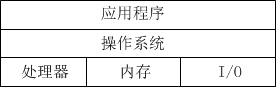
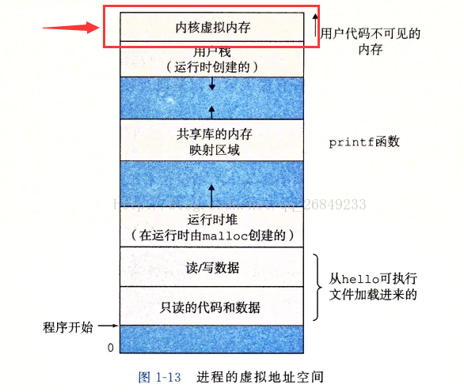

### 冯.诺依曼体系结构

我们常见的计算机：笔记本，台式计算机。而不常见的如服务器，大部分都遵循冯诺依曼体系


#### 组成：

```python
7. 输入单元：包括键盘，鼠标，扫描仪，写板等
8. 输出单元：显示器，打印机等
   另外，输入设备和输出设备都属于外设，基本上所有的外设都和IO有关
9. 中央处理器（CPU）：含有运算器和控制器等
10. 存储器：这里指的是内存
```

#### 所有的设备都只能直接和内存打交道：

```python
外设(输入设备或者输出设备) 只能直接和 存储器(内存) 打交道

CPU 只能直接和 存储器(内存)打交道
```


### 操作系统(Operator System)

操作系统：任何计算机系统都包含一个基本的程序集合。 

**操作系统**（英语：Operating System，简称**OS**）是管理[计算机](https://baike.baidu.com/item/%E8%AE%A1%E7%AE%97%E6%9C%BA)[硬件](https://baike.baidu.com/item/%E7%A1%AC%E4%BB%B6)与[软件](https://baike.baidu.com/item/%E8%BD%AF%E4%BB%B6)资源的[程序](https://baike.baidu.com/item/%E7%A8%8B%E5%BA%8F)，
其作用就是：在整个计算机软硬件架构中，它是用来搞“管理”的软件 
操作系统包括：

```python
1. 内核：
   内存管理  进程管理  文件管理  驱动管理
2. 其他程序
   比如：函数库 shell程序
```

#### 设计操作系统的目的：

```python
1. 与硬件交互，管理所有的软硬件资源 （对系统软硬件部分）
2. 为用户程序(应用程序) 提供一个良好的执行环境 （对用户）
```

#### 如何进行管理？

```python
1. 管理是通过数据进行管理的
2. 管理者和被管理者不进行直接沟通
```

### 进程

#### 基本概念：

##### 进程：（每个进程都有自己的状态和独立的地址空间。）

进程由操作系统管理

```pytohn
从用户角度看：  进程是程序的一次动态执行过程。
    分时系统： 时间片轮转。
  从操作系统： 进程是操作系统分配资源的基本单位（最小单位）
```

#### 描述进程—PCB（进程控制块）

1. 如何描述一个进程？

```python
1.描述一个进程需要知道进程信息，而进程信息放在一个叫做进程控制块的数据
构中，这个进程控制块就是PCB。
2.PCB也可以理解为一个进程属性的集合。
```

1. Linux操作系统下具体的PCB是：task_struct

```python
1. task_struct: 是Linux中描述进程的结构体
2. tsk_struct: 是Linux内核中的一个数据结构，它被装载在RAM(内存)中且包含了进程的信息
```

#### 如何管理一个进程？

```python
1. 将进程描述起来    
而具体描述的方法是结构体task_struct(我们把描述进程的结构体叫做PCB)       
2. 将结构体组织起来
用链表  （所有运行在系统里的进程都以task_struct链表的形式存在内核里。）
```

#### 进程和程序的区别：

程序： 数据+代码

进程： 数据+代码+堆栈+PCB

PCB: 进程控制块 （Process.Control.Block）

```pyton
并发：多个进程在一个cpu下采用进程切换的方式，在一段时间之内让多个进程得以推进。
并行：多个进程在多个CPU下分别.同时进行。
```


```python
1. 进程是动态的，程序是静态的；
2. 进程的生命周期是短暂的，而程序相对永久；
3. 进程有重要的数据结构PCB；
4. 一个进程只能对应一个程序
   而一个程序可以对应多个进程。
```

父子进程代码共享，数据各自开辟空间，私有一份采用（写时拷贝）——代码共享，数据私有


### 操作系统内核

​	操作系统内核是指大多数操作系统的核心部分。它由操作系统中用于管理存储器、文件、外设和系统资源的那些部分组成。操作系统内核通常运行进程，并提供进程间的通信。


​	内核是操作系统最基本的部分。它是为众多应用[程序](https://baike.baidu.com/item/%E7%A8%8B%E5%BA%8F)提供对[计算机硬件](https://baike.baidu.com/item/%E8%AE%A1%E7%AE%97%E6%9C%BA%E7%A1%AC%E4%BB%B6)的安全访问的一部分[软件](https://baike.baidu.com/item/%E8%BD%AF%E4%BB%B6)，这种访问是有限的，并且内核决定一个程序在什么时候对某部分硬件操作多长时间。直接对[硬件](https://baike.baidu.com/item/%E7%A1%AC%E4%BB%B6)操作是非常复杂的，所以内核通常提供一种硬件抽象的方法来完成这些操作。



  同时，作为中间层，必须要干好中间层的工作，所以总的来说，**操作系统有两个基本功能**：

​        （1）防止硬件被失控的应用程序滥用；

​        （2）向应用程序提供简单一致的机制来控制复杂而又通常大相径庭的低级硬件设备

### 操作系统内核

        （1）操==作系统包括操作系统内核（这是必然的）==，也就是说内核程序是操作系统所包含的一组计算机程序中的一个子集，所以内核程序也是一组计算机程序，而这些内核程序是操作系统中最常使用基本模块，直接与硬件打交道，主要由用于管理存储器、文件、外设和系统资源的那些部分组成。

        （2）==内核程序一直占据内存中的一段内存，这样处理器可以随时调用这些内核程序；==

        （3）而操作系统除了内核程序外，还有包括其他一些基本组件，如文本编辑器、编译器、用来与用户进行交互的程序等



上图中，关于进程的虚拟地址空间的说明中，**最上面的子区域“内核虚拟存储器”就是用来存储内核程序和数据的**，这个地址空间是一个固定的结构，所以对于每一个应用程序（进程）来说，都具有同样结构的虚拟地址空间，==这就可以保证每个进程都能调用操作系统内核程序来完成自己的功能。==


（1）内核，是操作系统的基础模块，用于管理系统资源。例如提供对软件层面的抽象（例如对进程、文件系统、同步、内存、网络协议等对象的操作和权限控制），和对硬件访问的抽象（例如磁盘，显示，网络接口卡（NIC））；操作系统，在内核的基础上有延伸，包括了提供基础服务的系统组件。


#### 四、总结

    总的说来，一个操作系统包含了内核（是一个提供硬件抽象层、磁盘及文件系统控制、多任务等功能的系统软件）以及其他计算机系统所必须的组件（如函数库、编译器、调式工具、文本编辑器、网站服务器，以及一个Unix的使用者接口（Unix shell）等，这些都是操作系统的一部分，而且每一个模块如编译器都是一个单独的进程，运行在操作系统中）。
