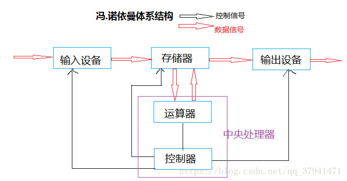

### 冯.诺依曼体系结构

我们常见的计算机：笔记本，台式计算机。而不常见的如服务器，大部分都遵循冯诺依曼体系



#### 组成：

```python
7. 输入单元：包括键盘，鼠标，扫描仪，写板等
8. 输出单元：显示器，打印机等
   另外，输入设备和输出设备都属于外设，基本上所有的外设都和IO有关
9. 中央处理器（CPU）：含有运算器和控制器等
10. 存储器：这里指的是内存
```

#### 所有的设备都只能直接和内存打交道：

```python
外设(输入设备或者输出设备) 只能直接和 存储器(内存) 打交道

CPU 只能直接和 存储器(内存)打交道
```


### 操作系统(Operator System)

操作系统：任何计算机系统都包含一个基本的程序集合。 
其作用就是：在整个计算机软硬件架构中，它是用来搞“管理”的软件 
操作系统包括：

```python
1. 内核：
   内存管理  进程管理  文件管理  驱动管理
2. 其他程序
   比如：函数库 shell程序
```

#### 设计操作系统的目的：

```python
1. 与硬件交互，管理所有的软硬件资源 （对系统软硬件部分）
2. 为用户程序(应用程序) 提供一个良好的执行环境 （对用户）
```

#### 如何进行管理？

```python
1. 管理是通过数据进行管理的
2. 管理者和被管理者不进行直接沟通
```

### 进程

#### 基本概念：

##### 进程：（每个进程都有自己的状态和独立的地址空间。）

进程由操作系统管理

```pytohn
从用户角度看：  进程是程序的一次动态执行过程。
    分时系统： 时间片轮转。
  从操作系统： 进程是操作系统分配资源的基本单位（最小单位）
```

#### 描述进程—PCB（进程控制块）

1. 如何描述一个进程？

```python
1.描述一个进程需要知道进程信息，而进程信息放在一个叫做进程控制块的数据
构中，这个进程控制块就是PCB。
2.PCB也可以理解为一个进程属性的集合。
```

1. Linux操作系统下具体的PCB是：task_struct

```python
1. task_struct: 是Linux中描述进程的结构体
2. tsk_struct: 是Linux内核中的一个数据结构，它被装载在RAM(内存)中且包含了进程的信息
```

#### 如何管理一个进程？

```python
1. 将进程描述起来    
而具体描述的方法是结构体task_struct(我们把描述进程的结构体叫做PCB)       
2. 将结构体组织起来
用链表  （所有运行在系统里的进程都以task_struct链表的形式存在内核里。）
```

#### 进程和程序的区别：

程序： 数据+代码

进程： 数据+代码+堆栈+PCB

PCB: 进程控制块 （Process.Control.Block）

```pyton
并发：多个进程在一个cpu下采用进程切换的方式，在一段时间之内让多个进程得以推进。
并行：多个进程在多个CPU下分别.同时进行。
```


```python
1. 进程是动态的，程序是静态的；
2. 进程的生命周期是短暂的，而程序相对永久；
3. 进程有重要的数据结构PCB；
4. 一个进程只能对应一个程序
   而一个程序可以对应多个进程。
```

父子进程代码共享，数据各自开辟空间，私有一份采用（写时拷贝）——代码共享，数据私有