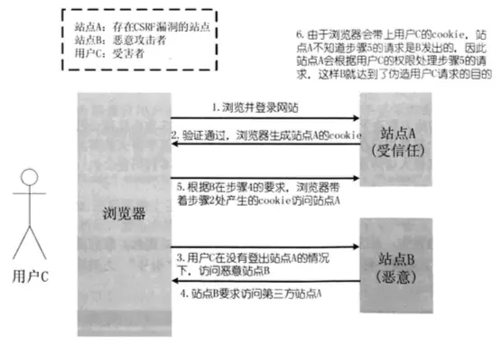

- 网络攻击（CSRF、XSS）
- 洪泛攻击
- DDoS


[https://www.jianshu.com/p/67408d73c66d](https://www.jianshu.com/p/67408d73c66d)

[https://www.jianshu.com/p/a63668a48eda](https://www.jianshu.com/p/a63668a48eda)

### Web攻击手段

​	对于常规的Web攻击手段，如XSS、CRSF、SQL注入、（常规的不包括文件上传漏洞、DDoS攻击）等，防范措施相对来说比较容易，对症下药即可，比如XSS的防范需要转义掉输入的尖括号，防止CRSF攻击需要将cookie设置为httponly，以及增加session相关的Hash token码 ，SQL注入的防范需要将分号等字符转义，等等做起来虽然筒单，但却容易被忽视，更多的是需要**从开发流程上来予以保障**（这句话是给技术管理者的建议），以免因人为的疏忽而造成损失。


#### CSRF攻击原理



1. 首先用户C浏览并登录了受信任站点A；
2. 登录信息验证通过以后，站点A会在返回给浏览器的信息中带上已登录的cookie，cookie信息会在浏览器端保存一定时间（根据服务端设置而定）；
3. 完成这一步以后，用户在没有登出（清除站点A的cookie）站点A的情况下，访问恶意站点B；
4. 这时恶意站点 B的某个页面向站点A发起请求，而这个请求会带上浏览器端所保存的站点A的cookie；
5. 站点A根据请求所带的cookie，判断此请求为用户C所发送的。

因此，站点A会报据用户C的权限来处理恶意站点B所发起的请求，而这个请求可能以用户C的身份发送 邮件、短信、消息，以及进行转账支付等操作，这样恶意站点B就达到了伪造用户C请求站点 A的目的。
受害者只需要做下面两件事情，攻击者就能够完成CSRF攻击：

- 登录受信任站点 A，并在本地生成cookie；
- 在不登出站点A（清除站点A的cookie）的情况下，访问恶意站点B。

很多情况下所谓的恶意站点，很有可能是一个存在其他漏洞（如XSS）的受信任且被很多人访问的站点，这样，普通用户可能在不知不觉中便成为了受害者。

==那么CSRF能够攻击的根本原因是：**服务器无法识别你的来源是否可靠**。==

#### 1.2、攻击举例

假设某银行网站A以GET请求来发起转账操作，转账的地址为`www.xxx.com/transfer.do?accountNum=l000l&money=10000`，参数accountNum表示转账的账户，参数money表示转账金额。
而某大型论坛B上，一个恶意用户上传了一张图片，而图片的地址栏中填的并不是图片的地址，而是前而所说的砖账地址：``
当你登录网站A后，没有及时登出，这时你访问了论坛B，不幸的事情发生了，你会发现你的账号里面少了10000块...
为什么会这样呢，在你登录银行A时，你的浏览器端会生成银行A的cookie，而当你访问论坛B的时候，页面上的标签需要浏览器发起一个新的HTTP请求，以获得图片资源，当浏览器发起请求时，请求的却是银行A的转账地址`www.xxx.com/transfer.do?accountNum=l000l&money=10000`，并且会带上银行A的cookie信息，结果银行的服务器收到这个请求后，会以为是你发起的一次转账操作，因此你的账号里边便少了10000块。
当然，绝大多数网站都不会使用GET请求来进行数据更新，因此，攻击者也需要改变思路，与时俱进。
假设银行将其转账方式改成POST提交，而论坛B恰好又存在一个XSS漏洞，恶意用户在它的页面上植入如下代码：

```
<form id="aaa" action="http://www.xxx.com/transfer.do" metdod="POST" display="none">
    <input type="text" name="accountNum" value="10001"/>
    <input type="text" name="money" value="10000"/>
</form>
<script>
    var form = document.forms('aaa');
    form.submit();
</script>
```

如果你此时恰好登录了银行A，且没有登出，当你打开上述页面后，脚本会将表单aaa提交，把accountNum和money参数传递给银行的转账地址`http://www.xxx.com/transfer.do`，同样的，银行以为是你发起的一次转账会从你的账户中扣除10000块。
当然，以上只是举例，正常来说银行的交易付款会有USB key、验证码、登录密码和支付密码等一系列屏障，流程比上述流程复杂得多，因此安全系数也高得多。

#### 1.3、CSRF的防御

**1、尽量使用POST，限制GET**
GET接口太容易被拿来做CSRF攻击，看上面示例就知道，只要构造一个img标签，而img标签又是不能过滤的数据。接口最好限制为POST使用，GET则无效，降低攻击风险。
当然POST并不是万无一失，攻击者只要构造一个form就可以，但需要在第三方页面做，这样就增加暴露的可能性。
**2、将cookie设置为HttpOnly**
	CRSF攻击很大程度上是利用了浏览器的cookie，为了防止站内的XSS漏洞盗取cookie,需要在cookie中设置“HttpOnly”属性，这样通过程序（如JavaScript脚本、Applet等）就无法读取到cookie信息，避免了攻击者伪造cookie的情况出现。
在Java的Servlet的API中设置cookie为HttpOnly的代码如下：
`response.setHeader( "Set-Cookie", "cookiename=cookievalue;HttpOnly");`
**3、增加token**
	CSRF攻击之所以能够成功，是因为攻击者可以伪造用户的请求，该请求中所有的用户验证信息都存在于cookie中，因此攻击者可以在不知道用户验证信息的情况下直接利用用户的cookie来通过安全验证。由此可知，抵御CSRF攻击的关键在于：**在请求中放入攻击者所不能伪造的信息，并且该信总不存在于cookie之中**。鉴于此，系统开发人员可以在HTTP请求中以参数的形式加入一个随机产生的token，并在服务端进行token校验，如果请求中没有token或者token内容不正确，则认为是CSRF攻击而拒绝该请求。
假设请求通过POST方式提交，则可以在相应的表单中增加一个隐藏域：
`<input type="hidden" name="_toicen" value="tokenvalue"/>`
token的值通过服务端生成，表单提交后token的值通过POST请求与参数一同带到服务端，每次会话可以使用相同的token，会话过期，则token失效，攻击者因无法获取到token，也就无法伪造请求。
在session中添加token的实现代码：

```
HttpSession session = request.getSession();
Object token = session.getAttribute("_token");
if(token == null I I "".equals(token)) {
    session.setAttribute("_token", UUID.randomUUIDO .toString());
}
```

**4、通过Referer识别**

​	HTTP协议里面定义了一个访问来源的字段，这个字段叫Referer。黑客伪造的链接或表单是在其他网站上，所以我们可以判断Referer是否为自身网站，如果是，则允许访问，如果不是，则拒绝访问。

​	根据HTTP协议，在HTTP头中有一个字段叫Referer，它记录了该HTTP请求的来源地址。在通常情况下，访问一个安全受限的页面的请求都来自于同一个网站。比如某银行的转账是通过用户访问http://www.xxx.com/transfer.do页面完成的，用户必须先登录www.xxx.com，然后通过单击页面上的提交按钮来触发转账事件。当用户提交请求时，该转账请求的Referer值就会是
提交按钮所在页面的URL（本例为[www.xxx](https://link.jianshu.com?t=http%3A%2F%2Fwww.xxx). com/[transfer.do](https://link.jianshu.com?t=http%3A%2F%2Ftransfer.do)）。如果攻击者要对银行网站实施CSRF攻击，他只能在其他网站构造请求，当用户通过其他网站发送请求到银行时，该请求的Referer的值是其他网站的地址，而不是银行转账页面的地址。因此，要防御CSRF攻击，银行网站只需要对于每一个转账请求验证其Referer值即可，如果是以`www.xx.om`域名开头的地址，则说明该请求是来自银行网站自己的请求，是合法的；如果Referer是其他网站，就有可能是CSRF攻击，则拒绝该请求。
取得HTTP请求Referer：
`String referer = request.getHeader("Referer");`

​	但是这种方法是有缺陷的，上面实验尝试过，如果对方在QQ上发送给你一个链接呢？点击的时候属于主动点击，此时一样没有Referer。程序会把它归属为安全请求，那么就被绕过了。并且如果某些低版本的浏览器存在漏洞（比如IE6），Referer很有可能被篡改，所以这个方法并非十全十美。