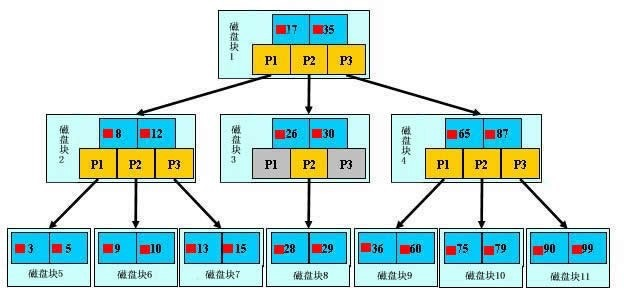
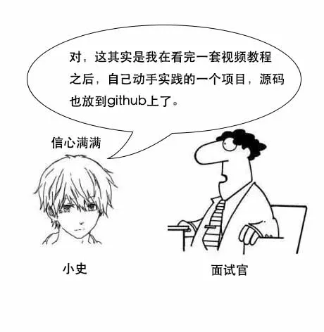
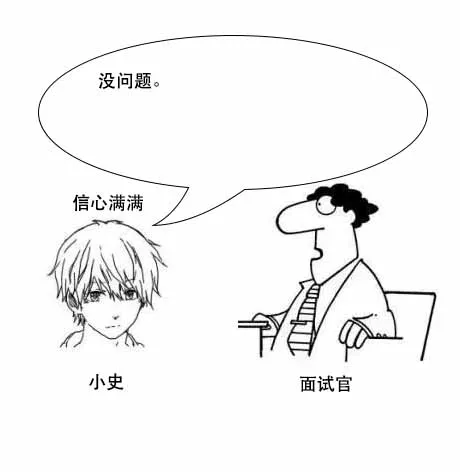
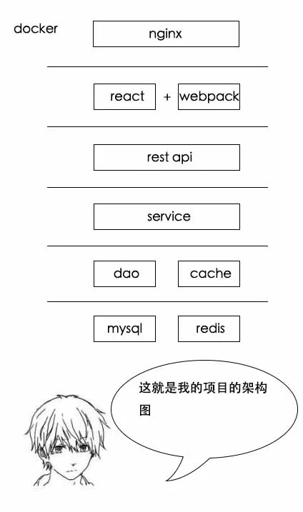

### 一、磁盘的IO

 磁盘读取数据靠的是机械运动，每次读取数据花费的时间可以分为**==寻道时间、旋转延迟、传输时间==**三个部分，寻道时间指的是磁臂移动到指定磁道所需要的时间，主流磁盘一般在5ms以下；旋转延迟就是我们经常听说的磁盘转速，比如一个磁盘7200转，表示每分钟能转7200次，也就是说1秒钟能转120次，旋转延迟就是1/120/2 = 4.17ms；传输时间指的是从磁盘读出或将数据写入磁盘的时间，一般在零点几毫秒，相对于前两个时间可以忽略不计。那么访问一次磁盘的时间，即一次磁盘IO的时间约等于5+4.17 = 9ms左右，听起来还挺不错的，但要知道一台500 -MIPS的机器每秒可以执行5亿条指令，因为指令依靠的是电的性质，换句话说执行一次IO的时间可以执行40万条指令，数据库动辄十万百万乃至千万级数据，每次9毫秒的时间，显然是个灾难。

​	也就是说我们数据库查询数据的时间，可以够我们做很多其它事了，我们如果浪费很多时间进行IO操作，很不划算。

​       考虑到磁盘IO是非常高昂的操作，计算机操作系统做了一些优化，当一次IO时，不光把当前磁盘地址的数据，而是把相邻的数据也都读取到内存缓冲区内，因为局部预读性原理告诉我们，当计算机访问一个地址的数据的时候，与其相邻的数据也会很快被访问到。每一次IO读取的数据我们称之为一页(page)。具体一页有多大数据跟操作系统有关，一般为4k或8k，也就是我们读取一页内的数据时候，实际上才发生了一次IO，这个理论对于索引的数据结构设计非常有帮助。

### 二、索引的数据结构--b+树

​        浅蓝色的块我们称之为一个磁盘块，可以看到每个磁盘块包含几个数据项（深蓝色所示）和指针（黄色所示），如磁盘块1包含数据项17和35，包含指针P1、P2、P3，P1表示小于17的磁盘块，P2表示在17和35之间的磁盘块，P3表示大于35的磁盘块。真实的数据存在于叶子节点即3、5、9、10、13、15、28、29、36、60、75、79、90、99。非叶子节点只不存储真实的数据，只存储指引搜索方向的数据项，如17、35并不真实存在于数据表中。

​        **b+树查找过程**

​       如图所示，如果要查找数据项29，**==那么首先会把磁盘块1由磁盘加载到内存==**，此时发生一次IO，在内存中用二分查找确定29在17和35之间，锁定磁盘块1的P2指针，内存时间因为非常短（相比磁盘的IO）可以忽略不计，通过磁盘块1的P2指针的磁盘地址把磁盘块3由磁盘加载到内存，发生第二次IO，29在26和30之间，锁定磁盘块3的P2指针，通过指针加载磁盘块8到内存，发生第三次IO，同时内存中做二分查找找到29，结束查询，总计三次IO。真实的情况是，3层的b+树可以表示上百万的数据，如果上百万的数据查找只需要三次IO，性能提高将是巨大的，如果没有索引，每个数据项都要发生一次IO，那么总共需要百万次的IO，显然成本非常非常高。

​       **b+树的性质：**

​      1.通过上面的分析，我们知道IO次数取决于b+数的高度h，假设当前数据表的数据为N，每个磁盘块的数据项的数量是m，则有h=㏒(m+1)N，当数据量N一定的情况下，m越大，h越小；而m = 磁盘块的大小 / 数据项的大小，磁盘块的大小也就是一个数据页的大小，==是固定的==，==如果数据项占的空间越小，数据项的数量越多，树的高度越低。这就是为什么每个数据项，即索引字段要尽量的小，比如int占4字节，要比bigint8字节少一半。这也是为什么b+树要求把真实的数据放到叶子节点而不是内层节点，一旦放到内层节点，磁盘块的数据项会大幅度下降，导致树增高。当数据项等于1时将会退化成线性表。==

​      2.当b+树的数据项是复合的数据结构，比如(name,age,sex)的时候，b+数是按照从左到右的顺序来建立搜索树的，比如当(张三,20,F)这样的数据来检索的时候，b+树会优先比较name来确定下一步的所搜方向，如果name相同再依次比较age和sex，最后得到检索的数据；但当(20,F)这样的没有name的数据来的时候，b+树就不知道下一步该查哪个节点，因为建立搜索树的时候name就是第一个比较因子，必须要先根据name来搜索才能知道下一步去哪里查询。比如当(张三,F)这样的数据来检索时，b+树可以用name来指定搜索方向，但下一个字段age的缺失，所以只能把名字等于张三的数据都找到，然后再匹配性别是F的数据了， 这个是非常重要的性质，即索引的最左匹配特性。

​       建索引的几大原则：

   1.最左前缀匹配原则，非常重要的原则，mysql会一直向右匹配直到遇到范围查询(>、<、between、like)就停止匹配，比如a = 1 and b = 2 and c > 3 and d = 4 如果建立(a,b,c,d)顺序的索引，d是用不到索引的，如果建立(a,b,d,c)的索引则都可以用到，a,b,d的顺序可以任意调整。

   2.  =和in可以乱序，比如a = 1 and b = 2 and c = 3 建立(a,b,c)索引可以任意顺序，mysql的查询优化器会帮你优化成索引可以识别的形式

​    3.尽量选择区分度高的列作为索引,区分度的公式是count(distinct col)/count(*)，表示字段不重复的比例，比例越大我们扫描的记录数越少，唯一键的区分度是1，而一些状态、性别字段可能在大数据面前区分度就是0，那可能有人会问，这个比例有什么经验值吗？使用场景不同，这个值也很难确定，一般需要join的字段我们都要求是0.1以上，即平均1条扫描10条记录

4.索引列不能参与计算，保持列“干净”，比如from_unixtime(create_time) = ’2014-05-29’就不能使用到索引，原因很简单，b+树中存的都是数据表中的字段值，但进行检索时，需要把所有元素都应用函数才能比较，显然成本太大。所以语句应该写成create_time = unix_timestamp(’2014-05-29’);

5.尽量的扩展索引，不要新建索引。比如表中已经有a的索引，现在要加(a,b)的索引，那么只需要修改原来的索引即可

[转载于](https://mp.weixin.qq.com/s/9zdhSU1XYHsXsKxtSn4mCw)

小史是一个应届生，虽然学的是电子专业，但是自己业余时间看了很多互联网与编程方面的书，一心想进BAT互联网公司。

话说两个多月前，小史通过了A厂的一面，两个多月后的今天，小史终于等到了A厂的二面。

简单的自我介绍后，面试官看了看小史的简历，开始发问了。

**【面试现场】**

小史：没问题，这个项目前端用的react+webpack，后端用的nginx+SpringBoot+Redis+MySql，前后端分离的，最后用docker进行容器化部署。主要模块有师生系统、课程系统、成绩系统、选课系统等。

这个项目的架构和说辞，小史早已背得溜溜的。

小史：底层mysql是存储，redis是缓存，dao层操作mysql，cache层操作redis，service层处理业务逻辑，rest api层为前端提供rest接口。前端这边用react进行模块化，webpack打包部署。网关nginx进行负载均衡。mysql、redis、nginx和springboot应用都放在docker里部署。

题目：为什么MySQL数据库要用B+树存储索引？

小史听到这个题目，陷入了回忆。

**【前段时间的饭局】**

话说吕老师给小史讲完[人工智能的一些知识](http://mp.weixin.qq.com/s?__biz=MzIzMTE1ODkyNQ==&mid=2649410733&idx=1&sn=9df27d1d07a70a6e13256934caf2a20d&chksm=f0b6094fc7c18059fb9f19b62377cf8bba347f3ee5f7dac9d2afa5e08c18f576bcab4315dc0d&scene=21#wechat_redirect)后，他们一起回家吃小史姐姐做的饭去了。

**【饭后】**

吕老师：面试的时候一定是往深了问，不精通的话容易吃亏。不过面试时一般都是根据项目来问，项目中用到的技术，一定要多看看原理，特别是能和数据结构和算法挂钩的那部分。

小史：树的话，无非就是前中后序遍历、二叉树、二叉搜索树、平衡二叉树，更高级一点的有红黑树、B树、B+树，还有之前你教我的字典树。

**【红黑树】**

一听到红黑树，小史头都大了，开始抱怨了起来。

小史：红黑树看过很多遍了，但是每次都记不住，它的规则实在是太多了，光定义就有四五条规则，还有插入删除的时候，需要调整树，复杂得很。

吕老师：小史，问你红黑树，并不是让你背诵它的定义，或者让你手写一个红黑树，而是想问问你它为什么这样设计，它的使用场景有哪些。

**【B树】**

==吕老师：小史，你要知道，文件系统和数据库的索引都是存在硬盘上的，并且如果数据量大的话，不一定能一次性加载到内存中。==

两个月前，小史面试没考虑内存情况差点挂了，[传送门](http://mp.weixin.qq.com/s?__biz=MzIzMTE1ODkyNQ==&mid=2649410393&idx=1&sn=e2aae1e16baede316922c53256a10c5f&chksm=f0b60ebbc7c187ad4e48b140daff2c80e5007076e99b26427fef50dd7f19ffed5181ba45baed&scene=21#wechat_redirect)

**【B+树】**

吕老师：这也是和业务场景相关的，你想想，数据库中select数据，不一定只选一条，很多时候会选多条，比如按照id排序后选10条。

小史：我明白了，如果是多条的话，B树需要做局部的中序遍历，可能要跨层访问。而B+树由于所有数据都在叶子结点，不用跨层，同时由于有链表结构，只需要找到首尾，通过链表就能把所有数据取出来了。

**【回到现场】**

小史：这和业务场景有关。如果只选一个数据，那确实是hash更快。但是数据库中经常会选择多条，这时候由于B+树索引有序，并且又有链表相连，它的查询效率比hash就快很多了。

小史：而且数据库中的索引一般是在磁盘上，数据量大的情况可能无法一次装入内存，B+树的设计可以允许数据分批加载，同时树的高度较低，提高查找效率。

HR和小史简单地聊了聊基本情况，这次面试就结束了。

小史走后，面试官在系统中写下了面试评语：

几天后，小史收到了A厂的offer。

### MySQL B+Tree索引和Hash索引的区别？

- Hash索引结构的特殊性，其检索效率非常高，索引的检索可以一次定位;
- B+树索引需要从根节点到枝节点，最后才能访问到页节点这样多次的IO访问;

那为什么大家不都用Hash索引而还要使用B+树索引呢？

#### Hash索引

1. Hash索引仅仅能满足"=","IN"和"<=>"查询，不能使用范围查询,因为经过相应的Hash算法处理之后的Hash值的大小关系，并不能保证和Hash运算前完全一样；
2. Hash索引无法被用来避免数据的排序操作，因为Hash值的大小关系并不一定和Hash运算前的键值完全一样；
3. Hash索引不能利用部分索引键查询，对于组合索引，Hash索引在计算Hash值的时候是组合索引键合并后再一起计算Hash值，而不是单独计算Hash值，所以通过组合索引的前面一个或几个索引键进行查询的时候，Hash索引也无法被利用；
4. Hash索引在任何时候都不能避免表扫描，由于不同索引键存在相同Hash值，所以即使取满足某个Hash键值的数据的记录条数，也无法从Hash索引中直接完成查询，还是要回表查询数据；
5. Hash索引遇到大量Hash值相等的情况后性能并不一定就会比B+树索引高。

#### B+Tree索引

MySQL中，只有HEAP/MEMORY引擎才显示支持Hash索引。

常用的InnoDB引擎中默认使用的是B+树索引，它会实时监控表上索引的使用情况，如果认为建立哈希索引可以提高查询效率，则自动在内存中的“自适应哈希索引缓冲区”建立哈希索引（在InnoDB中默认开启自适应哈希索引），通过观察搜索模式，MySQL会利用index key的前缀建立哈希索引，如果一个表几乎大部分都在缓冲池中，那么建立一个哈希索引能够加快等值查询。

#### B+树索引和哈希索引的明显区别是：

如果是等值查询，那么哈希索引明显有绝对优势，因为只需要经过一次算法即可找到相应的键值；当然了，这个前提是，==**键值都是唯一的。如果键值不是唯一的，就需要先找到该键所在位置，然后再根据链表往后扫描**==，直到找到相应的数据；

如果是范围查询检索，这时候哈希索引就毫无用武之地了，因为原先是有序的键值，经过哈希算法后，有可能变成不连续的了，就没办法再利用索引完成范围查询检索；

同理，哈希索引没办法利用索引完成排序，以及like ‘xxx%’ 这样的部分模糊查询（这种部分模糊查询，其实本质上也是范围查询）；

哈希索引也不支持多列联合索引的最左匹配规则；

B+树索引的关键字检索效率比较平均，不像B树那样波动幅度大，在有大量重复键值情况下，哈希索引的效率也是极低的，因为存在所谓的哈希碰撞问题。

在大多数场景下，都会有范围查询、排序、分组等查询特征，用B+树索引就可以了。