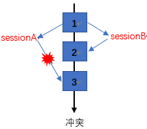

### InnoDB-MVCC与乐观锁


#### InnoDB MVCC

​	多版本并发控制，是为了避免加锁而实现的。一般的实现方法是存储快照来实现的。InnoDB实现方式是在记录后添加两个隐藏列（表项），分别是事务创建时间、过期时间，存储的实际上是系统版本号（系统版本号随着事务的创建而递增）。
	这样一来，INSERT 时加上开始版本号，upDATE/DELETE时加上过期版本号，这样一来在SELETE时，就只访问开始系统版本号小于当前的事务的版本号、过期时间要么未定义要么在当前版本号之后的记录，这样就可以保证：访问的记录是在本事务开始前就存在而且在本事务期间没有过期（被删除或被修改过的）。可以避免脏读、不可重复读、幻读的问题。（个人觉得）


最近通过《高性能MySQL》一书学习MySQL方面的知识，在看到书中所讲InnoDB-MVCC部分的时候，有一种强烈的感觉，这不就是乐观锁吗（入门级小学徒的疑惑脸）？当下便去网上以各种方式查找阅读MVCC和乐观锁相关的博客，发现大部分的博客对于这两者之间的关系都只字不提，提了的也是众说纷纭，关于两者关系的细节方面也十分暧昧没有定论。在暂时无法得出最终结论的情况下，我先谈谈在学习这方面知识后我自己对两者的理解，然后试着得出自己的结论，正确与否大家一起思考。

在解释MVCC之前，我首先引用《高性能MySQL》书中原文来解释一下隔离级别：

- READ UNCOMMITTED（未提交读）：在READ UNCOMMITTED级别，事务中的修改，即使没有提交，对其他事务也都是可见的。事务可以读取未提交的数据，这也被称为脏读。


- READ COMMITTED（提交读）：大多数数据库默认的隔离级别（MySQL除外）。在READ COMMITTED级别，一个事务开始时，只能“看见”已经提交的事务所做的修改。换句话说，一个事务从开始直到提交之前，所做的任何修改对其他事务都是不可见的，这个级别有时候也叫做不可重复读，因为同一事务中两次执行同样的查询，可能会得到不一样的结果。
- REPEATABLE READ（可重复读）：这是MySQL默认的隔离级别，解决了脏读的问题。该级别保证了在同一事务中多次读取同样记录的结果是一致的。但是理论上，该隔离级别还是无法解决另外一个幻读的问题。所谓幻读，指的是当某个事务在读取某个范围内的记录时，另外一个事务又在该范围内插入了新的记录，当之前的事务再次读取该范围的记录时，会产生幻行。
- SERIALIZABLE（可串行化）：该隔离级别下通过强制事务串行执行，避免了幻读的问题。简单来说，SERIALIZABLE会在读取的每一行数据上都加锁，所以可能导致大量的超时和锁争用的问题。

如果看了以上对四个隔离级别的解释还是无法理解什么是隔离级别以及为什么要有隔离级别，可以去网上百度隔离级别，网上有一些通过现实场景来解释隔离级别的例子很容易理解，这里就不再做赘述。

那隔离级别到底和MVCC有什么关系呢？如果说将数据库比作一辆汽车，然后将隔离级别比作汽车轮毂，那么MVCC就是ABS防抱死制动系统，不过这个ABS防抱死制动系统只适用于READ COMMITTED和REPEATABLE READ两个型号的轮毂。 


​	上面解释隔离级别时提到了，在REPEATABLE READ隔离级别下，尽管解决了不可重复读，但还是存在幻读的问题。如果要避免幻读，就得在事务执行的时候加锁，但是大量的锁会严重影响性能。怎样才能不通过加锁还能解决幻读呢？这就是MVCC要做的事情。

​	MVCC是Multi-Version Concurrency Control（多版本并发控制）的缩写，很多数据库都实现了MVCC，但是在不同的存储引擎中MVCC的实现是不同的，今天所说的是InnoDB中的MVCC实现。InnoDB的MVCC，是通过在每行记录后保存两个隐藏的列来实现的（用户不可见）。一个列保存行创建的时间，一个列保存行过期（删除）的时间，这里所说的时间并不是传统意义上的时间，而是系统版本号，下面是REPEATABLE READ隔离级别下MVCC的具体操作： 

**-SELECT** 
InnoDB会根据以下两个条件检查每行记录： 
（1）InnoDB只查找版本早于当前事务版本的数据行（行的系统版本号小于或者等于事务的系统版本号），这样可以确保事务读取到的行，要么是在事务开始之前已经存在的，要么是事务自身插入或者修改过的（结合以下INSERT、UPDATE操作理解）。 
（2）行的删除版本要么未定义，要么大于当前事务版本号。可以确保事务读取到的行，在事务开启之前未被删除（结合以下DELETE操作理解）。 
**-INSERT** 
InnoDB为新插入的每一行保存当前系统版本号作为行版本号。 
**-DELETE** 
InnoDB为删除的每一行保存当前系统版本号作为行删除标识（第二个隐藏列的作用来了）。 
**-UPDATE** 
InnoDB将更新后的列作为新的行插入数据库（并不是覆盖），并保存当前系统版本号作为该行的行版本号，同时保存当前系统版本号到原来的行作为行删除标识。


​	到这里，MVCC是什么以及它做了什么事基本上已经说清楚了，为什么在学习了MVCC后我会产生“这就是乐观锁”的想法呢（实际上很多人都有这种想法，在一些博客里也有人说MVCC就是乐观锁）？有这几个原因。首先，InnoDB中MVCC和乐观锁（其实这么说是不严谨的，后面会解释为什么）都是通过“不加锁”的手段来实现加锁的效果。其次它们的不加锁手段都是通过版本号去控制的。通过这两点也不难看出为什么会有很多人在MVCC和乐观锁之间产生疑问。

​	那么乐观锁是怎么实现的呢？最常见的就是通过数据版本（Version）记录机制实现。数据版本和InnoDB-MVCC中的系统版本作用相似不做过多解释。通过为数据库表增加一个数字类型的字段作为版本标识Version（用户可见，字段名自定），当读取数据时，将其Version的值一同读出，数据每更新一次，Version都增加1，当提交更新的时候，判断数据库表对应行的当前版本信息与第一次读取出来的Version值进行对比，如果一致，则给与更新，否则不予更新（可以不涉及事务，但是MVCC机制必须依托于事务，事实上隔离级别本就是事务的隔离级别）。具体操作如下：

```mysql
SELECT id, name, Version FROM testable;（例如id=1，Version=1024）

UPDATE testable SET name=’张三’,Version=Version+1 WHERE id=1 AND Version=1024;

```

 

从上面的所有文字中，我们还是无法得出一个有效的结论，只看得出InnoDB-MVCC和文中所提到的乐观锁确实很像，它们到底是何关系我们还是无从所知。那我们再来看看《高性能MySQL》中所提到的一句话：==不同存储引擎的MVCC实现是不同的，典型的有乐观并发控制和悲观并发控制==。看完这句话我们再结合上文，可以得出这样一个结论：MVCC并不是乐观锁，InnoDB所实现的MVCC才是乐观锁（当然也有其他存储引擎利用乐观并发控制的思想实现MVCC），更严谨一点来说，乐观锁并不是一种具体的技术，乐观锁只是一种并发控制的思想，所有认为“并发事务不算大”而采用非加锁的形式来实现“加锁”效果的控制机制我们都认为它是乐观锁。既然如此，那我们之前提到的乐观锁就不能叫乐观锁了，它只是乐观锁的一种表达方式，是一种在用户行为上通过非加锁的方式来实现并发控制的手段。同样的MVCC更不能称之为乐观锁，只能说InnoDB实现的MVCC是一种在系统行为上通过非加锁的方式来实现并发控制的手段。

​	总结来说，InnoDB-MVCC是一种系统行为，在REPEATABLE READ隔离级别下，它通过乐观并发控制解决了该隔离级别所不能解决的幻读，但是前提是这些都得依托于事务的封装。尽管如此，它还是无法完全解决一些并发业务场景下的问题，并且过多的事务使用会严重影响系统的性能，这就需要通过用户行为去约束（最开始所提到的乐观锁）。

​	所以，最后的结论就是，MVCC并非乐观锁，但是InnoDB存储引擎所实现的MVCC是乐观的，它和之前所提到的用户行为的“乐观锁”都采用的是乐观机制，属于不同的“乐观锁”手段，它们都是“乐观家族”的成员。


### MVCC简介

#### 1.1 什么是MVCC

MVCC是一种多版本并发控制机制。

#### 1.2 MVCC是为了解决什么问题?

大多数的MYSQL事务型存储引擎,如,InnoDB，Falcon以及PBXT都不使用一种简单的行锁机制.事实上,他们都和MVCC–多版本并发控制来一起使用.
大家都应该知道,锁机制可以控制并发操作,但是其系统开销较大,而MVCC可以在大多数情况下代替行级锁,使用MVCC,能降低其系统开销.

#### 1.3 MVCC实现

MVCC是通过保存数据在某个时间点的快照来实现的. 不同存储引擎的MVCC. 不同存储引擎的MVCC实现是不同的,典型的有乐观并发控制和悲观并发控制.

#### 2.MVCC 具体实现分析

下面,我们通过InnoDB的MVCC实现来分析MVCC使怎样进行并发控制的. 
InnoDB的MVCC,是通过在每行记录后面保存两个隐藏的列来实现的,这两个列，分别保存了这个行的创建时间，一个保存的是行的删除时间。这里存储的并不是实际的时间值,而是系统版本号(可以理解为事务的ID)，没开始一个新的事务，系统版本号就会自动递增，事务开始时刻的系统版本号会作为事务的ID.下面看一下在REPEATABLE READ隔离级别下,MVCC具体是如何操作的.

2.1简单的小例子

```mysql
create table yang( 
id int primary key auto_increment, 
name varchar(20));
```


**假设系统的版本号从1开始.**

#### INSERT

InnoDB为新插入的每一行保存当前系统版本号作为版本号. 
第一个事务ID为1；

```mysql
start transaction;
insert into yang values(NULL,'yang') ;
insert into yang values(NULL,'long');
insert into yang values(NULL,'fei');
commit;
```


对应在数据中的表如下(后面两列是隐藏列,我们通过查询语句并看不到)

| id   | name | 创建时间(事务ID) | 删除时间(事务ID) |
| ---- | ---- | ---------------- | ---------------- |
| 1    | yang | 1                | undefined        |
| 2    | long | 1                | undefined        |
| 3    | fei  | 1                | undefined        |


#### SELECT

InnoDB会根据以下两个条件检查每行记录: 
a.InnoDB只会查找版本早于当前事务版本的数据行(也就是,行的系统版本号小于或等于事务的系统版本号)，这样可以确保事务读取的行，要么是在事务开始前已经存在的，要么是事务自身插入或者修改过的. 
b.行的删除版本要么未定义,要么大于当前事务版本号,这可以确保事务读取到的行，在事务开始之前未被删除. 
只有a,b同时满足的记录，才能返回作为查询结果.

DELETE
InnoDB会为删除的每一行保存当前系统的版本号(事务的ID)作为删除标识. 
看下面的具体例子分析: 
第二个事务,ID为2;

```mysql
start transaction;
select * from yang;  //(1)
select * from yang;  //(2)
commit; 
```

假设1
假设在执行这个事务ID为2的过程中,刚执行到(1),这时,有另一个事务ID为3往这个表里插入了一条数据; 
第三个事务ID为3;

```mysql
start transaction;
insert into yang values(NULL,'tian');
commit;
```


这时表中的数据如下:

id	name	创建时间(事务ID)	删除时间(事务ID)
1	yang	1	undefined
2	long	1	undefined
3	fei	1	undefined
4	tian	3	undefined


然后接着执行事务2中的(2),由于id=4的数据的创建时间(事务ID为3),执行当前事务的ID为2,而InnoDB只会查找事务ID小于等于当前事务ID的数据行,所以id=4的数据行并不会在执行事务2中的(2)被检索出来,在事务2中的两条select 语句检索出来的数据都只会下表:

| id   | name | 创建时间(事务ID) | 删除时间(事务ID) |
| ---- | ---- | ---------------- | ---------------- |
| 1    | yang | 1                | undefined        |
| 2    | long | 1                | undefined        |
| 3    | fei  | 1                | undefined        |


#### 假设2

假设在执行这个事务ID为2的过程中,刚执行到(1),假设事务执行完事务3后，接着又执行了事务4; 
第四个事务:

```mysql
start   transaction;  
delete from yang where id=1;
commit;  
```


此时数据库中的表如下:

id	name	创建时间(事务ID)	删除时间(事务ID)
1	yang	1	4
2	long	1	undefined
3	fei	1	undefined
4	tian	3	undefined


接着执行事务ID为2的事务(2),根据SELECT 检索条件可以知道,它会检索创建时间(创建事务的ID)小于当前事务ID的行和删除时间(删除事务的ID)大于当前事务的行,而id=4的行上面已经说过,而id=1的行由于删除时间(删除事务的ID)大于当前事务的ID,所以事务2的(2)select * from yang也会把id=1的数据检索出来.所以,事务2中的两条select 语句检索出来的数据都如下:

| id   | name | 创建时间(事务ID) | 删除时间(事务ID) |
| ---- | ---- | ---------------- | ---------------- |
| 1    | yang | 1                | 4                |
| 2    | long | 1                | undefined        |
| 3    | fei  | 1                | undefined        |

#### UPDATE

InnoDB执行UPDATE，实际上是新插入了一行记录，并保存其创建时间为当前事务的ID，同时保存当前事务ID到要UPDATE的行的删除时间.

假设3
假设在执行完事务2的(1)后又执行,其它用户执行了事务3,4,这时，又有一个用户对这张表执行了UPDATE操作: 
第5个事务:

```mysql
start  transaction;
update yang set name='Long' where id=2;
commit;
```


根据update的更新原则:会生成新的一行,并在原来要修改的列的删除时间列上添加本事务ID,得到表如下:


id	name	创建时间(事务ID)	删除时间(事务ID)
1	yang	1	4
2	long	1	5
3	fei	1	undefined
4	tian	3	undefined
2	Long	5	undefined
 ———————————————— 


继续执行事务2的(2),根据select 语句的检索条件,得到下表:

| id   | name | 创建时间(事务ID) | 删除时间(事务ID) |
| ---- | ---- | ---------------- | ---------------- |
| 1    | yang | 1                | 4                |
| 2    | long | 1                | 5                |
| 3    | fei  | 1                | undefined        |