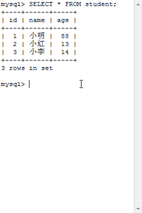
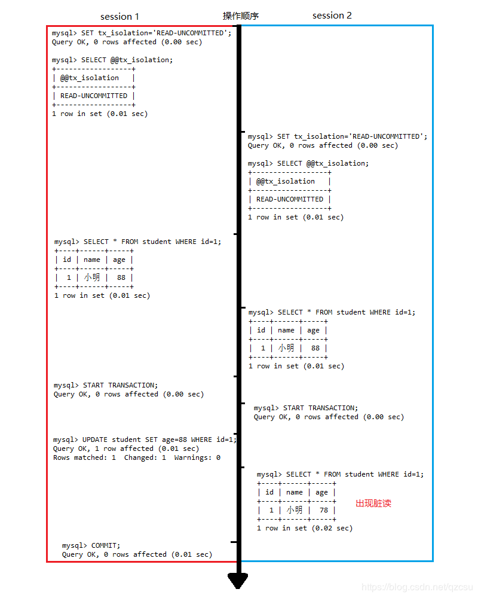
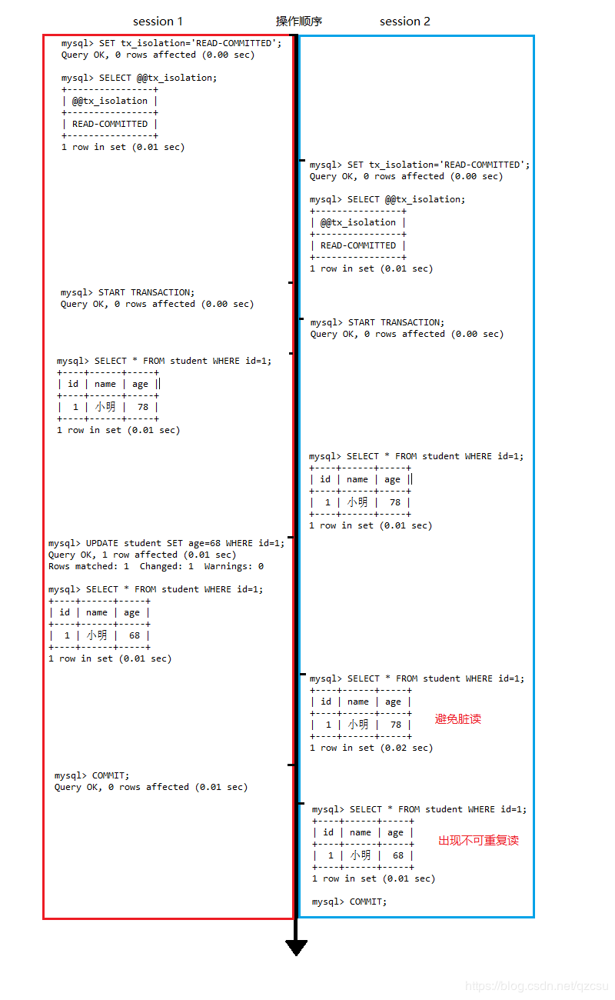
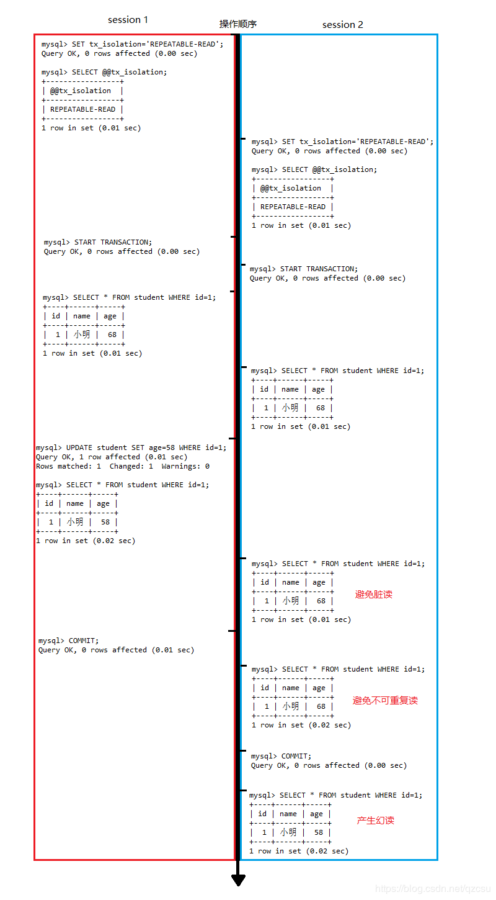
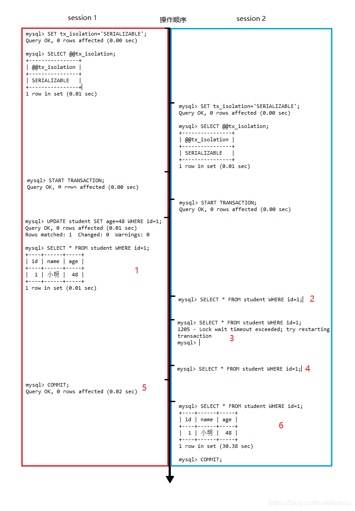

#### 什么是事务？

事务则是将一系列的操作包装成为一个整体运算集合，这个运算集合要么都执行，要么都不执行。
所以，如果我们将这两个操作定义在一个事务中执行，那么很显然可以及时避免这种问题，即取款的这两个步骤要么都执行成功，要么都不执行。

#### 事务的特性

一般来讲事务具备四个特性，简称ACID。

​	A，Automicity 原子性，事务所引起的数据库操作要么都完成，要么都不执行
	C，Consistency 一致性，事务的执行前后数据总体是不变
	I，Isolation 隔离性，彼此之间进行隔离，尽可能让不同的事务之间影响最小
	D，Durability，持久性，一旦事务完成，系统必须保证任何故障都不会引起事务表示出不一致。

#### 事务的并发所带来的问题

> 如果不考虑事务之间存在隔离性，在多个事务对同一张表进行操作时，将会产生数据的不一致性。一般来说可分为：脏读，不可重复读，幻读

#### 准备工作

在MySQL中创建一张student表，并且在表中插入三条数据

```mysql
CREATE TABLE `student` (
  `id` int(11) NOT NULL,
  `name` varchar(50) NOT NULL,
  `age` int(11) NOT NULL,
  PRIMARY KEY (`id`)
) ENGINE=InnoDB DEFAULT CHARSET=utf8;
INSERT INTO `student` VALUES ('1', '小明', '88');
INSERT INTO `student` VALUES ('2', '小红', '13');
INSERT INTO `student` VALUES ('3', '小李', '14');
```



说明，在MySQL中默认是开始事务自动提交功能，也就意味着，平常我们每执行一条SQL语句就进行了一次事务的提交，可以一下命令进行查看，结果为1表示启动事务自动提交功能。

```python
SELECT @@autocommit;
```

当然可以不用理会这个变量，我们可以每次手动的开启事务与提交事务，当然也可以回滚事务。其命令分别如下所示

```mysql
START TANSACTION;
COMMIT;
ROLLBACK;
```


### MySQL数据库的事务隔离级别

​	针对上述所说的事务并发执行所带来的不良影响，可以通过设置数据库事务隔离级别使这些不良的影响达到一个可控的范围。MySQL数据库一共设置了四个事务隔离级别，分别是，**READ-UNCOMMITTED（读未提交），READ-COMMITTED（读提交），REPEATABLE-READ（可重复读），SERIALIZABLE（串行）**

#### READ-UNCOMMITTED（读未提交）

> 允许当前未提交的事务读取其它事务未提交的内容，隔离级别最低，脏读，不可重复读，幻读都不能避免。

------

读未提交演示，先将数据隔离级别设置为读未提交，此时出现脏读

当前有两个事务在访问同一个数据区时，A事务对数据进行了修改，而且这种数据修改还没有提交到数据库中，这时B事务刚好使用了这个被修改的数据。

**\*session1未提交的修改直接被session2访问，造成脏读***




#### READ-COMMITTED（读提交）

> 允许当前未提交的事务读取其它事务已提交的内容，隔离级别比读未提交好，可以避免脏读，但是不可重复读，幻读都不能避免。

------

读提交演示，先将数据隔离级别设置为读提交，虽避免了脏读，但出现了不可重复读

**\*session1未提交的修改，session2已经访问不到，避免了脏读。但是在session1提交了修改后，session2立刻可以访问到数据的修改。在session2的角度来说，在一次事务中针对同一个数据的两次读操作结果不同，结果是不可重复读。***





#### REPEATABLE-READ（可重复读）

> 事务交叉执行时不允许当前未提交的事务读取其它事务在此时已提交的内容，隔离级别比读提交好，可以避免脏读，不可重复读，但是幻读不能避免。

------

可重复读演示，先将数据隔离级别设置为可重复读，避免了脏读和不可重复读，出现了幻读

**\*session1未提交的修改，session2已经访问不到，避免了脏读。并且session1提交了修改后，session2也不能访问到数据的修改。但是当session2提交本次事务后，在本次事务提交前后针对同一个数据的两次读操作结果不同，就像产生了幻觉一样，即幻读。***




#### SERIALIZABLE（串行）

> 事务不能并发执行，所有的事务都必须一个接一个执行，即串行。

------

串行演示如下，先将数据隔离级别设置为串行，避免了脏读，不可重复读，幻读。



​	在session1 执行到步骤1时对该条数据进行了修改，此时再去执行步骤2，发现session2一直卡在此处查询不出结果，最后一直等待到步骤3MySQL内部的锁超时。然后在步骤4再次进行查询又一次被阻塞在此处，直到session1执行了步骤5，提交本次修改后，步骤6session2立刻查询出该条数据，可以看出一次简单查询用了30多秒，实际是事务串行进行阻塞导致。
	总的来说，在该隔离级别下，每次操作得到的数据都是绝对的安全的。
