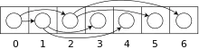

#### 平衡二叉树

​	树形结构是计算机系统里最重要的数据结构。

​	我们知道，二叉树的查找的时间复杂度是O(log2N)，其查找效率与深度有关，而普通的二叉树可能由于内部节点排列问题退化成链表，这样查找效率就会很低。因此平衡二叉树是更好的选择，因为它保持平衡，即通过旋转调整结构保持最小的深度。其查找的时间复杂度也是O(log2N)。

​	但实际上，数据库中索引的结构也并非AVL树或更优秀的红黑树，尽管它的查询的时间复杂度很低。

#### 为什么平衡二叉树也不适合作为索引

​	之前说了平衡树的查找时间复杂度是O(log2N)，已经很不错了，但还是不适合作为索引结构。那么肯定是有一种更适合作为索引的数据结构。那么这个更适合作为索引的数据结构，难道是查找的时间复杂度更低吗？并不是。这种作为索引的数据结构的查找的时间复杂度也近似O(log2N)。

#### 局部性原理与磁盘预读：

​	由于存储介质的特性，磁盘本身存取就比主存慢很多，再加上机械运动耗费，==磁盘的存取速度往往是主存的几百分分之一，因此为了提高效率，要尽量减少磁盘I/O。==为了达到这个目的，==磁盘往往不是严格按需读取，而是每次都会预读，即使只需要一个字节，磁盘也会从这个位置开始，顺序向后读取一定长度的数据放入内存。==这样做的理论依据是计算机科学中著名的局部性原理： ==也就是每次读取一页数据,而不是每次只读一个节点数据,==当一个数据被用到时，其附近的数据也通常会马上被使用。 程序运行期间所需要的数据通常比较集中。 
	由于磁盘顺序读取的效率很高（不需要寻道时间，只需很少的旋转时间），==因此对于具有局部性的程序来说，预读可以提高I/O效率。==

​	==但是平衡二叉树的存储结构是数组,所以,逻辑上相邻的节点,在物理存储上可能不连着.也就是每次我们虽然读取一页数据,n个节点,但是只有一个有用==.

​	也就是说，==使用红黑树（平衡二叉树）结构的话，每次磁盘预读中的很多数据是用不上的数据==。

#### 那为什么平衡二叉树不适合作为索引呢？

​	==索引是存在于索引文件中，是存在于磁盘中的。因为索引通常是很大的，因此无法一次将全部索引加载到内存当中，因此每次只能从磁盘中读取一个磁盘页的数据到内存中。==而这个磁盘的读取的速度较内存中的读取速度而言是差了好几个级别。==每一次IO读取的数据我们称之为一页(page)。具体一页有多大数据跟操作系统有关，一般为4k或8k，也就是我们读取一页内的数据时候，实际上才发生了一次IO，==

​	==注意，我们说的平衡二叉树结构，指的是逻辑结构上的平衡二叉树，其物理实现是数组。然后由于在逻辑结构上相近的节点在物理结构上可能会差很远。因此，每次读取的磁盘页的数据中有许多是用不上的。因此，查找过程中要进行许多次的磁盘读取操作。==

​	==而适合作为索引的结构应该是尽可能少的执行磁盘IO操作，==因为执行磁盘IO操作非常的耗时。因此，平衡二叉树并不适合作为索引结构。

#### B-Tree适合作为索引

平衡二叉树不适合作为索引。那么什么才适合作为索引——B树。

​	==平衡二叉树没能充分利用磁盘预读功能，而B树是为了充分利用磁盘预读功能来而创建的一种数据结构，也就是说B树就是为了作为索引才被发明出来的的。==

​	搞清楚上面的意思。磁盘预读是具体实现，其理论依据是局部性原理。

​	为什么说红黑树没能充分利用磁盘预读功能，引用一篇博文的一段话：

​	红黑树这种结构，h明显要深的多。由于逻辑上很近的节点（父子）物理上可能很远，无法利用局部性，所以红黑树的I/O渐进复杂度也为O(h)，效率明显比B-Tree差很多。

​	也就是说，==`使用红黑树（平衡二叉树）结构的话，每次磁盘预读中的很多数据是用不上的数据`==。因此，它没能利用好磁盘预读的提供的数据。然后又由于深度大（较B树而言），所以进行的磁盘IO操作更多。

​	==B树的每个节点可以存储多个关键字，它将节点大小设置为磁盘页的大小，充分利用了磁盘预读的功能。每次读取磁盘页时就会读取一整个节点。==也正因每个节点存储着非常多个关键字，树的深度就会非常的小。==进而要执行的磁盘读取操作次数就会非常少，更多的是在内存中对读取进来的数据进行查找。==

​	B树的查询，主要发生在内存中，而平衡二叉树的查询，则是发生在磁盘读取中。因此，虽然B树查询查询的次数不比平衡二叉树的次数少，但是相比起磁盘IO速度，内存中比较的耗时就可以忽略不计了。因此，B树更适合作为索引。

#### Q0.数据库索引有哪些，优缺点？

hash索引和B+树索引
hash索引等值查询效率高，但是不能排序，因此不能进行范围查询
B+树索引数据有序，能够进行范围查询

 

#### Q1.为什么不用二叉查找树作为数据库索引？

二叉查找树，查找到指定数据，效率其实很高logn。但是数据库索引文件有可能很大，关系型数据存储了上亿条数据，索引文件大则上G，不可能全部放入内存中，
而是需要的时候换入内存，方式是磁盘页。一般来说树的一个节点就是一个磁盘页。如果使用二叉查找树，那么每个节点存储一个元素，查找到指定元素，需要进行大量的磁盘IO，效率很低。
而B树解决了这个问题，通过单一节点包含多个data，大大降低了树的高度，大大减少了磁盘IO次数。

 

#### Q2.B树和二叉查找树的性能对比？

B树包括B+树的设计思想都是尽可能的降低树的高度，以此降低磁盘IO的次数，因为一个索引节点就表示一个磁盘页，页的换入换出次数越多，表示磁盘IO次数越多，越低效。
B树算法减少定位数据所在的节点时所经历的磁盘IO次数，从而加快存取速度。
假设一个节点可以容纳100个值，那么3层的B树可以容纳100万个数据。（根节点100值，第二层可以存储99个节点（k-1），也就是99*100 个值，第三层可以存储
（99*100-1）*100）结果是近似100万个数据。而如果使用二叉查找树，则需要将近20层，也就是进行20次磁盘IO，性能差距如此之大。
如mongoDB数据库使用，单次查询平均快于Mysql（但侧面来看Mysql至少平均查询耗时差不多）。

 

#### Q3.B+对比B树的优点？

因为B树的每个节点除了存储指向子节点的索引之外，还有data域，因此单一节点存储的指向子节点的索引并不是很多，树高度较高，磁盘IO次数较多，
而B+树单一节点存储的指向子节点的索引更多，B+树空间利用率高，因此B+树高度更低，磁盘IO次数更少，性能更好。
因为B树的中间节点存储了数据，所以整个树的每一层都有可能查找到要查找的数据，查询性能不稳定，
而B+树所有的data都存储在叶子节点，且叶子节点位于同一层，因此查询性能稳定。
B树如果想要进行范围查找，需要频繁的进行二叉树的中序遍历，进行范围查找比较复杂，
B+树要查找的元素都位于叶子节点，且连接形成有序链表，便于范围查找。

 

#### Q4.B树，B+树使用场景。

B树主要用于文件系统，和部分数据库索引，如文档型数据库mongodb
B+树主要用于mysql数据库索引。

 

#### Q5.为什么数据库索引不用红黑树而用B+树？

红黑树当插入删除元素的时候会进行频繁的变色与旋转（左旋，右旋），来保证红黑树的性质，浪费时间。
但是当数据量较小，数据完全可以放入内存中，不需要进行磁盘IO，这时候，红黑树时间复杂度比B+树低。
比如TreeSet TreeMap 和HashMap （jdk1.8）就是使用红黑树作为底层数据结构。
