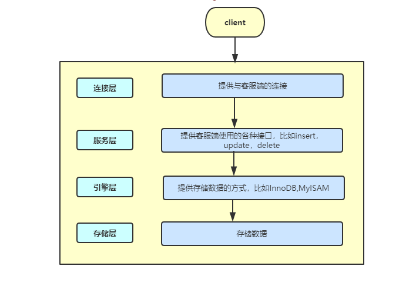

### MySQL的存储引擎(InnoDB,MyISAM)

#### 1.什么是存储引擎

**存储引擎：**存储引擎决定了数据库底层如何实现数据存储，如何建立数据索引，如何查询数据，如何删除数据等一些列操作数据和数据索引的方法

​	

#### 2.MySQL有哪些引擎，它们的各有什么特点？

**MySQL有两种存储引擎：InnoDB和MyISAM**

**InnoDB：**

1. **事务支持：**

   **MyISAM：**强调的是性能，每次查询具有原子性,其执行数度比InnoDB类型更快，但是不提供事务支持（也就是没有回滚等能力）。

   **InnoDB：**提供事务支持事务，外部键等高级数据库功能。 支持4种事务隔离级别，每一条SQL都被默认封装为事务进行提交,这样会影响速度，优化方式是将多余的SQL语句放在begin和commit之间，组成一个事务。具有事务(commit)、回滚(rollback)和崩溃修复能力(crash recovery capabilities)的事务安全(transaction-safe (ACID compliant))型表。

   ​

2. **表锁差异**

   **MyISAM：**只支持表级锁，用户在操作myisam表时，select，update，delete，insert语句都会给表自动加锁，如果加锁以后的表满足insert并发的情况下，可以在表的尾部插入新的数据。
   **InnoDB：**支持事务和行级锁，是innodb的最大特色。行锁大幅度提高了多用户并发操作的新能。但是InnoDB的行锁，只是在WHERE的主键是有效的，非主键的WHERE都会锁全表的。

   ​

3. **InnoDB支持外键，MyISAM不支持外键**

   ​

4. **表的具体行数**

   **MyISAM：**保存有表的总行数，如果select count(*) from table;会直接取出出该值。
   **InnoDB：**没有保存表的总行数，如果使用select count(*) from table；就会遍历整个表，消耗相当大，但是在加了wehre条件后，myisam和innodb处理的方式都一样。

   ​

5. **全文索引**

   MyISAM：支持 FULLTEXT类型的全文索引
   InnoDB：不支持FULLTEXT类型的全文索引，但是InnoDB在5.7之后支持全文索引

6.  **存储结构**

   **MyISAM：**每个MyISAM在磁盘上存储成三个文件。第一个文件的名字以表的名字开始，扩展名指出文件类型。.frm文件存储表定义。数据文件的扩展名为.MYD (MYData)。索引文件的扩展名是.MYI (MYIndex)。
   **InnoDB：**所有的表都保存在同一个数据文件中（也可能是多个文件，或者是独立的表空间文件），InnoDB表的大小只受限于操作系统文件的大小，一般为2GB。

7. **CURD操作**

   **MyISAM：**如果执行大量的SELECT，MyISAM是更好的选择。
   **InnoDB：**如果你的数据执行大量的INSERT或UPDATE，出于性能方面的考虑，应该使用InnoDB表。DELETE 从性能上InnoDB更优，但DELETE FROM table时，InnoDB不会重新建立表，而是一行一行的删除，在innodb上如果要清空保存有大量数据的表，最好使用truncate table这个命令。

#### 总结

- 如果一个表修改要求高，我们选择InnoDB，因为InnoDB支持事务，如果我们查询要求比较高，我们选择MyISAM,因为MyISAM做的事少，所以MyISAM查询速度更快