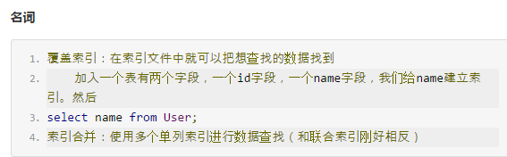
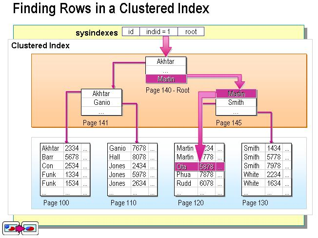
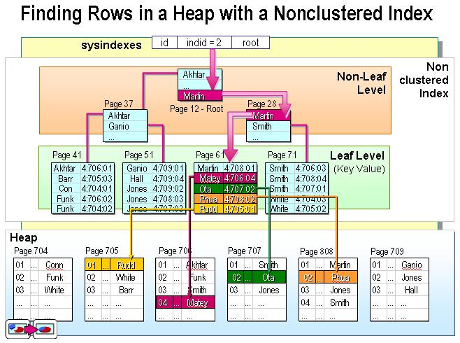
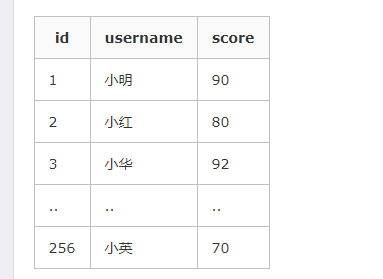
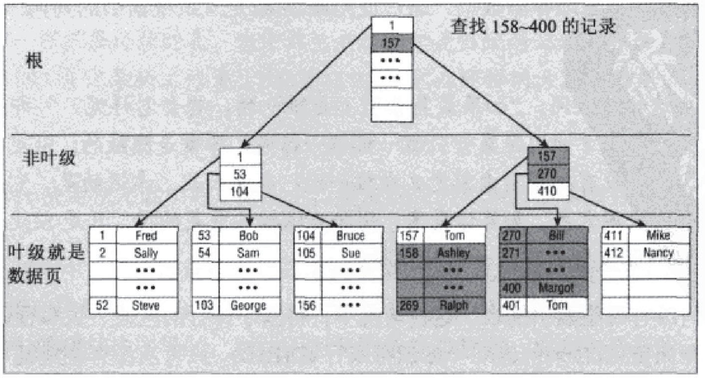
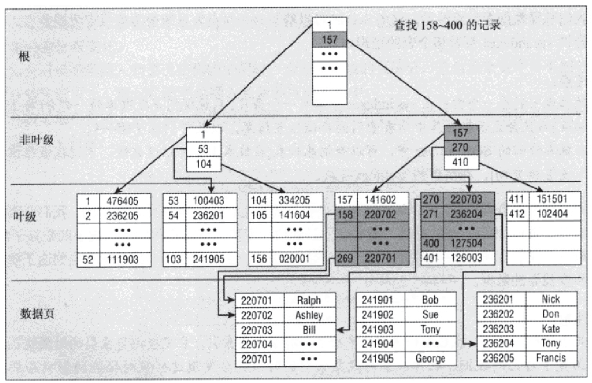

#### 1.请你说一下什么是索引？

​	索引是对数据表中的一列或者多列数据进行排序的一种结构，它就像新华字典前面的目录一样，可以加速我们的查询，MySQL用的是B+树索引，相比于hash索引，有很多优点，比如我们可以范围查询。而且对于内存不大，无法一次加载hash索引表的情况下，B+树索引任然有用，它可以分批加载，所以仍能起到加速查找的作用。

**2、索引种类**

- 普通索引：仅加速查询
- 唯一索引：加速查询 + 列值唯一（可以有null）
- 主键索引：加速查询 + 列值唯一 +　表中只有一个（不可以有null）
- **组合索引(复合索引，联合索引)**：多列值组成一个索引，专门用于组合搜索，其效率大于索引合并
- 全文索引：对文本的内容进行分词，进行搜索 

*索引合并，使用多个单列索引组合搜索*
*覆盖索引，select的数据列只用从索引中就能够取得，不必读取数据行，换句话说查询列要被所建的索引覆盖*

```python
PS：联合索引遵循最左前缀原则
    id    name    pwd   email (将name，pwd，email3个字段建立联合索引)
    select * from tb where name = 'x';（命中）
    select * from tb where name = 'x' and pwd = 'x';（命中）
    select * from tb where name = 'x' and email = 'x';（命中）
    select * from tb where pwd = 'x';(不能命中)
    select * from tb where pwd = 'x' and email='x';(不能命中)
```


#### 索引合并详解

二哥：按理来说，如果两个单列索引命中的条数小，就会全部取出来做下交集

```python
我出个题，你来写一写
一个有3个字段的数组
例如[{a:1,b:2,c:3},{a:3,b:3,c:5}]
我有m个query，每次query查询某个a和某个b下的c值，你咋做
```

```mysql
二哥：搞一个索引数组，存[a, index]，排序
            再搞一个索引数组，存[b, index]，排序
二哥：对的，就是合并索引，把两个字段的索引全部取出来做交集
小白：把两个字段的索引全部取出来做交集，是求index吧，然后还要去主键索引找到index，取出c吧
小白：也就是3次查询，原来底层这么实现的啊
二哥：排完序二分查找拿到上下界，遍历即可
小白：那这个组合索引，组合总数岂不是多的不得了，怎么还用这个呢
小白：组合，就相当于求笛卡儿积，要存储这么多索引，存储空间不是爆了
二哥：看业务需求，我给你说下符合索引
二哥：就是按照[a+$+b，index]去排序
二哥：假设我们查的是a和b，那么直接组合查找就行了
小白：谢谢二哥，我懂了，复合索引不能随便建立。
二哥：如果查a，也简单，因为a++b是排序的，查a相当于查a++最小值，和a+$+最大值
二哥：这就是前缀匹配
二哥：如果查b。。。没法命中索引，还是要扫全表
小白：哇塞，居然符合索引可以干单列索引的事，厉害
二哥：复合索引有顺序的
小白：还确认一遍，你这里面都必须带上index,吧，也就是【a+$+b，index】吧，
小白：是先找数据，这里面同时存放了原数据的index，利用这个index回到聚焦索引里卖弄查询其他内容
二哥：肯定得带上index的，不然去哪查，其实mysql里面对应的是offset，文件偏移量
小白：select age from User where name ='二哥' and addr='火星'
	 假设我们建立索引index（name,addr），其实里面每个数据项都是name,addr,offset,我们通过复合索引找	    到offest，然后根据offest去聚焦索引查到二哥的age = 18岁，是吧，二哥
二哥：嗯，好像数据库会把主键也丢进索引中
二哥：好像数据库会把主键也丢进索引中，如果查主键还不用再去磁盘再查一次
小白：额，那就是覆盖索引

```





- **索引的优点**
  1. 正取使用索引可以避免全表扫描，加速查询
  2. 创建系统唯一性索引，可以保证每一行数据的唯一性；
  3. 大大提高数据检索的速度；
  4. 加快表与表之间的链接，特别是具有主、外键关系的表；
  5. 在针对使用order by和groupby子句进行数据检索时，可以显著地减少分组和排序的时间；
- **索引的缺点**
  1. 创建和维护索引是需要耗费时间的，这种时间会随着数据量的增加而增加；
  2. 索引需要占用物理空间，除了数据表占用数据空间外，每一个索引还要占用一定的物理空间，如果要建立聚集索引，那么需要的空间就会更大；
  3. 当表中的数据进行增加、删除和修改的时候，索引也要动态地维护，这样就降低了**数据的维护速度**；

#### 2.创建索引的建议

- 我们没必要给每个列都创建索引，创建太多的索引反而会降低性能，浪费存储空间。因此在创建索引的时候，应该仔细考虑在哪些列上可以创建索引，在哪些列上不能了创建索引。下面列出一些经验总结的建议：
- **应该创建索引的列：**
  - 在经常需要搜索的列，也就是Select后跟的列，加快检索速度；

  - 在经常使用Where子句中的列创建索引，加快条件的判断速度；

  - 在主键的列上；（主键）

  - 在经常使用连接外键的列上；（外键）

  - 在经常需要根据范围进行搜索的列上创建索引，因为索引已经排序，其指定的范围是连续的；

  - 对串列进行索引，如果可能应该指定一个前缀长度。例如，如果有一个CHAR(255)的列，如果在前10个或20个字符内，多数值是惟一的，那么就不要对整个列进行索引==。短索引不仅可以提高查询速度而且可以节省磁盘空间和I/O操作。==

  - ```python
    - 避免使用select *
    - count(1)或count(列) 代替 count(*)
    - 创建表时尽量时 char 代替 varchar
    - 表的字段顺序固定长度的字段优先
    - 组合索引代替多个单列索引（经常使用多个条件查询时）
    - 尽量使用短索引
    - 使用连接（JOIN）来代替子查询(Sub-Queries)
    - 连表时注意条件类型需一致
    - 索引散列值（重复少）不适合建索引，例：性别不适合
    ```

    ​
- **不应该创建索引的列：**
  - 查询中很少使用得列不应该创建索引。创建的话有些得不偿失；
  - 对于一个数据列中有大量重复值的，我们也不应该创建索引。比如性别：就'男'，'女','保密',我们就不需要创建索引，因为数据不唯一，比如我们检索男生，那么使用索引还是会扫描很多内容，并不能明显加快检索速度，而且建立索引还会浪费存储空间；
  - 对于text、image、varchar(max)和bit数据类型的列不应该增加索引，这是因为，这些列值的数据量要么量相当大，要么取值很少；
  - 当修改性能远远大于检索性能的时候，不应该创建索引。从上面索引的缺点知道，修改性能和检索性能是互相矛盾的。当增加索引时，就会提高检索性能，但会降低修改性能。当减少索引时，就会提高修改性能，降低检索性能。因此，当修改性能远远大于检索性能时，不应该创建索引；也就是我们如果经常修改该数据，那么我们不应该创建索引

#### 3.索引的类型

​    存储引擎负责实现索引，因此不是所有的存储索引都支持聚集索引。

​	单单从定义来看是不是显得有点抽象，打个比方，一个表就像是我们以前用的新华字典，聚集索引就像是拼音目录，而每个字存放的页码就是我们的数据物理地址，我们如果要查询一个“哇”字，我们只需要查询“哇”字对应在新华字典拼音目录对应的页码，就可以查询到对应的“哇”字所在的位置，而拼音目录对应的A-Z的字顺序，和新华字典实际存储的字的顺序A-Z也是一样的，如果我们中文新出了一个字，拼音开头第一个是B，那么他插入的时候也要按照拼音目录顺序插入到A字的后面，现在用一个简单的示意图来大概说明一下在数据库中的样子：

| 地址 | id   | username | score |
| ---- | ---- | -------- | ----- |
| 0x01 | 1    | 小明     | 90    |
| 0x02 | 2    | 小红     | 80    |
| 0x03 | 3    | 小华     | 92    |
| ..   | ..   | ..       | ..    |
| 0xff | 256  | 小英     | 70    |

注：第一列的地址表示该行数据在磁盘中的物理地址，后面三列才是我们SQL里面用的表里的列，其中id是主键，建立了聚集索引。

结合上面的表格就可以理解这句话了吧：数据行的物理顺序与列值的**顺序相同**，如果我们查询id比较靠后的数据，那么这行数据的地址在磁盘中的物理地址也会比较靠后。而且由于物理排列方式与聚集索引的顺序相同，所以也就只能建立一个聚集索引了。



​	可以直接获取到对应的全部列的数据，==而非聚集索引在索引没有覆盖到对应的列的时候需要进行二次查询，后面会详细讲。因此在查询方面，聚集索引的速度往往会更占优势。==

其实按照定义，除了聚集索引以外的索引都是非聚集索引，只是人们想细分一下非聚集索引，分成普通索引，唯一索引，全文索引。如果非要把非聚集索引类比成现实生活中的东西，那么非聚集索引就像新华字典的偏旁字典，他结构顺序与实际存放顺序不一定一致。


**非聚集索引实际存放的示意图**

##### 非聚集索引的二次查询问题

​	非聚集索引叶节点仍然是索引节点，只是有一个指针指向对应的数据块，此如果使用非聚集索引查询，而查询列中包含了其他该索引没有覆盖的列，那么他还要进行第二次的查询，查询节点上对应的数据行的数据



以及聚集索引clustered index(id), 非聚集索引index(username)。

使用以下语句进行查询，不需要进行二次查询，直接就可以从非聚集索引的节点里面就可以获取到查询列的数据。

```
select id, username from t1 where username = '小明'
select username from t1 where username = '小明'
```

但是使用以下语句进行查询，就需要二次的查询去获取原数据行的score：

```
select username, score from t1 where username = '小明'
```

在SQL Server里面查询效率如下所示，Index Seek就是索引所花费的时间，Key Lookup就是二次查询所花费的时间。可以看的出二次查询所花费的查询开销占比很大，达到50%。

[https://www.cnblogs.com/s-b-b/p/8334593.html](https://www.cnblogs.com/s-b-b/p/8334593.html)


​    根据索引的顺序与数据表的物理顺序是否相同，可以把索引分成两种类型：

- 一种是数据表的物理顺序与索引顺序相同的聚集索引，

- 另一种是数据表的物理顺序与索引顺序不同的非聚集索引。

- **使用聚集索引和非聚集索引的建议：**
  - 每个表只能有一个聚集索引，因为表中数据的物理顺序是唯一的

  - 在创建任何非聚集索引之前先创建聚集索引，这是因为聚集索引改变了表中行的物理顺序，数据行按照一定的顺序排列，并且自动维护这个顺序。

  - 聚集索引的平均大小大约是数据表的5%，但是，实际的聚集索引的大小 常常根据索引列的大小而变化，因此一定要保证有足够的空间来创建聚集索引

    ​

- #### 聚集索引和非聚集索引区别？

  聚合索引(clustered index) / 非聚合索引(nonclustered index)

  **1、聚集索引**： 数据叶节点就是真正数据，如下图所示：

  

   　　

  **2、堆上的非聚集索引**：叶节点存储的不是真正的数据，而是指向数据的指针，如下图所示：

  

  ##### 根本区别

  聚集索引和非聚集索引的根本区别是表记录的排列顺序和与索引的排列顺序是否一致。

  ##### 聚集索引

  聚集索引表记录的排列顺序和索引的排列顺序一致，所以查询效率快，只要找到第一个索引值记录，其余就连续性的记录在物理也一样连续存放。聚集索引对应的缺点就是修改慢，因为为了保证表中记录的物理和索引顺序一致，在记录插入的时候，会对数据页重新排序。

  聚集索引类似于新华字典中用拼音去查找汉字，拼音检索表于书记顺序都是按照a~z排列的，就像相同的逻辑顺序于物理顺序一样，当你需要查找a,ai两个读音的字，或是想一次寻找多个傻(sha)的同音字时，也许向后翻几页，或紧接着下一行就得到结果了。

  ##### 非聚集索引

  非聚集索引制定了表中记录的逻辑顺序，但是记录的物理和索引不一定一致，两种索引都采用B+树结构，非聚集索引的叶子层并不和实际数据页相重叠，而采用叶子层包含一个指向表中的记录在数据页中的指针方式。==非聚集索引层次多，不会造成数据重排。==

  非聚集索引类似在新华字典上通过偏旁部首来查询汉字，检索表也许是按照横、竖、撇来排列的，但是由于正文中是a~z的拼音顺序，所以就类似于逻辑地址于物理地址的不对应。同时适用的情况就在于分组，大数目的不同值，频繁更新的列中，这些情况即不适合聚集索引。

  ​


#### 4.MySQL中常见索引有：

- 普通索引：普通索引仅有一个功能：加速查询

- 唯一索引：唯一索引有两个功能：加速查询 和 唯一约束（可含null）

- 组合索引：

  - 组合索引是将n个列组合成一个索引

  - 其应用场景为：频繁的同时使用n列来进行查询，如：where n1 = 'alex' and n2 = 666。

  - 如上创建组合索引之后（遵循最左前缀），查询：

    - name and email  -- 使用索引
    - name                 -- 使用索引
    - email                 -- 不使用索引

    注意：对于同时搜索n个条件时，组合索引的性能好于多个单一索引合并。

- 主键索引：主键有两个功能：加速查询 和 唯一约束（不可含null）


#### 5.MySQL B+Tree索引和Hash索引的区别？

- Hash索引结构的特殊性，其检索效率非常高，索引的检索可以一次定位;
- B+树索引需要从根节点到枝节点，最后才能访问到页节点这样多次的IO访问;


#### 6.什么时候不能命中索引

在MySQL中，并不是你建立了索引，并且你在SQL中使用到了该列，MySQL就肯定会使用到那些索引的，有一些情况很可能在你不知不觉中，你就“成功的避开了”MySQL的所有索引。

现假设有t_stu表，age,sname上建立了索引

- 索引列参与计算:

  ```mysql
  如果where条件中age列中使用了计算，则不会使用该索引

  SELECT `sname` FROM `t_stu` WHERE `age`=20;-- 会使用索引
  SELECT `sname` FROM `t_stu` WHERE `age`+10=30;-- 不会使用索引！！因为所有索引列参与了计算
  SELECT `sname` FROM `t_stu` WHERE `age`=30-10;-- 会使用索引
  故，如果需要计算，千万不要计算到索引列，想方设法让其计算到表达式的另一边去。
  ```


  

- 索引列使用了函数:

  ```
  同样的道理，索引列使用了函数，一样会导致相同的后果
  SELECT `sname` FROM `stu` WHERE concat(`sname`,'abc') ='Jaskeyabc'; -- 不会使用索引,因为使用了函数运算,原理与上面相同
  SELECT `sname` FROM `stu` WHERE `sname` =concat('Jaskey','abc'); -- 会使用索引
  ```


- 索引列使用like,(不一定会使用索引):

  ```mysql
  SELECT * FROM `houdunwang` WHERE `uname` LIKE '前缀就走索引%' -- 走索引
  SELECT * FROM `houdunwang` WHERE `uname` LIKE '后缀不走索引%' -- 不走索引
  所以当需要搜索email列中.com结尾的字符串而email上希望走索引时候,可以考虑数据库存储一个反向的内容reverse_email
  SELECT * FROM table WHERE reverse_email LIKE REVERSE('%.com'); -- 走索引
  注：以上如果你使用REVERSE(email) = REVERSE('%.com')，一样得不到你想要的结果，因为你在索引列email列上使用了函数，MySQL不会使用该列索引
  ```


- 索引列上使用正则表达式也不会走索引:
- 类型不同不走索引:


  ```
  这是一个坑，假设有一张表,里面的a列是一个字符char类型,且a上建立了索引,你用它与数字类型做比较判断的话：
   CREATE TABLE `t1` (`a` char(10));
   SELECT * FROM `t1` WHERE `a`='1' -- 走索引
   SELECT * FROM `t2` WHERE `a`=1 -- 字符串和数字比较，不走索引！
  但是如果那个表那个列是一个数字类型，拿来和字符类型的做比较，则不会影响到使用索引
   CREATE TABLE `t2` (`b` int);

   SELECT * FROM `t2` WHERE `b`='1' -- 虽然b是数字类型，和'1'比较依然走索引
  但是，无论如何，这种额外的隐式类型转换都是开销，而且由于有字符和数字比就不走索引的情况，故建议避免一切隐式类型转换
  ```


- 尽量避免OR操作:

  ```mysql
  select * from dept where dname='jaskey' or loc='bj' or deptno=45 --如果条件中有or,即使其中有条件带索引也不会使用。换言之,就是要求使用的所有字段,都必须建立索引
  所以除非每个列都建立了索引，否则不建议使用OR，在多列OR中，可以考虑用UNION 替换
    select * from dept where dname='jaskey' union
    select * from dept where loc='bj' union
    select * from dept where deptno=45
  ```


