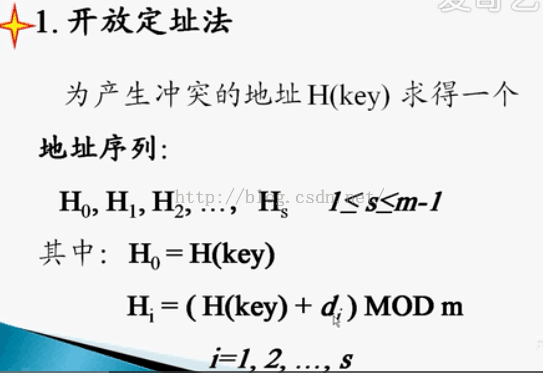
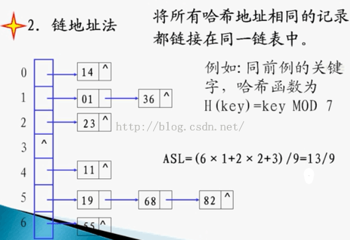

[经典hash实现文章,有空实现](https://blog.csdn.net/Alexwym/article/details/81053470)

###  哈希表

​	是一个用途很广泛的数据结构，常用于需要进行大集合搜索的地方，比如腾讯QQ。对于上线的用户我们需要将其添加到一个集合中，以便对其进行各种处理。那么这个集合该采取哪种数据结构呢？最基本的数据结构就两种：链表和数组。在前面的文章中，我们曾经比较过链表和数组的优缺点。链表适用于插入和删除操作较多的集合，但是不适用于取值操作多的集合。而数组不适用于插入和删除操作较多的集合，但是适用于取值操作较多的集合。然而很不幸的是，对于QQ而言。它既有很多插入删除操作也有很多取值操作。每当用户上下线，我们都需要立即将这个用户从集合中添加删除。而当用户上线时，我们需要将它与所有已经上线的用户比较一遍，来确定这个账号是不是已经在线了，防止重新登陆。这样一来，无论是链表还是数组，都无法很好地适用于这个场景。因此，今天我们就来介绍一个介于数组和链表之间的数据结构——哈希表。

#### 一、哈希表的结构

哈希表又被称为数组链表。当插入删除操作和取值操作都较频繁时，我们可以采用哈希表来作为集合的数据结构。

定义：哈希表（Hash table，也叫散列表），是根据关键码值(Key value)而直接进行访问的数据结构。也就是说，它通过把关键码值映射到表中一个位置来访问记录，以加快查找的速度。这个映射函数叫做散列函数，存放记录的数组叫做散列表。大致结构如下

#### 特点：

1.第一列是一个数组。因此我们在查找每一个链表头结点位置所耗费的时间复杂度都是常数1；

2.每一行都是一个链表。理论上，这个链表可以无限扩大。实际上当然是不行的，我们可以设想两种极端情况。一种是链表的长度远远大于头结点数组的长度，那么这时这个哈希表其实就相当于一个链表，它取值操作的时间复杂度还是接近n。另一种情况就是链表的长度远远小于头结点数组的长度，那么这时这个哈希表其实就相当于一个数组，它插入和删除操作的时间复杂度还是接近n。为了避免这两种极端情况的出现，我们引入了一个控制变量peakValue（当前哈希表的数据个数/数组长度）。如果这个值超过了某一界限，我们就对当前的哈希表进行重构。

3.每一次存放和取出数据，都是先找到对应的行号（即头结点的位置），然后再去遍历该行链表中的各个数据。

#### 二、哈希表的构建思路

基本思路：首先我们需要开辟一个连续的数组来储存每个头结点，这个数组的大小是固定的。每当我们取到一个待加入的键值对时，首先要将其封装成一个节点。然后根据key计算出相应的hashcode，这个hashcode会定位到唯一的一个链表头。最后再把数据放到这个链表里面。

需要实现的方法

1.添加数据put()

2.获取数据get()

3.返回当前哈希表的大小size()

4.展示当前的哈希表构成show()

5.哈希表的重构rehash()——私有方法

6.具体的添加数据的方法input()——私有方法

这个方法里面实现了具体的数据添加方法，其实就是把rehash()和put()两个方法的共同部分给提取了出来，实现代码的复用

### 哈希函数处理冲突的方法

##### 对产生冲突的键，再次用同样的哈希函数哈希

**其中 m 为表的长度**

**对增量di有三种取法：**

**线性探测再散列   di = 1 , 2 , 3 , ... , m-1**

**平方探测再散列（也叫做二次探测法）   di =** 加1的平方；减1的平方，加2的平方，减2的平方，加3的平方，减3的平方。。。

**随机探测再散列**   di 是一组伪随机数列

**2.再哈希法：**再hash法，就是算hashcode的方法不止一个，一个要是算出来重复啦，再用另一个算法去算。反正很多，直到不重复为止咯。
**3.链地址法(Java hashmap就是这么做的)**

**4.建立一个公共溢出区**

