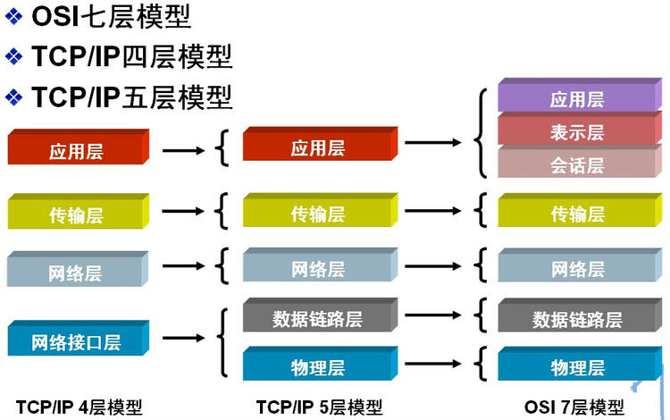

### TCP各层

[优秀博文](https://www.cnblogs.com/inception6-lxc/p/9152691.html)

OSI七层模型及其包含的协议如下:

物理层: 通过媒介传输比特,确定机械及电气规范,传输单位为bit，主要包括的协议为：IEE802.3 CLOCK RJ45

数据链路层: 将比特组装成帧和点到点的传递,传输单位为帧,主要功能为成帧，差错控制，流量控制，传输管理，主要包括的协议为MAC VLAN PPP

网络层：负责数据包从源到宿的传递和网际互连，传输单位为包,主要功能为路由选择，流量控制，差错控制，用晒控制，主要包括的协议为IP ARP ICMP

传输层：提供端到端的可靠报文传递和错误恢复，传输单位为报文,主要功能为可靠传输，不可靠传输，差错控制，流量控制，服用分用，主要包括的协议为TCP UDP

会话层：建立、管理和终止会话，传输单位为SPDU，主要包括的协议为RPC NFS

表示层: 对数据进行翻译、加密和压缩,传输单位为PPDU，主要包括的协议为JPEG ASII

应用层: 允许访问OSI环境的手段,传输单位为APDU，主要包括的协议为FTP HTTP DNS

**每一层的协议如下：**

物理层：RJ45、CLOCK、IEEE802.3    （中继器，集线器，网关）

数据链路：PPP、FR、HDLC、VLAN、MAC  （网桥，交换机）

网络层：IP、ICMP、ARP、RARP、OSPF、IPX、RIP、IGRP、 （路由器）

传输层：TCP、UDP、SPX

会话层：NFS、SQL、NETBIOS、RPC

表示层：JPEG、MPEG、ASCII

应用层：FTP、DNS、Telnet、SMTP、HTTP、WWW、NFS

| 应用程序   | FTP   | TFTP | TELNET | SMTP | DNS  | HTTP | SSH  | MYSQL |
| ---------- | ----- | ---- | ------ | ---- | ---- | ---- | ---- | ----- |
| 熟知端口   | 21,20 | 69   | 23     | 25   | 53   | 80   | 22   | 3306  |
| 传输层协议 | TCP   | UDP  | TCP    | TCP  | UDP  | TCP  | TCP  | TCP   |

### TCP中的流量控制和拥塞控制

[**注：tcp协议如何保证传输的可靠性**](https://blog.csdn.net/jhh_move_on/article/details/45770087)

- **流量控制**主要针对的是端到端传输中控制流量大小并保证传输可靠性（**未收到ack就不滑动**）。流量控制往往是指点对点通信量的控制，所要做的是抑制发送端发送数据的速率。
- **拥塞控制**主要是一个全局性过程，涉及到所有主机，路由器，以及与降低网络传输性能有关的所有因素。**防止过多的数据注入到网络中**。如果有发生丢包则通过拥塞控制减小窗口，确定出合适(**慢启动 拥塞避免 快重传 快恢复**)的拥塞窗口（**增性加乘性减**）。

###  请问TCP用了哪些措施保证其可靠性

##### 三次握手，超时重传，确认机制，滑动窗口，拥塞控制。

#### 参考回答：

#### 1、序列号、确认应答、超时重传

数据到达接收方，接收方需要发出一个确认应答，表示已经收到该数据段，并且确认序号会说明了它下一次需要接收的数据序列号。如果发送发迟迟未收到确认应答，那么可能是发送的数据丢失，也可能是确认应答丢失，这时发送方在等待一定时间后会进行重传。这个时间一般是2*RTT(报文段往返时间）+一个偏差值。

#### 2、窗口控制与高速重发控制/快速重传（重复确认应答）

TCP会利用窗口控制来提高传输速度，意思是在一个窗口大小内，不用一定要等到应答才能发送下一段数据，窗口大小就是无需等待确认而可以继续发送数据的最大值。如果不使用窗口控制，每一个没收到确认应答的数据都要重发。

使用窗口控制，如果数据段1001-2000丢失，后面数据每次传输，确认应答都会不停地发送序号为1001的应答，表示我要接收1001开始的数据，发送端如果收到3次相同应答，就会立刻进行重发；但还有种情况有可能是数据都收到了，但是有的应答丢失了，这种情况不会进行重发，因为发送端知道，如果是数据段丢失，接收端不会放过它的，会疯狂向它提醒......

#### 3、拥塞控制(慢开始,拥塞避免  快重传,快恢复)

如果把窗口定的很大，发送端连续发送大量的数据，可能会造成网络的拥堵（大家都在用网，你在这狂发，吞吐量就那么大，当然会堵），甚至造成网络的瘫痪。所以TCP在为了防止这种情况而进行了拥塞控制。

慢启动：定义拥塞窗口，一开始将该窗口大小设为1，之后每次收到确认应答（经过一个rtt），将拥塞窗口大小*2。

拥塞避免：设置慢启动阈值，一般开始都设为65536。拥塞避免是指当拥塞窗口大小达到这个阈值，拥塞窗口的值不再指数上升，而是加法增加（每次确认应答/每个rtt，拥塞窗口大小+1），以此来避免拥塞。

将报文段的超时重传看做拥塞，则一旦发生超时重传，我们需要先将阈值设为当前窗口大小的一半，并且将窗口大小设为初值1，然后重新进入慢启动过程。

快速重传：在遇到3次重复确认应答（高速重发控制）时，代表收到了3个报文段，但是这之前的1个段丢失了，便对它进行立即重传。

然后，先将阈值设为当前窗口大小的一半，然后将拥塞窗口大小设为慢启动阈值+1的大小。

这样可以达到：在TCP通信时，网络吞吐量呈现逐渐的上升，并且随着拥堵来降低吞吐量，再进入慢慢上升的过程，网络不会轻易的发生瘫痪。

### UDP如何实现可靠性传输

​	传输层无法保证数据的可靠传输，只能通过应用层来实现了。实现的方式可以参照tcp可靠性传输的方式，只是实现不在传输层，实现转移到了应用层。

#### ● 请你说说传递到IP层怎么知道报文该给哪个应用程序，它怎么区分UDP报文还是TCP报文

#### 参考回答：

根据端口区分；

看ip头中的协议标识字段，17是udp，6是tcp

#### ● 请你说一说TCP的三次握手和四次挥手的过程及原因

#### 参考回答：

##### 三次握手的过程

- TCP服务器进程先创建传输控制块TCB，时刻准备接受客户进程的连接请求，此时服务器就进入了LISTEN（监听）状态；
- TCP客户进程也是先创建传输控制块TCB，然后向服务器发出连接请求报文，这是报文首部中的同部位SYN=1，同时选择一个初始序列号 seq=x ，此时，TCP客户端进程进入了 SYN-SENT（同步已发送状态）状态。TCP规定，SYN报文段（SYN=1的报文段）不能携带数据，但需要消耗掉一个序号。
- TCP服务器收到请求报文后，如果同意连接，则发出确认报文。确认报文中应该 ACK=1，SYN=1，确认号是ack=x+1，同时也要为自己初始化一个序列号 seq=y，此时，TCP服务器进程进入了SYN-RCVD（同步收到）状态。这个报文也不能携带数据，但是同样要消耗一个序号。
- TCP客户进程收到确认后，还要向服务器给出确认。确认报文的ACK=1，ack=y+1，自己的序列号seq=x+1，此时，TCP连接建立，客户端进入ESTABLISHED（已建立连接）状态。TCP规定，ACK报文段可以携带数据，但是如果不携带数据则不消耗序号。

当服务器收到客户端的确认后也进入ESTABLISHED状态，此后双方就可以开始通信了。

##### 四次挥手过程

- 客户端进程发出连接释放报文，并且停止发送数据。释放数据报文首部，FIN=1，其序列号为seq=u（等于前面已经传送过来的数据的最后一个字节的序号加1），此时，客户端进入FIN-WAIT-1（终止等待1）状态。 TCP规定，FIN报文段即使不携带数据，也要消耗一个序号。
- 服务器收到连接释放报文，发出确认报文，ACK=1，ack=u+1，并且带上自己的序列号seq=v，此时，服务端就进入了CLOSE-WAIT（关闭等待）状态。TCP服务器通知高层的应用进程，客户端向服务器的方向就释放了，这时候处于半关闭状态，即客户端已经没有数据要发送了，但是服务器若发送数据，客户端依然要接受。这个状态还要持续一段时间，也就是整个CLOSE-WAIT状态持续的时间。
- 客户端收到服务器的确认请求后，此时，客户端就进入FIN-WAIT-2（终止等待2）状态，等待服务器发送连接释放报文（在这之前还需要接受服务器发送的最后的数据）。
- 服务器将最后的数据发送完毕后，就向客户端发送连接释放报文，FIN=1，ack=u+1，由于在半关闭状态，服务器很可能又发送了一些数据，假定此时的序列号为seq=w，此时，服务器就进入了LAST-ACK（最后确认）状态，等待客户端的确认。
- 客户端收到服务器的连接释放报文后，必须发出确认，ACK=1，ack=w+1，而自己的序列号是seq=u+1，此时，客户端就进入了TIME-WAIT（时间等待）状态。注意此时TCP连接还没有释放，必须经过2∗ *∗MSL（最长报文段寿命）的时间后，当客户端撤销相应的TCB后，才进入CLOSED状态。

服务器只要收到了客户端发出的确认，立即进入CLOSED状态。同样，撤销TCB后，就结束了这次的TCP连接。可以看到，服务器结束TCP连接的时间要比客户端早一些。

#### 为什么建立连接是三次握手，关闭连接确是四次挥手呢？

​	建立连接的时候， 服务器在LISTEN状态下，收到建立连接请求的SYN报文后，把ACK和SYN放在一个报文里发送给客户端。
	而关闭连接时，服务器收到对方的FIN报文时，仅仅表示对方不再发送数据了但是还能接收数据，而自己也未必全部数据都发送给对方了，所以己方可以立即关闭，也可以发送一些数据给对方后，再发送FIN报文给对方来表示同意现在关闭连接，因此，己方ACK和FIN一般都会分开发送，从而导致多了一次。

**为什么要三次挥手？**

​	一句话，主要防止已经失效的连接请求报文突然又传送到了服务器，从而产生错误。

​	如果使用的是两次握手建立连接，假设有这样一种场景，客户端发送了第一个请求连接并且没有丢失，只是因为在网络结点中滞留的时间太长了，由于TCP的客户端迟迟没有收到确认报文，以为服务器没有收到，此时重新向服务器发送这条报文，此后客户端和服务器经过两次握手完成连接，传输数据，然后关闭连接。此时此前滞留的那一次请求连接，网络通畅了到达了服务器，这个报文本该是失效的，但是，两次握手的机制将会让客户端和服务器再次建立连接，这将导致不必要的错误和资源的浪费。

​	Cient端实际上只有一次请求，而Server端却有2个响应，极端的情况可能由于Client端多次重新发送请求数据而导致Server端最后建立了N多个响应在等待，因而造成极大的资源浪费！所以，“三次握手”很有必要！

​	如果采用的是三次握手，就算是那一次失效的报文传送过来了，服务端接受到了那条失效报文并且回复了确认报文，但是客户端不会再次发出确认。由于服务器收不到确认，就知道客户端并没有请求连接。

**为什么要四次挥手？**

　　试想一下，假如现在你是客户端你想断开跟Server的所有连接该怎么做？第一步，你自己先停止向Server端发送数据，并等待Server的回复。但事情还没有完，虽然你自身不往Server发送数据了，但是因为你们之前已经建立好平等的连接了，所以此时他也有主动权向你发送数据；故Server端还得终止主动向你发送数据，并等待你的确认。其实，说白了就是保证双方的一个合约的完整执行！

#### 如果已经建立了连接，但是客户端突然出现故障了怎么办？

​	TCP还设有一个保活计时器，显然，客户端如果出现故障，服务器不能一直等下去，白白浪费资源。服务器每收到一次客户端的请求后都会重新复位这个计时器，时间通常是设置为2小时，若两小时还没有收到客户端的任何数据，服务器就会发送一个探测报文段，以后每隔75秒发送一次。若一连发送10个探测报文仍然没反应，服务器就认为客户端出了故障，接着就关闭连接。

####● 请说明一下哪种应用场景会使用TCP协议，使用它的意义

考察点：TCP协议

##### 参考回答：

当对网络通讯质量有要求的时候，比如：整个数据要准确无误的传递给对方，这往往用于一些要求可靠的应用，比如HTTP、HTTPS、FTP等传输文件的协议，POP、SMTP等邮件传输的协议

#### TCP的TIME_WAIT和Close_Wait状态

##### CLOSE_WAIT

​	发起TCP连接关闭的一方称为client，被动关闭的一方称为server。被动关闭的server收到FIN后，但未发出ACK的TCP状态是CLOSE_WAIT。出现这种状况一般都是由于server端代码的问题，如果你的服务器上出现大量CLOSE_WAIT，应该要考虑检查代码。

##### TIME_WAIT

​	跟握手不同，挥手可以由客户端发起，也可以是服务端发起。发起关闭的一端我们称之为主动关闭方，另一端称之为被动关闭方。

​	根据TCP协议定义的3次握手断开连接规定,发起socket主动关闭的一方 socket将进入TIME_WAIT状态。TIME_WAIT状态将持续2个MSL(Max Segment Lifetime)，RFC 793指出MSL为2分钟，现实中常用30秒或1分钟。TIME_WAIT状态下的**socket不能被回收使用**。 具体现象是对于一个处理大量短连接的服务器,如果是由服务器主动关闭客户端的连接，将导致服务器端存在大量的处于TIME_WAIT状态的socket， 甚至比处于Established状态下的socket多的多,严重影响服务器的处理能力，甚至耗尽可用的socket，停止服务。

**为什么需要TIME_WAIT ?**

##### 1.保证TCP协议的全双工连接能够可靠关闭

​	如果Client直接CLOSED了，那么由于IP协议的不可靠性或者是其它网络原因，导致Server没有收到Client最后回复的ACK。那么Server就会在超时之后继续发送FIN，此时由于Client已经CLOSED了，就找不到与重发的FIN对应的连接，**最后Server就会收到RST而不是ACK**，Server就会以为是连接错误把问题报告给高层。这样的情况虽然不会造成数据丢失，但是却导致TCP协议不符合可靠连接的要求。所以，Client不是直接进入CLOSED，而是要保持TIME_WAIT，等待服务端ack超时后，重传FIN，客服端再次受到FIN的时候，才能又一次回复ACK，让服务端正确接收ACK，最后正确的关闭连接。**1MSL时间留给最后的ACK确认报文段到达服务器端，1MSL时间留给服务器端再次发送的FIN。**

##### 2.保证本次连接的重复数据段（网络重复的数据）从网络中消失

​	如果Client直接CLOSED，然后又再向Server发起一个新连接，我们不能保证这个新连接与刚关闭的连接的端口号是不同的。也就是说有可能新连接和老连接的端口号是相同的。一般来说不会发生什么问题，但是还是有特殊情况出现：假设新连接和已经关闭的老连接端口号是一样的，如果前一次连接的某些数据仍然滞留在网络中，这些延迟数据在建立新连接之后才到达Server，由于新连接和老连接的端口号是一样的，又因为TCP协议判断不同连接的依据是socket pair，于是，TCP协议就认为那个延迟的数据是属于新连接的，这样就和真正的新连接的数据包发生混淆了。所以TCP连接还要在TIME_WAIT状态等待2倍MSL，2MSL的时间足以让某个方向上的分组存活MSL秒后被丢弃，这样可以保证本次连接的所有数据都从网络中消失。

**MSL(Maximum Segment Lifetime)：**报文最长存活时间：

​	它是任何报文在网络上存在的最长时间，超过这个时间报文将被丢弃。因为TCP报文段以IP数据报在网络内传输，而IP数据报则有限制其生存时间的**TTL时间**。RFC 793指出MSL为2分钟，现实中常用30秒或1分钟。

**TTL（time-to-live）生存时间字段**
        在IP首部中的8位字段。该字段不是存的具体时间，**而是设置了数据报可以经过的最多路由器跳数。**它制定了数据报的生存时间**。**它的最大值是255（简单的讲就是不同经过超过255个路由器），**TTL的初始值由源主机设置（通常为32或64），**一旦经过一个处理它的路由器，它的值就减去1。当该字段值为0时，数据报就被丢弃，并发送ICMP报文通知源主机。尽管这个跳数限制而不是真正的时间限制，我们仍然假设最大限跳的分组在网络中存在的时间不可能超过MSL秒。

**RST**

在某些特殊情况下，TCP连接的一端会向另一端发送复位报文段，以通知对方关闭或重新建立连接。

一般来说，有以下三种情况：

1.  **访问不存在的端口。**若端口不存，则直接返回RST，同时RST报文接收通告窗口大小为0. 其实客户端向服务器的某个端口发起连接，如果端口被处于TIME_WAIT 状态的连接占用时，客户端也会收到RST

2.  **异常终止连接。**  一方直接发送RST报文，表示异常终止连接。一旦发送方发送复位报文段，发送端所有排队等待发送的数据都被丢弃。应用程序可以通过socket选项 SO_LINGER来发送RST复位报文。

   3.**处理半打开连接。**      一方关闭了连接，另一方却没有收到结束报文（如网络故障），此时另一方还维持着原来的连接。而一方即使重启，也没有该连接的任何信息。这种状态  就叫做半打开连接。而此时另一方往处于半打开状态的连接写数据，则对方回应RST复位报文。

### 请简述TCP/UDP的区别

TCP和UDP是OSI模型中的运输层中的协议。TCP提供可靠的通信传输，而UDP则常被用于让广播和细节控制交给应用层的通信传输。
两者的区别大致如下：

- TCP面向连接，UDP面向非连接即发送数据前不需要建立链接
- TCP提供可靠的服务（数据传输），UDP无法保证
- TCP面向字节流，UDP面向报文
- TCP数据传输慢，UDP数据传输快

- TCP提供一种面向连接的、可靠的字节流服务
- 在一个TCP连接中，仅有两方进行彼此通信，因此广播和多播不能用于TCP
- TCP使用校验和，确认和重传机制来保证可靠传输
- TCP使用累积确认
- TCP使用滑动窗口机制来实现流量控制，通过动态改变窗口的大小进行拥塞控制

### TCP和UDP的应用场景

**TCP**：当对网络通讯质量有要求的时候，比如：整个数据要准确无误的传递给对方，这往往用于一些要求可靠的应用，比如HTTP、HTTPS、FTP等传输文件的协议，POP、SMTP等邮件传输的协议。 
在日常生活中，常见使用TCP协议的应用如：`浏览器，用的HTTP；``FlashFXP，用的FTP；``Outlook，用的POP、SMTP；``Putty，用的Telnet、SSH；``QQ文件传输`

**UDP**：当强调传输性能而不是传输的完整性时， 要求网络通讯速度能尽量的快。如：QQ语音 QQ视频等。

### TCP对应的协议和UDP对应的协议

**TCP对应的协议：**

- FTP：定义了文件传输协议，使用21端口。
- Telnet：一种用于远程登陆的端口，使用23端口，用户可以以自己的身份远程连接到计算机上，可提供基于DOS模式下的通信服务。
- SMTP：邮件传送协议，用于发送邮件。服务器开放的是25号端口。
- POP3：它是和SMTP对应，POP3用于接收邮件。POP3协议所用的是110端口。
- HTTP：是从Web服务器传输超文本到本地浏览器的传送协议，端口默认80。

**UDP对应的协议：**

- DNS：用于域名解析服务，将域名地址转换为IP地址。DNS用的是53号端口。
- SNMP：简单网络管理协议，使用161号端口，是用来管理网络设备的。由于网络设备很多，无连接的服务就体现出其优势。
- TFTP(Trival File TransferProtocal)，简单文件传输协议，该协议在熟知端口69上使用UDP服务。

### 重传机制

网络万一阻塞了呢？发出去的请求包在规定时间内没有收到ACK，不管是请求包丢失，还是ACK包丢失，还是网络延迟，总之，这里都是需要有个重传机制的。TCP的重传机制有两种：**超时重传**和**快速重传**。

### 超时重传

说白了就是在请求包发出去的时候，开启一个计时器，当计时器达到时间之后，没有收到ACK，则就进行重发请求的操作，一直重发直到达到重发上限次数或者收到ACK。

### 快速重传

还有一种机制就是快速重传，当接收方收到的数据包是不正常的序列号，那么接收方会重复把应该收到的那一条ACK重复发送，这个时候，如果发送方收到连续3条的同一个序列号的ACK，那么就会启动快速重传机制，把这个ACK对应的发送包重新发送一次。具体可以参考：

### TCP粘包问题

#### 1 什么是粘包现象

　　**TCP粘包**是指发送方发送的若干包数据到接收方接收时粘成一包，从接收缓冲区看，后一包数据的头紧接着前一包数据的尾。

#### 2 为什么出现粘包现象

　　**（1）发送方原因**

　　我们知道，TCP默认会使用Nagle算法。而Nagle算法主要做两件事：1）只有上一个分组得到确认，才会发送下一个分组；2）收集多个小分组，在一个确认到来时一起发送。

　　所以，正是Nagle算法造成了发送方有可能造成粘包现象。

　　**（2）接收方原因**

　　TCP接收到分组时，并不会立刻送至应用层处理，或者说，应用层并不一定会立即处理；实际上，TCP将收到的分组保存至接收缓存里，然后应用程序主动从缓存里读收到的分组。这样一         来，如果TCP接收分组的速度大于应用程序读分组的速度，多个包就会被存至缓存，应用程序读时，就会读到多个首尾相接粘到一起的包。

#### 3 什么时候需要处理粘包现象

　　（1）如果发送方发送的多个分组本来就是同一个数据的不同部分，比如一个很大的文件被分成多个分组发送，这时，当然不需要处理粘包的现象；

　　（2）但如果多个分组本毫不相干，甚至是并列的关系，我们就一定要处理粘包问题了。

#### 4 如何处理粘包现象

　　**（1）发送方**

　　对于发送方造成的粘包现象，我们可以通过关闭Nagle算法来解决，使用TCP_NODELAY选项来关闭Nagle算法。

　　**（2）接收方**

　　遗憾的是TCP并没有处理接收方粘包现象的机制，我们只能在应用层进行处理。

　　**（3）应用层处理**

　　应用层的处理简单易行！并且不仅可以解决接收方造成的粘包问题，还能解决发送方造成的粘包问题。

　　解决方法就是循环处理：应用程序在处理从缓存读来的分组时，读完一条数据时，就应该循环读下一条数据，直到所有的数据都被处理；但是如何判断每条数据的长度呢？

　　两种途径：

　　　　1）格式化数据：每条数据有固定的格式（开始符、结束符），这种方法简单易行，但选择开始符和结束符的时候一定要注意每条数据的内部一定不能出现开始符或结束符；

　　　　2）发送长度：发送每条数据的时候，将数据的长度一并发送，比如可以选择每条数据的前4字节是数据的长度（一个int来储存数据长度大小），应用层处理时可以根据长度来判断每条数据的开始和结束。

详细还可以参考此博客：[链接](https://www.cnblogs.com/QG-whz/p/5537447.html)

### ARP/RARP协议

**地址解析协议，即ARP（Address Resolution Protocol），是根据IP地址获取物理地址的一个TCP/IP协议。**主机发送信息时将包含目标IP地址的ARP请求广播到网络上的所有主机，并接收返回消息，以此确定目标的物理地址；收到返回消息后将该IP地址和物理地址存入本机ARP缓存中并保留一定时间，下次请求时直接查询ARP缓存以节约资源。地址解析协议是建立在网络中各个主机互相信任的基础上的，网络上的主机可以自主发送ARP应答消息，其他主机收到应答报文时不会检测该报文的真实性就会将其记入本机ARP缓存；由此攻击者就可以向某一主机发送伪ARP应答报文，使其发送的信息无法到达预期的主机或到达错误的主机，这就构成了一个ARP欺骗。**ARP命令可用于查询本机ARP缓存中IP地址和MAC地址的对应关系、添加或删除静态对应关系等。**

ARP协议工作流程：

　　**逆地址解析协议，即RARP，功能和ARP协议相对，其将局域网中某个主机的物理地址转换为IP地址**，比如局域网中有一台主机只知道物理地址而不知道IP地址，那么可以通过RARP协议发出征求自身IP地址的广播请求，然后由RARP服务器负责回答。

　　RARP协议工作流程：

　　（1）给主机发送一个本地的RARP广播，在此广播包中，声明自己的MAC地址并且请求任何收到此请求的RARP服务器分配一个IP地址；

　　（2）本地网段上的RARP服务器收到此请求后，检查其RARP列表，查找该MAC地址对应的IP地址；

　　（3）如果存在，RARP服务器就给源主机发送一个响应数据包并将此IP地址提供给对方主机使用；

　　（4）如果不存在，RARP服务器对此不做任何的响应；

　　（5）源主机收到从RARP服务器的响应信息，就利用得到的IP地址进行通讯；如果一直没有收到RARP服务器的响应信息，表示初始化失败。

