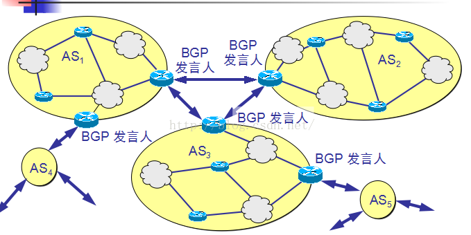

### 在浏览器中输入www.baidu.com后执行的全部过程

1、**应用层：**客户端浏览器通过DNS解析到www.baidu.com的IP地址220.181.27.48，通过这个IP地址找到客户端到服务器的路径。客户端浏览器发起一个HTTP会话到220.161.27.48，然后通过TCP进行封装数据包，输入到网络层。

**当一个主机请求查询域名时：**

**1.先查本地缓存**

**2.没有缓存请求本地域名服务器**

**3.本地域名服务器没有请求根域名服务器**

1、在浏览器中输入www . qq .com 域名，[操作系统](http://lib.csdn.net/base/operatingsystem)会先检查自己本地的hosts文件是否有这个网址映射关系，如果有，就先调用这个IP地址映射，完成域名解析。
2、如果hosts里没有这个域名的映射，则查找本地DNS解析器缓存，是否有这个网址映射关系，如果有，直接返回，完成域名解析。
3、如果hosts与本地DNS解析器缓存都没有相应的网址映射关系，首先会找TCP/ip参数中设置的首选DNS服务器，在此我们叫它本地DNS服务器，此服务器收到查询时，如果要查询的域名，包含在本地配置区域资源中，则返回解析结果给客户机，完成域名解析，此解析具有权威性。
4、如果要查询的域名，不由本地DNS服务器区域解析，但该服务器已缓存了此网址映射关系，则调用这个IP地址映射，完成域名解析，此解析不具有权威性。
5、如果本地DNS服务器本地区域文件与缓存解析都失效，则根据本地DNS服务器的设置（是否设置转发器）进行查询，如果未用转发模式，本地DNS就把请求发至13台根DNS，根DNS服务器收到请求后会判断这个域名(.com)是谁来授权管理，并会返回一个负责该顶级域名服务器的一个IP。本地DNS服务器收到IP信息后，将会联系负责.com域的这台服务器。这台负责.com域的服务器收到请求后，如果自己无法解析，它就会找一个管理.com域的下一级DNS服务器地址(http://qq.com)给本地DNS服务器。当本地DNS服务器收到这个地址后，就会找http://qq.com域服务器，重复上面的动作，进行查询，直至找到www . qq .com主机。
6、如果用的是转发模式，此DNS服务器就会把请求转发至上一级DNS服务器，由上一级服务器进行解析，上一级服务器如果不能解析，或找根DNS或把转请求转至上上级，以此循环。不管是本地DNS服务器用是是转发，还是根提示，最后都是把结果返回给本地DNS服务器，由此DNS服务器再返回给客户机。
从客户端到本地DNS服务器是属于递归查询，而DNS服务器之间就是的交互查询就是迭代查询。

- **HTTP请求与响应**

2、**运输层：**在客户端的传输层，把HTTP会话请求分成报文段，添加源和目的端口，如服务器使用80端口监听客户端的请求，客户端由系统随机选择一个端口如5000，与服务器进行交换，服务器把相应的请求返回给客户端的5000端口。然后使用IP层（网络层）的IP地址查找目的端。

  3、**网络层：**客户端的网络层不用关心应用层或者传输层的东西，主要做的是通过查找路由表确定如何到达服务器，期间可能经过多个路由器，这些都是由路由器来完成的工作，我不作过多的描述，无非就是通过查找路由表决定通过那个路径到达服务器。

路由选择协议的任务就是要确定数据报在源与目的地之间采用的路径。

路由选择协议分为：静态的和动态的。Internet中使用的是动态路由选择协议，在Internet的概念中，将整个互联网划分为许多个小的自治系统（AS）。AS的最主要的特征：一个AS对其他AS表现出的是一个单一 和一致的路由选择策略。

由于AS的存在，路由选择协议又分为两种：

- 内部网关协议（IGP）：即在一个AS内部使用的路由选择协议，而这与互联网中其他AS选用什么路由协议无关。比如：RIP，OSPF
- 外部网关协议（EGP）：若源主机和目的主机不再同一个AS中，就需要使用一种协议将路由选择信息传递到另一个AS中，这就是EGP。比如：BGP。

https://www.nowcoder.com/discuss/3853?pos=264&type=1&order=0

内部网关协议IGP(Interior Gateway Protocol)即在一个自治系统内部使用的路由选择协议。目前这类路由选择协议使用得最多，如RIP和OSPF协议。外部网关协议EGP(External Gateway Protocol)若源站和目的站处在不同的自治系统中，当数据报传到一个自治系统的边界时，就需要使用一种协议将路由选择信息传递到另一个自治系统中。这样的协议就是外部网关协议EGP。在外部网关协议中目前使用最多的是BGP-4。 

​         1）RIP协议 

​         工作原理： 

​          路由信息协议RIP是内部网关协议IGP中最先得到广泛使用的协议。RIP是一种分布式的基于距离向量的路由选择协议。RIP协议要求网络中的每一个路由器都要维护从它自己到其他每一个目的网络的距离记录。距离的解释：从一路由器到直接连接的网络的距离定义为1。从一个路由器到非直接连接的网络的距离定义为所经过的路由器数加1。RIP协议中的“距离”也称为“跳数”(hop count)，因为每经过一个路由器，跳数就加1。这里的“距离”实际上指的是“最短距离”。RIP认为一个好的路由就是它通过的路由器的数目少，即“距离短”。RIP允许一条路径最多只能包含15个路由器。“距离”的最大值为16时即相当于不可达。可见RIP只适用于 

  小型互联网。RIP不能在两个网络之间同时使用多条路由。RIP选择一个具有最少路由器的路由（即最短路由）哪怕还存在另一条高速(低时延)但路由器较多的路由。 

​         2）内部网关协议OSPF(Open Shortest Path First) 

​         基本特点： 

​      “开放”表明OSPF协议不是受某一家厂商控制，而是公开发表的。“最短路径优先”是因为使用了Dijkstra提出的最短路径算法SPF。OSPF只是一个协议的名字，它并不表示其他的路由选择协议不是“最短路径优先”。是分布式的链路状态协议。 

  工作原理： 

   向本自治系统中所有路由器发送信息，这里使用的方法是洪泛法。发送的信息就是与本路由器相邻的所有路由器的链路状态，但这只是路由器所知道的部分信息。“链路状态”就是说明本路由器都和哪些路由器相邻，以及该链路的“度量”(metric)。  

  只有当链路状态发生变化时，路由器才用洪泛法向所有路由器发送此信息。 

​       3）外部网关协议 BGP 

  BGP是不同自治系统的路由器之间交换路由信息的协议。边界网关协议BGP只能是力求寻找一条能够到达目的网络且比较好的路由（不能兜圈子），而并非要寻找一条最佳路由。 

  BGP发言人：每一个自治系统的管理员要选择至少一个路由器作为该自治系统的“BGP发言人”。一般说来，两个BGP发言人都是通过一个共享网络连接在一起的，而BGP发言人往往就是BGP边界路由器，但也可以不是BGP边界路由器。 

  BGP交换路由信息： 

  一个BGP发言人与其他自治系统中的BGP发言人要交换路由信息，就要先建立TCP连接，然后在此连接上交换BGP报文以建立BGP会话(session)，利用BGP会话交换路由信息。使用TCP连接能提供可靠的服务也简化了路由选择协议。使用TCP连接交换路由信息的两个BGP发言人，彼此成为对方的邻站或对等站。

 

 4、**链路层：**客户端的链路层，包通过链路层发送到路由器，通过邻居协议查找给定IP地址的MAC地址，然后发送ARP请求查找目的地址，如果得到回应后就可以使用ARP的请求应答交换的IP数据包现在就可以传输了，然后发送IP数据包到达服务器的地址。

​	https://www.nowcoder.com/discuss/3853?pos=264&type=1&order=0

 ARP(地址解析协议) 

​          不管网络层使用的是什么协议，在实际网络的链路上传送数据帧时，最终还是必须使用硬件地址。每一个主机都设有一个 ARP 高速缓存(ARP cache)，里面有所在的局域网上的各主机和路由器的 IP 地址到硬件地址的映射表。当主机 A 欲向本局域网上的某个主机 B 发送 IP 数据报时，就先在其 ARP 高速缓存中查看有无主机 B 的 IP 地址。如有，就可查出其对应的硬件地址，再将此硬件地址写入 MAC 帧，然后通过局域网将该 MAC 帧发往此硬件地址。

    